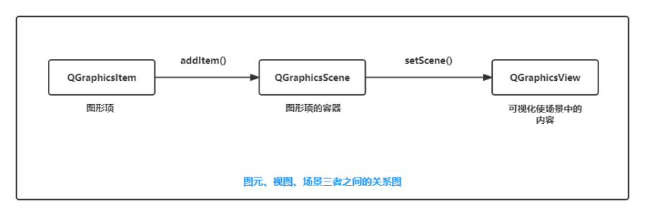
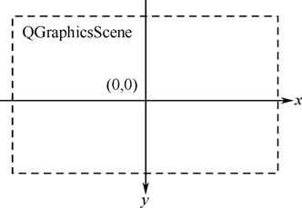
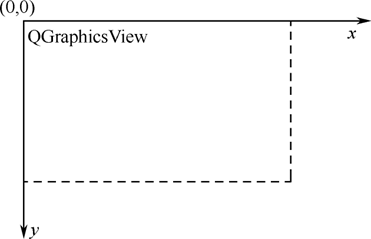
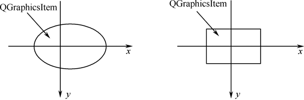

[TOC]

更多参见
[QT基础与实例应用目录](https://blog.csdn.net/leacock1991/article/details/118662440)

## Graphics View框架结构的主要特点

（1）在`Graphics View`框架结构中，系统可以利用Qt绘图系统的反锯齿、OpenGL工具来改善绘图性能。

（2）`Graphics View`支持事件传播体系结构，可以使图元在场景（scene）中的交互能力提高1倍，图元能够处理键盘事件和鼠标事件。其中，鼠标事件包括鼠标被按下、移动、释放和双击，还可以跟踪鼠标的移动。

（3）在`Graphics View`框架中，通过`二元空间划分树（Binary Space Partitioning，BSP）`提供快速的图元查找，这样就能够实时地显示包含上百万个图元的大场景。

## Graphics View框架结构的三元素

- 场景类：`QGraphicsScene`类
- 视图类：`QGraphicsView`类
- 图元类：`QGraphicsItem`类

`Graphics View`框架结构主要包含三个类，即`场景类（QGraphicsScene）`、`视图类（QGraphicsView）`和`图元类（QGraphicsItem）`，统称为“三元素”。其中，`场景类`**提供了一个用于管理位于其中的众多图元容器**，`视图类`**用于显示场景中的图元**，一个场景可以通过多个视图表现，一个场景包括多个几何图形。

### 场景类：QGraphicsScene类

**一个用于放置图元的容器**，本身是不可见的，必须通过与之相连的视图类来显示及与外界进行互操作，拥有以下功能：

1、提供用于管理大量图元（Items）的便捷接口。
2、分发事件给场景中的每一个图元。
3、管理图元（items）的状态，例如：选择和焦点处理等。
4、提供无变换的渲染功能，主要用于打印。

通过`QGraphicsScene::addItem()`可以添加一个图元到场景中。图元可以通过多个函数进行检索。`QGraphicsScene::items()`和一些重载函数可以返回与点、矩形、多边形或向量路径相交的所有图元。`QGraphicsScene::itemAt()`返回指定点的顶层图元。`QGraphicsScene::itemAt()`函数返回指定点的最上面的图元（场景中的图元可能会重叠）。所有的图元寻找函数返回的图元都是按照递减顺序进行的（例如第一个返回的图元在最上面，最后返回的图元在最下面）。如果要从场景中删除一个图元，可以使用`QGraphicsScene::RemoveItem()`函数。

场景允许通过`QGraphicsScence::render()`函数将场景的各个部分呈现到一个绘制设备中。可以通过`QGraphicsScene:: setSelectionArea()`函数选择图元，选择区域可以是任意的形状，使用`QPainterPath`表示。若要得到当前选择的图元列表，则可以使用函数`QGraphicsScene:: selectedItems()`。可以通过`QGraphicsScene:: setFocusItem()`函数或`QGraphicsScene:: setFocus()`函数来设置图元的焦点，获得当前具有焦点的图元使用函数`QGraphicsScene::focusItem()`。
事件传播体系结构将场景事件发送给图元，同时也管理图元之间的事件传播。如果场景接收了在某一点的鼠标单击事件，场景会将事件传给这一点的图元

### 视图类：QGraphicsView类

**提供一个可视的窗口，用于显示场景中的图元**。在同一个场景中可以有多个视图，也可以为相同的数据集提供几种不同的视图。`QGraphicsView`是可滚动的窗口部件，可以提供滚动条来浏览大的场景。

视图接收键盘和鼠标的输入事件，并将它们翻译为场景事件（将坐标转换为场景的坐标）。使用变换矩阵函数`QGraphicsView::matrix()`可以变换场景的坐标，实现场景缩放和旋转。`QGraphicsView`提供`QGraphicsView::mapToScene()`和`QGraphicsView:: mapFromScene()`函数用于与场景的坐标进行转换。

默认的`QGraphicsView`提供了一个`QWidget`作为视口部件，如果要使用`OpenGL`进行渲染，可以调用`QGraphicsView::setViewport()`设置`QGLWidget`作为视口。

### 图元类：QGraphicsItem类

**场景中各个图元的基类**，在它的基础上可以继承出各种图元类，Qt已经预置的包括`直线（QGraphicsLineItem）`、`椭圆（QGraphicsEllipseItem）`、`文本图元（QGraphicsTextItem）`、`矩形（QGraphicsRectItem）`等。当然，也可以在`QGraphicsItem`类的基础上实现自定义的图元类，即用户可以继承`QGraphicsItem`实现符合自己需要的图元。

`QGraphicsItem`主要有以下功能:

- 处理鼠标按下、移动、释放、双击、悬停、滚轮和右键菜单事件。
- 处理键盘输入事件。
- 处理拖曳事件。
- 分组。
- 碰撞检测。

## GraphicsView图形视图框架的坐标系统

`Graphics View`坐标基于笛卡儿坐标系，一个图元的场景具有x坐标和y坐标。当使用没有变换的视图观察场景时，场景中的一个单元对应屏幕上的一个像素。

三个`Graphics View`基本类有各自不同的坐标系，场景坐标、视图坐标和图元坐标。`Graphics View`提供了三个坐标系统之间的转换函数。在绘制图形时，`Graphics View`的场景坐标对应于`QPainter`的逻辑坐标，视图坐标与设备坐标相同。

### 场景坐标

**场景坐标是所有图元的基础坐标系统**。场景坐标系统描述了顶层的图元，每个图元都有场景坐标和相应的包容框。场景坐标的原点在场景中心，坐标原点是*x*轴正方向向右，*y*轴正方向向下。

`QGraphicsScene`类的坐标系以中心为原点（0,0）

### 视图坐标

**视图坐标是窗口部件的坐标**。视图坐标的**单位是像素**。`QGraphicsView`视图的左上角是（0,0），*x*轴正方向向右，*y*轴正方向向下。所有的鼠标事件最开始都是使用视图坐标。

`QGraphicsView`类继承自`QWidget`类，因此它与其他的`QWidget`类一样，以窗口的左上角作为自己坐标系的原点。

### 图元坐标

**图元使用自己的本地坐标**，这个坐标系统通常以**图元中心为原点**，这也是所有变换的原点。图元坐标方向是*x*轴正方向向右，*y*轴正方向向下。创建图元后，只需注意图元坐标就可以了，`QGraphicsScene`和`QGraphicsView`会完成所有的变换。

`QGraphicsItem`类的坐标系，在调用`QGraphicsItem`类的`paint()`函数重绘图元时，则以此坐标系为基准。

### 坐标变换函数

`Graphics View`框架提供了多种坐标变换函数

| 映 射 函 数                          | 转 换 类 型        |
| ------------------------------------ | ------------------ |
| `QGraphicsView::mapToScene()`      | 从视图到场景       |
| `QGraphicsView::mapFromScene()`   | 从场景到视图       |
| `QGraphicsItem:: mapFromScene()` | 从场景到图元       |
| `QGraphicsItem:: mapToScene()`      | 从图元到场景       |
| `QGraphicsItem:: mapToParent()`      | 从子图元到父图元   |
| `QGraphicsItem:: mapFromParent()`    | 从父图元到子图元   |
| `QGraphicsItem:: mapToItem()`        | 从本图元到其他图元 |
| `QGraphicsItem:: mapFromItem()`      | 从其他图元到本图元 |

## 图形视图框架的事件处理与传播

图形视图框架中的事件都是首先由视图进行接收，然后传递给场景，再由场景传递给相应的图元。

>视图——>场景——>图元

（1）对于键盘事件，它会传递给获得焦点的图元，可以使用`QGraphicsScene`类的`setFocusItem()`函数或者图元自身调用`setFocus()`函数来将其设置为焦点图元。默认情况下，如果场景没有获得焦点，那么所有的键盘事件都会被丢弃。如果调用了场景的`setFocus()`函数或者场景中的一个图元获得了焦点，那么场景也会自动获得焦点。
（2）对于鼠标悬停效果，`QGraphicsScene`会调度悬停事件。如果一个图元可以接收悬停事件，那么当鼠标进入它的区域之中时，它就会收到一个`GraphicsSceneHoverEnter`事件。如果鼠标继续在图元的区域之中进行移动，那么`QGraphicsScene`就会向该图元发送`GraphicsSceneHoverMove`事件。当鼠标离开图元的区域时，它将会收到一个`GraphicsSceneHoverLeave`事件。图元默认是无法接收悬停事件的，可以使用`QGraphicsItem`类的`setAcceptHoverEvents()`函数设置图元接收鼠标悬停事件。

参考：

[【Qt】一文总结图形视图框架基础](https://blog.csdn.net/iriczhao/article/details/124765535)

希望我的文章对于大家有帮助，由于个人能力的局限性，文中可能存在一些问题，欢迎指正、补充！

