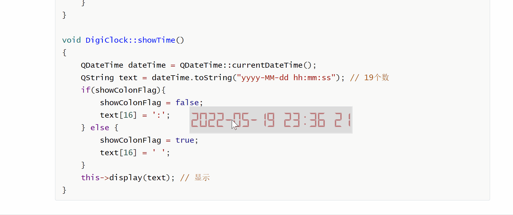
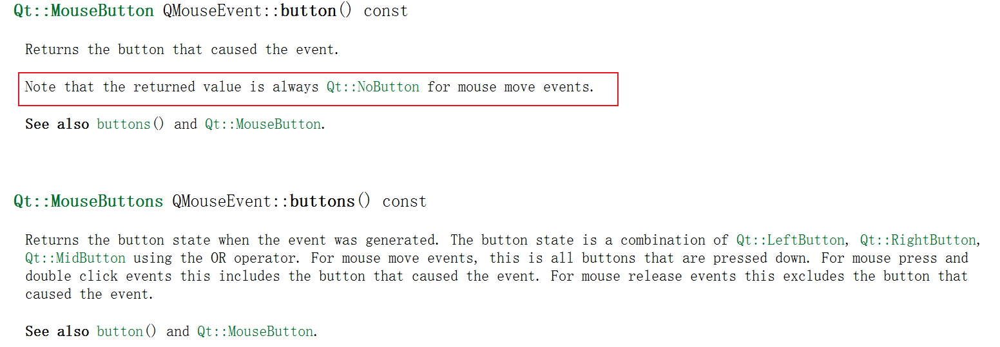

[TOC]

更多参见
[QT基础与实例应用目录](https://blog.csdn.net/leacock1991/article/details/118662440)

### 代码链接

GitHub链接 ：[ClockExample](https://github.com/lichangke/QT/tree/main/CodeDemo/CH4/CH405/ClockExample)

### 简介

借助`QLCDNumber`实现电子时钟，可以随意拖拽到桌面任意位置，鼠标右键进行关闭，用于实践`QPalette`类、`QTimer`的使用以及`mousePressEvent`\`mouseMoveEvent`\`mouseDoubleClickEvent`事件处理函数的使用。可在此基础上扩展其他应用，参看Qt帮助手册。




注意:

1、`mouseMoveEvent` 与 `mousePressEvent` 在 区分左右键的方法

2、`QLCDNumber` 设置`Flat`才能改变前景色(数字颜色)。

3、`QPoint dragOffsetPoint` 的使用 // 保存拖拽鼠标点 相对时钟窗体左上角位置 的偏移值




### 代码展示

**头文件**

```cpp
class DigiClock : public QLCDNumber
{
    Q_OBJECT

public:
    DigiClock(QWidget *parent = nullptr);
    ~DigiClock();
    void mousePressEvent(QMouseEvent *event); // 鼠标按下事件响应函数
    void mouseMoveEvent(QMouseEvent *event); // 鼠标移动事件响应函数
    void mouseDoubleClickEvent(QMouseEvent *event); // 鼠标双击事件响应函数
public slots:
    void showTime();
private:
    int colorIndex; // 颜色序号
    QList<Qt::GlobalColor> colorList; // 颜色列表
    bool showColonFlag; // 是否显示 :, 模拟闪烁
    QPoint dragOffsetPoint; // 保存拖拽鼠标点 相对时钟窗体左上角位置 的偏移值

};
```


**Cpp文件**

```cpp
DigiClock::DigiClock(QWidget *parent)
    : QLCDNumber(parent)
{
    colorIndex = 0;
    colorList = {Qt::darkRed,Qt::darkGreen,Qt::darkBlue,
                 Qt:: darkCyan,Qt::darkMagenta,Qt::darkYellow,Qt::darkGray};
    //设值参数
    this->setWindowFlags(Qt::FramelessWindowHint); // 设置窗体标识，无边框无标题栏
    this->setDecMode(); // 十进制
    this->setDigitCount(19); //显示个数
    this->setWindowOpacity(0.5); // 设置透明度  0 全透明 1 全不透明
    this->setSegmentStyle(QLCDNumber::Flat); // flat 才能改变 前景色
    this->resize(600,100); // 重设大小

    QPalette p = this->palette();
    p.setColor(QPalette::Window,Qt::lightGray); // 背景色
    p.setColor(QPalette::WindowText,colorList.at(colorIndex)); // 前景色 字体颜色
    this->setPalette(p);

    QTimer *timer = new QTimer(this); //定时器用于 每秒刷新显示
    connect(timer,SIGNAL(timeout()),this,SLOT(showTime()));
    timer->start(1000);
    this->showTime(); // 初始时间显示
    showColonFlag = true;
}

DigiClock::~DigiClock()
{
}

void DigiClock::mousePressEvent(QMouseEvent *event)
{
    if(event->button() == Qt::LeftButton){ // 注意 mouseMoveEvent 的区别
        dragOffsetPoint = event->globalPos() - this->frameGeometry().topLeft();
        event->accept();
    }
    if(event->button() == Qt::RightButton){
        close(); // 关闭
    }
}

void DigiClock::mouseMoveEvent(QMouseEvent *event)
{
    // 注意这里和 mousePressEvent 的区别，在mouseMoveEvent中 event->button() 始终为 NoButton
    if(event->buttons() & Qt::LeftButton){
        move(event->globalPos() - dragOffsetPoint);
        event->accept();
    }
}

void DigiClock::mouseDoubleClickEvent(QMouseEvent *event)
{
    if(event->button() == Qt::LeftButton){
        colorIndex++;
        if(colorIndex >= colorList.size()){
            colorIndex = 0;
        }
        QPalette p = this->palette();
        p.setColor(QPalette::WindowText,colorList.at(colorIndex)); // 前景色 字体颜色
        this->setPalette(p);
        event->accept();
    }
}

void DigiClock::showTime()
{
    QDateTime dateTime = QDateTime::currentDateTime();
    QString text = dateTime.toString("yyyy-MM-dd hh:mm:ss"); // 19个数
    if(showColonFlag){
        showColonFlag = false;
        text[16] = ':';
    } else {
        showColonFlag = true;
        text[16] = ' ';
    }
    this->display(text); // 显示
}
```


在此基础上可以扩展更多应用。


希望我的文章对于大家有帮助，由于个人能力的局限性，文中可能存在一些问题，欢迎指正、补充！

