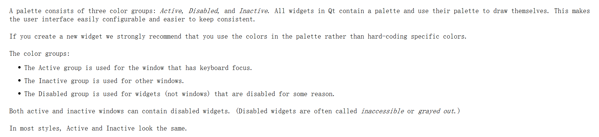
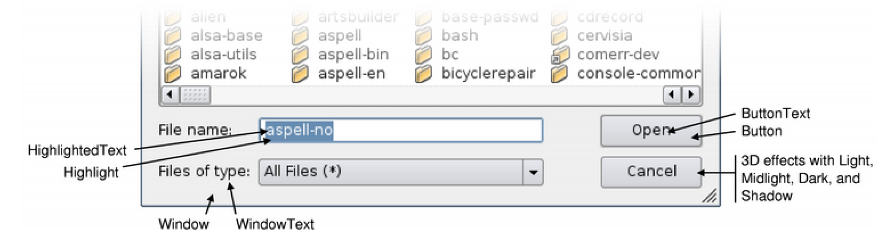
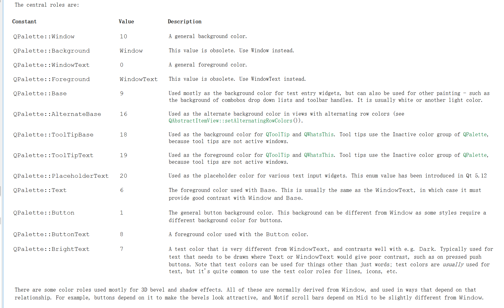
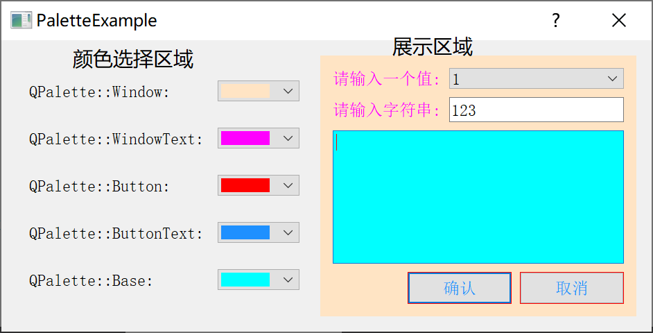

[TOC]


更多参见
[QT基础与实例应用目录](https://blog.csdn.net/leacock1991/article/details/118662440)


### 代码链接

GitHub链接 ：[PaletteExample](https://github.com/lichangke/QT/tree/main/CodeDemo/CH4/CH404/PaletteExample)

### `QPalette`简介

在QT中我们如何改变某个控件的颜色外观呢？比如改变背景、文字颜色等。QT提供了调色板类`QPalette`专门用于管理对话框的外观显示。每个控件或者窗体都包含一个`QPalette`对象，在显示时会根据其`QPalette`对象中对各个部分各状态下的颜色的描述进行绘制。

`QPalette`类有两个基本概念：一个是`ColorGroup`,另一个是`ColorRole`。详细可参见QT帮助手册。

`ColorGroup`指一下三种不同的状态：

- `QPalette::Active`: 获得焦点的状态
- `QPalette::Inactive`: 未获得焦点的状态
- `QPalette::Disabled`:不可用状态

`Inactive`和`Active`通常情况下颜色显示一致，也可根据情况设置。



`ColorRole` 用于对窗体不同部位颜色的分类，例如， `QPalette::Window`是指背景色，`QPalette::WindowText`指前景色





`QPalette`中几个重要的函数

```cpp
//对不同ColorRole的不同ColorGroup设置颜色
void QPalette::setColor(QPalette::ColorGroup group, QPalette::ColorRole role, const QColor &color);
//对不同ColorRole设置颜色不区分ColorGroup
void QPalette::setColor(QPalette::ColorRole role, const QColor &color);
// 通过画刷的设置对显示进行修改，这样可能使用图片也不是单一的颜色对主题进行填充
void QPalette::setBrush(QPalette::ColorGroup group, QPalette::ColorRole role, const QBrush &brush);
void QPalette::setBrush(QPalette::ColorRole role, const QBrush &brush);
```

### Demo以及说明





**头文件**

```cpp
class Palette : public QDialog
{
    Q_OBJECT

public:
    Palette(QWidget *parent = nullptr);
    ~Palette();
private slots:
    void ShowWindow(); // 背景色
    void ShowWindowText(); // 前景色
    void ShowButton(); // 按钮背景色
    void ShowButtonText(); //按钮前景色
    void ShowBase();
private:
    void CreateCtrlFrame(); // 完成颜色选取区域的创建
    void CreateDisplayFrame(); // 完成展示区域的创建
    void fillColorList(QComboBox *comboBox); // 颜色选取区域 颜色下拉列表中插入颜色
private:
    QHBoxLayout *mainLayout;
    // 颜色选择部分
    QFrame *ctrlFrame;
    QLabel *windowLabel; // 背景色
    QComboBox *windowComboBox;
    QLabel *windowTextLabel; // 前景色
    QComboBox *windowTextComboBox;
    QLabel *buttonLabel; // 按钮背景色
    QComboBox *buttonComboBox;
    QLabel *buttonTextLabel; // 按钮前景色
    QComboBox *buttonTextComboBox;
    QLabel *baseLabel; // 主要用作文本输入小部件的背景颜色
    QComboBox *baseComboBox;

    //展示部分
    QFrame *displayFrame;
    QLabel *displayLabel1;
    QComboBox *displayComboBox;
    QLabel *displayLabel2;
    QLineEdit *displayLineEdit;
    QTextEdit *displayTextEdit;
    QPushButton *displayOkBtn;
    QPushButton *displayCancelBtn;
};
```

**Cpp文件**

```cpp
Palette::Palette(QWidget *parent)
    : QDialog(parent)
{
    setAutoFillBackground(true);
    CreateCtrlFrame();
    CreateDisplayFrame();
    mainLayout = new QHBoxLayout(this);
    mainLayout->addWidget(ctrlFrame);
    mainLayout->addWidget(displayFrame);
}

Palette::~Palette()
{
}

void Palette::ShowWindow()
{
    QStringList colorList = QColor::colorNames(); // 获取内置颜色名列表
    QString name =  colorList.at(windowComboBox->currentIndex());
    QColor color = QColor(name);
    QPalette p = displayFrame->palette();
    p.setColor(QPalette::Window,color);
    // 将修改后的 QPalette 重新设置回去，并更新
    displayFrame->setPalette(p);
    displayFrame->update();
}

void Palette::ShowWindowText()
{
    QStringList colorList = QColor::colorNames(); // 获取内置颜色名列表
    QString name =  colorList.at(windowTextComboBox->currentIndex());
    QColor color = QColor(name);
    QPalette p = displayFrame->palette();
    p.setColor(QPalette::WindowText,color);
    // 将修改后的 QPalette 重新设置回去，并更新
    displayFrame->setPalette(p);
    displayFrame->update();
}

void Palette::ShowButton()
{
    QStringList colorList = QColor::colorNames(); // 获取内置颜色名列表
    QString name =  colorList.at(buttonComboBox->currentIndex());
    QColor color = QColor(name);
    QPalette p = displayFrame->palette();
    p.setColor(QPalette::Button,color);
    // 将修改后的 QPalette 重新设置回去，并更新
    displayFrame->setPalette(p);
    displayFrame->update();
}

void Palette::ShowButtonText()
{
    QStringList colorList = QColor::colorNames(); // 获取内置颜色名列表
    QString name =  colorList.at(buttonTextComboBox->currentIndex());
    QColor color = QColor(name);
    QPalette p = displayFrame->palette();
    p.setColor(QPalette::ButtonText,color);
    // 将修改后的 QPalette 重新设置回去，并更新
    displayFrame->setPalette(p);
    displayFrame->update();
}

void Palette::ShowBase()
{
    QStringList colorList = QColor::colorNames(); // 获取内置颜色名列表
    QString name =  colorList.at(baseComboBox->currentIndex());
    QColor color = QColor(name);
    QPalette p = displayFrame->palette();
    p.setColor(QPalette::Base,color);
    // 将修改后的 QPalette 重新设置回去，并更新
    displayFrame->setPalette(p);
    displayFrame->update();
}

void Palette::CreateCtrlFrame()
{
    ctrlFrame = new QFrame; //  颜色选择部分
    // 背景色
    windowLabel = new QLabel;
    windowLabel->setText(tr("QPalette::Window:"));
    windowComboBox = new QComboBox;
    fillColorList(windowComboBox);
    connect(windowComboBox,SIGNAL(activated(int)),this,SLOT(ShowWindow()));
    // 前景色
    windowTextLabel = new QLabel;
    windowTextLabel->setText(tr("QPalette::WindowText:"));
    windowTextComboBox = new QComboBox;
    fillColorList(windowTextComboBox);
    connect(windowTextComboBox,SIGNAL(activated(int)),this,SLOT(ShowWindowText()));
    // 按钮背景色
    buttonLabel = new QLabel;
    buttonLabel->setText(tr("QPalette::Button:"));
    buttonComboBox = new QComboBox;
    fillColorList(buttonComboBox);
    connect(buttonComboBox,SIGNAL(activated(int)),this,SLOT(ShowButton()));
    // 按钮前景色
    buttonTextLabel = new QLabel;
    buttonTextLabel->setText(tr("QPalette::ButtonText:"));
    buttonTextComboBox = new QComboBox;
    fillColorList(buttonTextComboBox);
    connect(buttonTextComboBox,SIGNAL(activated(int)),this,SLOT(ShowButtonText()));
    // 主要用作文本输入部件的背景颜色
    baseLabel = new QLabel;
    baseLabel->setText(tr("QPalette::Base:"));
    baseComboBox = new QComboBox;
    fillColorList(baseComboBox);
    connect(baseComboBox,SIGNAL(activated(int)),this,SLOT(ShowBase()));
    // 布局
    QGridLayout *ctrlLayout = new QGridLayout(ctrlFrame);
    ctrlLayout->setSpacing(20);
    ctrlLayout->addWidget(windowLabel,0,0);
    ctrlLayout->addWidget(windowComboBox,0,1);
    ctrlLayout->addWidget(windowTextLabel,1,0);
    ctrlLayout->addWidget(windowTextComboBox,1,1);
    ctrlLayout->addWidget(buttonLabel,2,0);
    ctrlLayout->addWidget(buttonComboBox,2,1);
    ctrlLayout->addWidget(buttonTextLabel,3,0);
    ctrlLayout->addWidget(buttonTextComboBox,3,1);
    ctrlLayout->addWidget(baseLabel,4,0);
    ctrlLayout->addWidget(baseComboBox,4,1);
}

void Palette::CreateDisplayFrame()
{
    displayFrame = new QFrame; //  展示部分
    // 设置为true 才能改变背景色
    displayFrame->setAutoFillBackground(true);
    displayLabel1 = new QLabel;
    displayLabel1->setText(tr("请输入一个值:"));
    displayComboBox = new QComboBox;
    displayComboBox->addItem(tr("1"));
    displayComboBox->addItem(tr("2"));
    displayLabel2 = new QLabel;
    displayLabel2->setText(tr("请输入字符串:"));
    displayLineEdit = new QLineEdit;
    displayTextEdit = new QTextEdit;
    QGridLayout *displayTopLayout = new QGridLayout;
    displayTopLayout->addWidget(displayLabel1,0,0);
    displayTopLayout->addWidget(displayComboBox,0,1);
    displayTopLayout->addWidget(displayLabel2,1,0);
    displayTopLayout->addWidget(displayLineEdit,1,1);
    displayTopLayout->addWidget(displayTextEdit,2,0,1,2);

    displayOkBtn = new QPushButton(tr("确认"));
    displayCancelBtn = new QPushButton(tr("取消"));
    // 设置为true 才能改变背景色
    displayOkBtn->setAutoFillBackground(true);
    displayCancelBtn->setAutoFillBackground(true);

    QHBoxLayout *displayBtnLayout = new QHBoxLayout;
    displayBtnLayout->addStretch(1);
    displayBtnLayout->addWidget(displayOkBtn);
    displayBtnLayout->addWidget(displayCancelBtn);

    QVBoxLayout *displayLayout = new QVBoxLayout(displayFrame);
    displayLayout->addLayout(displayTopLayout);
    displayLayout->addLayout(displayBtnLayout);
}

void Palette::fillColorList(QComboBox *comboBox)
{
    QStringList colorList = QColor::colorNames(); // 获取内置颜色名列表
    QString color;
    foreach(color,colorList){
        QPixmap pix(QSize(70,20)); //创建QPixmap对象用于颜色显示
        pix.fill(color);
        comboBox->addItem(QIcon(pix),nullptr); // nullptr不显示名称
        comboBox->setIconSize(QSize(70,20));
        // 设置下拉列表框的尺寸调整为符合内容大小
        comboBox->setSizeAdjustPolicy(QComboBox::AdjustToContents);
    }
}
```


注意

```cpp
// 设置为true 才能改变背景色
displayFrame->setAutoFillBackground(true);
```


希望我的文章对于大家有帮助，由于个人能力的局限性，文中可能存在一些问题，欢迎指正、补充！

