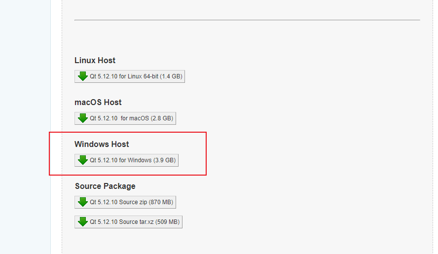
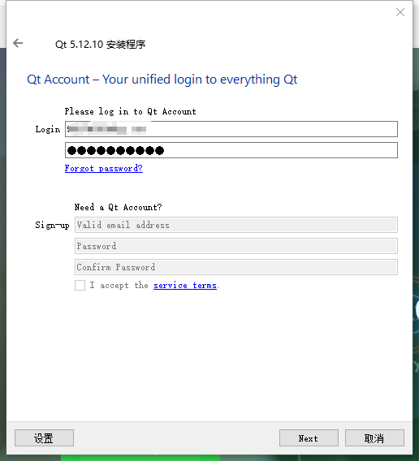
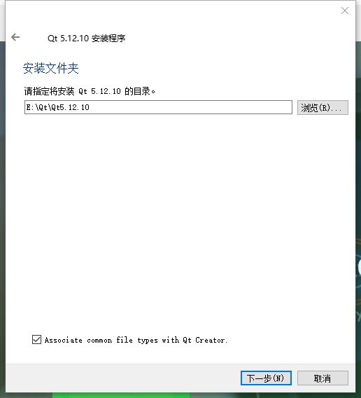
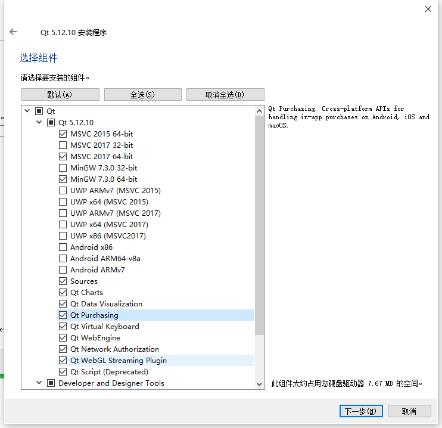
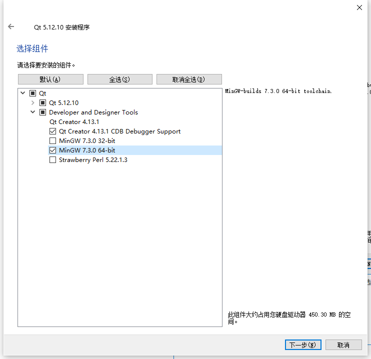

[TOC]

## QT 下载

QT5.12下载

[http://www.qtcn.org/bbs/read-htm-tid-1075.html](http://www.qtcn.org/bbs/read-htm-tid-1075.html)

我这里选择的是 **Windows Host** 下的 QT 5.12.10 for Windows(3.9GB)

也可以通过转存的百度网盘

链接：[https://pan.baidu.com/s/1bLQokHK6vmBNzre8Au9mGw](https://pan.baidu.com/s/1bLQokHK6vmBNzre8Au9mGw)
提取码：0bdc 

## 安装

双击 `qt-opensource-windows-x86-5.12.10.exe` 进入安装向导，下一步输入帐号和密码（如果没有可以在官网申请 官网 [https://www.qt.io/](https://www.qt.io/)）

下一步，设置安装路径

组件选择，根据需要选择

一些介绍

- MinGW 7.3.0 64-bit 编译器模块。MinGW 是 Minimalist GNU for Windows 的缩写，MinGW是 Windows 平台上使用的 GNU 工具集导入库的集合。采用GCC编译器，据说编译出来的可执行文件运行速度会比其他编译器好
- 用于 windows 平台上的 MSVC 编译器模块，如 msvc2017 32-bit 和 msvc2017 64-bit 等。要安装 MSVC 编译器的模块，需要计算机上已经安装相应版本的 Visual Studio
- 用于 Android 平台的模块，如 Android x86 和 Android ARMv7。如果安装这些组件，就可以构建Android的软件
- Sources 模块是 Qt 的源程序，喜欢阅读源码的朋友或者收藏家们可以选，反正我选了之后一直放在文件夹里吃灰
- Qt Charts 是二维图表模块，用于绘制柱状图、饼图、曲线图等常用二维图表。我的项目正好需要这个，所以我也选了
- Qt Data Visualization 是三维数据图表模块，用于数据的三维显示，如散点的三维空间分布、三维曲面等。
- Qt Purchasing、Qt Virtual Keyboard、Qt WebEngine、Qt Network Auth(TP)等其他模块，括号里的 TP 表示技术预览（Technology Preview）（Purchasing难道是二维码扫码支付？有趣有趣）
- Qt Scritp（Deprecated）是脚本模块，括号里的“Deprecated”表示这是已经过时的模块。

Devoloper and Designer Tools里面，Qt Creator 一定要选。如果前面有选MinGW而主机里没有安装过MinGW的话，应该勾选MinGw这一项。

选择好之后，点击下一步，勾选同意的复选框，然后下一步。

希望我的文章对于大家有帮助，由于个人能力的局限性，文中可能存在一些问题，欢迎指正、补充！

