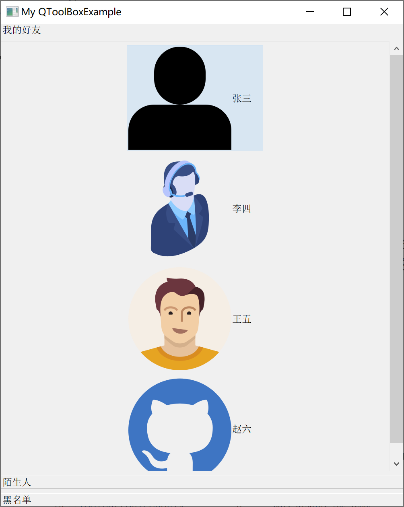
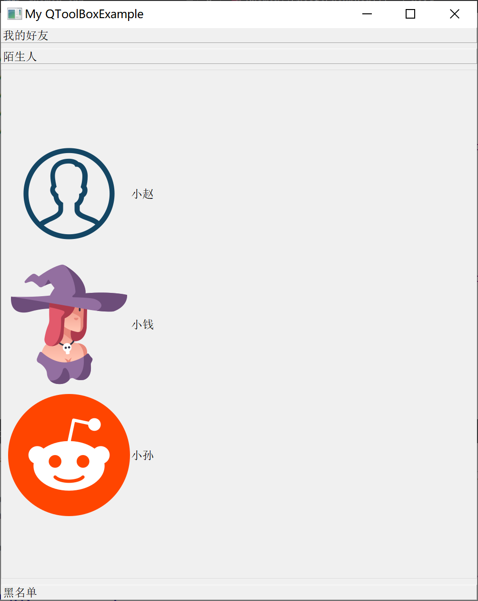
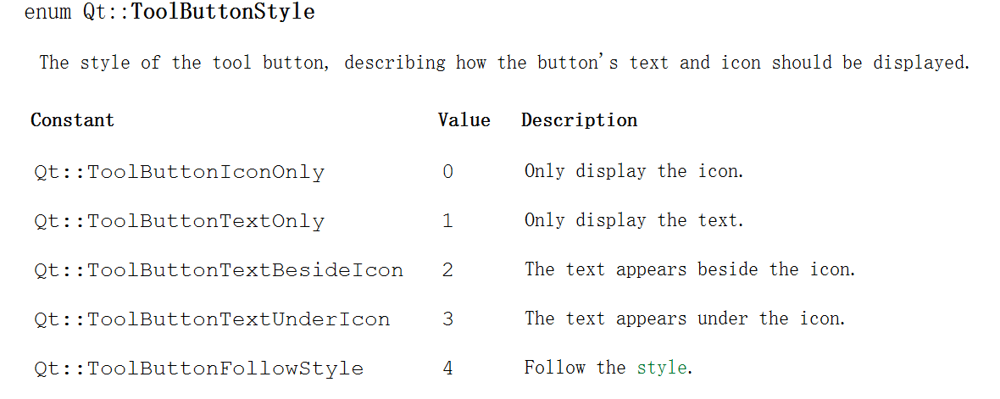

[TOC]


更多参见
[QT基础与实例应用目录](https://blog.csdn.net/leacock1991/article/details/118662440)

### 简介

`QToolBox`提供一种列状的层叠窗体，`QToolButton`提供了一种快速访问命令或选择项的按钮，通常在工具条中使用。示例通过`QToolBox`类的使用，实现类似的抽屉效果。







### 代码链接

GitHub链接 ：[QToolBoxExample](https://github.com/lichangke/QT/tree/main/CodeDemo/CH4/CH402/QToolBoxExample)

### 代码展示

**头文件**

```cpp
class Drawer : public QToolBox
{
    Q_OBJECT

public:
    Drawer(QWidget *parent = nullptr, Qt::WindowFlags f = Qt::WindowFlags());
    ~Drawer();
private:
    QGroupBox *groupbox1;
    QVBoxLayout *layout1;
    QToolButton *toolBtn1_1;
    QToolButton *toolBtn1_2;
    QToolButton *toolBtn1_3;
    QToolButton *toolBtn1_4;

    QGroupBox *groupbox2;
    QVBoxLayout *layout2;
    QToolButton *toolBtn2_1;
    QToolButton *toolBtn2_2;
    QToolButton *toolBtn2_3;

    QGroupBox *groupbox3;
    QVBoxLayout *layout3;
    QToolButton *toolBtn3_1;
    QToolButton *toolBtn3_2;

    void CreateGroupBox1();
    void CreateGroupBox2();
    void CreateGroupBox3();
};
```

**Cpp文件**

```cpp
Drawer::Drawer(QWidget *parent, Qt::WindowFlags f)
    :QToolBox(parent,f)
{
    setWindowTitle(tr("My QToolBoxExample"));
    CreateGroupBox1();
    CreateGroupBox2();
    CreateGroupBox3();

    addItem(groupbox1,tr("我的好友")); // QToolBox 中添加每个抽屉
    addItem(groupbox2,tr("陌生人"));
    addItem(groupbox3,tr("黑名单"));
    resize(1000,1200);
}

Drawer::~Drawer()
{
}

void Drawer::CreateGroupBox1()
{
    toolBtn1_1 = new QToolButton;
    toolBtn1_1->setText("张三");
    QPixmap icon1_1(":/icon/1.png");
    toolBtn1_1->setIcon(icon1_1);
    toolBtn1_1->setIconSize(icon1_1.size());
    toolBtn1_1->setAutoRaise(true); // 鼠标离开时自动恢复为弹起状态
//    Qt::ToolButtonIconOnly        只显示图标
//    Qt::ToolButtonTextOnly        只显示文字
//    Qt::ToolButtonTextBesideIcon  文字显示在图标旁边
//    Qt::ToolButtonTextUnderIcon   文字显示在图标下
//    Qt::ToolButtonFollowStyle     遵循Style标准， 详见Qt帮助
    toolBtn1_1->setToolButtonStyle(Qt::ToolButtonStyle::ToolButtonTextBesideIcon);

    toolBtn1_2 = new QToolButton;
    toolBtn1_2->setText("李四");
    QPixmap icon1_2(":/icon/2.png");
    toolBtn1_2->setIcon(icon1_2);
    toolBtn1_2->setIconSize(icon1_2.size());
    toolBtn1_2->setAutoRaise(true);
    toolBtn1_2->setToolButtonStyle(Qt::ToolButtonStyle::ToolButtonTextBesideIcon);


    toolBtn1_3 = new QToolButton;
    toolBtn1_3->setText("王五");
    QPixmap icon1_3(":/icon/3.png");
    toolBtn1_3->setIcon(icon1_3);
    toolBtn1_3->setIconSize(icon1_3.size());
    toolBtn1_3->setAutoRaise(true);
    toolBtn1_3->setToolButtonStyle(Qt::ToolButtonStyle::ToolButtonTextBesideIcon);


    toolBtn1_4 = new QToolButton;
    toolBtn1_4->setText("赵六");
    QPixmap icon1_4(":/icon/4.png");
    toolBtn1_4->setIcon(icon1_4);
    toolBtn1_4->setIconSize(icon1_4.size());
    toolBtn1_4->setAutoRaise(true);
    toolBtn1_4->setToolButtonStyle(Qt::ToolButtonStyle::ToolButtonTextBesideIcon);

    groupbox1 = new QGroupBox; // 对应每个抽屉
    layout1 = new QVBoxLayout(groupbox1); // QGroupBox 的布局
    layout1->setMargin(10);
    layout1->setAlignment(Qt::AlignHCenter);//对齐方式
    layout1->addWidget(toolBtn1_1);
    layout1->addWidget(toolBtn1_2);
    layout1->addWidget(toolBtn1_3);
    layout1->addWidget(toolBtn1_4);
}

void Drawer::CreateGroupBox2()
{
    toolBtn2_1 = new QToolButton;
    toolBtn2_1->setText("小赵");
    QPixmap icon2_1(":/icon/5.png");
    toolBtn2_1->setIcon(icon2_1);
    toolBtn2_1->setIconSize(icon2_1.size());
    toolBtn2_1->setAutoRaise(true); // 鼠标离开时自动恢复为弹起状态
    toolBtn2_1->setToolButtonStyle(Qt::ToolButtonStyle::ToolButtonTextBesideIcon);

    toolBtn2_2 = new QToolButton;
    toolBtn2_2->setText("小钱");
    QPixmap icon2_2(":/icon/6.png");
    toolBtn2_2->setIcon(icon2_2);
    toolBtn2_2->setIconSize(icon2_2.size());
    toolBtn2_2->setAutoRaise(true);
    toolBtn2_2->setToolButtonStyle(Qt::ToolButtonStyle::ToolButtonTextBesideIcon);

    toolBtn2_3 = new QToolButton;
    toolBtn2_3->setText("小孙");
    QPixmap icon2_3(":/icon/7.png");
    toolBtn2_3->setIcon(icon2_3);
    toolBtn2_3->setIconSize(icon2_3.size());
    toolBtn2_3->setAutoRaise(true);
    toolBtn2_3->setToolButtonStyle(Qt::ToolButtonStyle::ToolButtonTextBesideIcon);

    groupbox2 = new QGroupBox; // 对应每个抽屉
    layout2 = new QVBoxLayout(groupbox2); // QGroupBox 的布局
    layout2->setMargin(10);
    layout2->setAlignment(Qt::AlignLeft);//对齐方式
    layout2->addWidget(toolBtn2_1);
    layout2->addWidget(toolBtn2_2);
    layout2->addWidget(toolBtn2_3);
}

void Drawer::CreateGroupBox3()
{
    toolBtn3_1 = new QToolButton;
    toolBtn3_1->setText("小明");
    QPixmap icon3_1(":/icon/8.png");
    toolBtn3_1->setIcon(icon3_1);
    toolBtn3_1->setIconSize(icon3_1.size());
    toolBtn3_1->setAutoRaise(true); // 鼠标离开时自动恢复为弹起状态
    toolBtn3_1->setToolButtonStyle(Qt::ToolButtonStyle::ToolButtonTextBesideIcon);

    toolBtn3_2 = new QToolButton;
    toolBtn3_2->setText("大明");
    QPixmap icon3_2(":/icon/9.png");
    toolBtn3_2->setIcon(icon3_2);
    toolBtn3_2->setIconSize(icon3_2.size());
    toolBtn3_2->setAutoRaise(true);
    toolBtn3_2->setToolButtonStyle(Qt::ToolButtonStyle::ToolButtonTextBesideIcon);

    groupbox3 = new QGroupBox; // 对应每个抽屉
    layout3 = new QVBoxLayout(groupbox3); // QGroupBox 的布局
    layout3->setMargin(10);
    layout3->setAlignment(Qt::AlignRight);//对齐方式
    layout3->addWidget(toolBtn3_1);
    layout3->addWidget(toolBtn3_2);
}
```

**`Qt::ToolButtonStyle` 说明**




希望我的文章对于大家有帮助，由于个人能力的局限性，文中可能存在一些问题，欢迎指正、补充！

