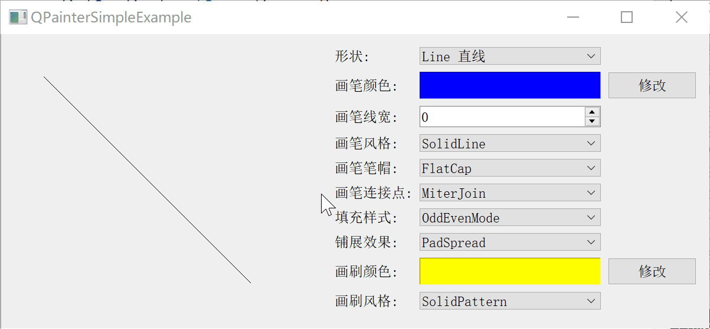
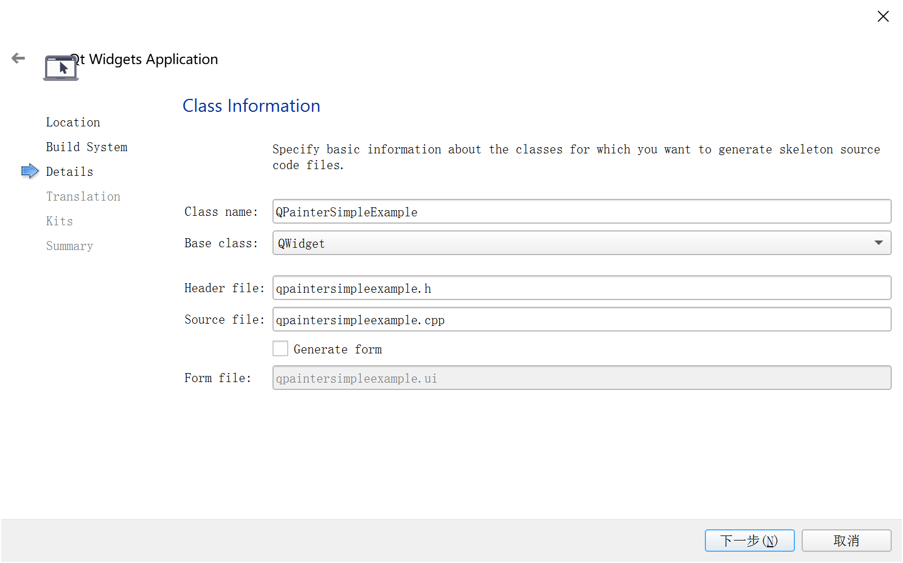
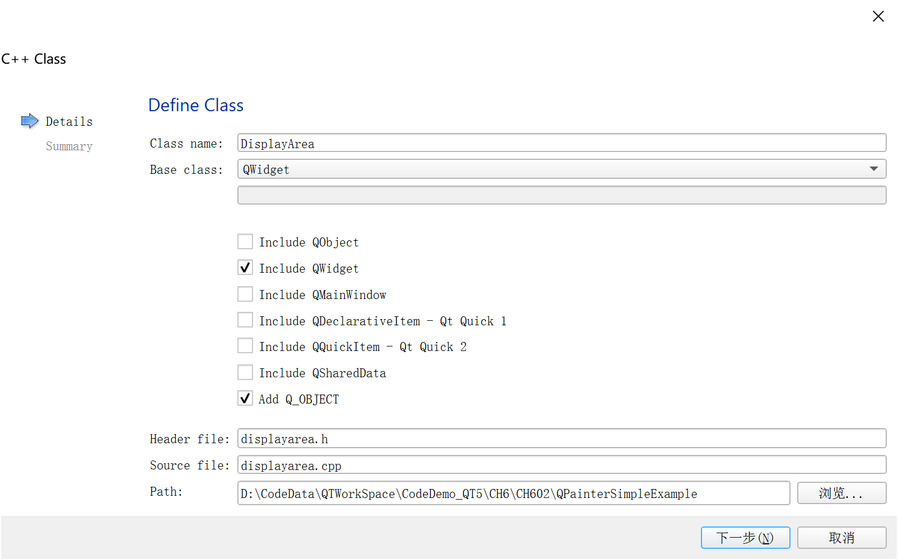
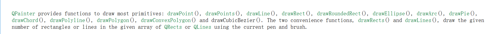
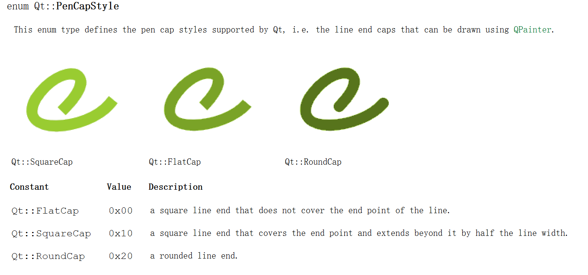
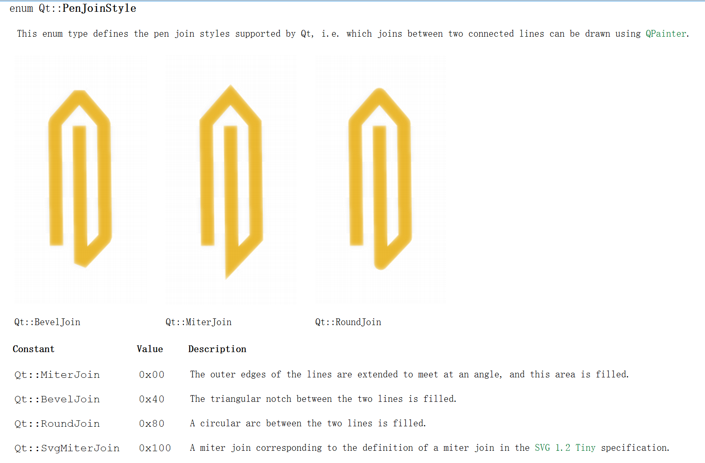
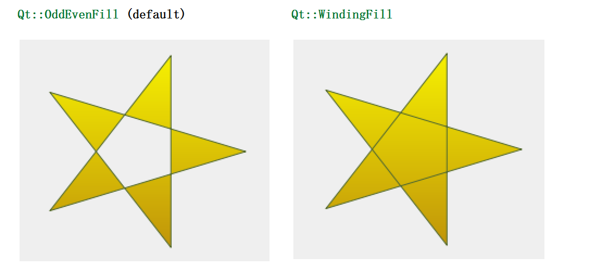
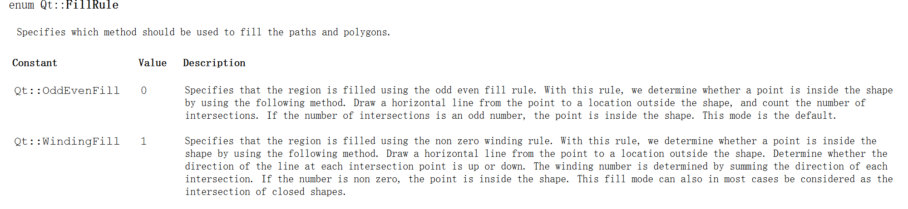
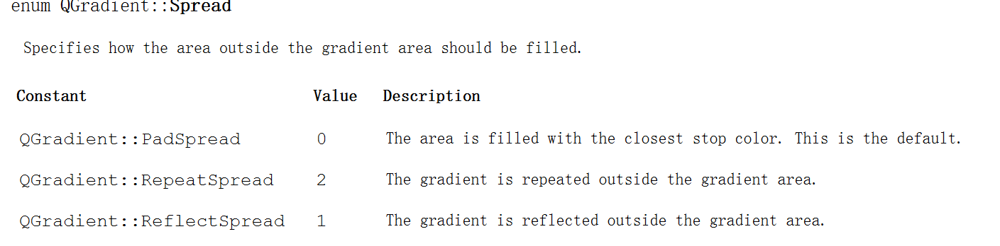
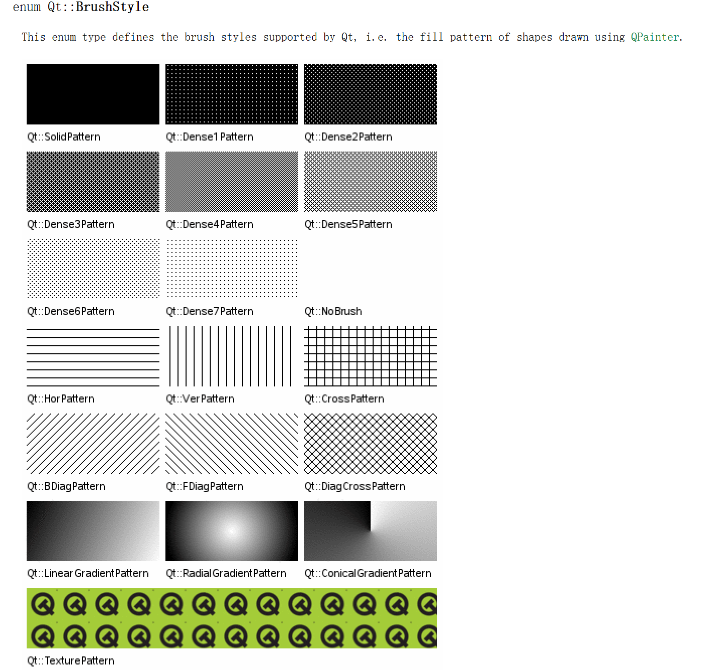

[TOC]

更多参见
[QT基础与实例应用目录](https://blog.csdn.net/leacock1991/article/details/118662440)

## 代码链接

GitHub链接 ：[QPainterSimpleExample](https://github.com/lichangke/QT/tree/main/CodeDemo/CH6/CH602/QPainterSimpleExample)

## 介绍

结合实例介绍如何利用`QPainter`绘制各种图形，可绘制**不同形状**，使用不同**画笔颜色**、**画笔线宽**、**画笔风格**，选择不同**画笔连接点**，可设置不同的**填充模式**、**铺展效果**、**渐变效果**以及**画刷颜色**、**画刷风格**等。




# 实现步骤


## 工程创建

如下图创建`PaintExample`工程，类名为`QPainterMainWidget`基类为`QWidget`,取消创建界面




右键工程添加以`QWidget`为基类的绘图显示区`DisplayArea`




这时除了`main.cpp`工程还包含`qpaintermainwidget.cpp、qpaintermainwidget.h、displayarea.cpp、displayarea.h`


## 绘图显示区实现

这里需要如下变量保存基本信息

```cpp
    enum Shape{
        Line, // 直线  drawLine()
        Rect, // 长方形  drawRect()
        RoundedRect, // 圆角长方形 drawRoundedRect()
        Ellipse, // 椭圆形 drawEllipse()
        Polygon, // 多边形 drawPolygon()
        Polyline, // 多边线 drawPolyline()
        Points, // 点 drawPoints()
        Arc, // 弧 drawArc()
        Path, // 路径 drawPath(const QPainterPath &path)
        Text, // 文字 drawText
        PixMap, // 图片 drawPixmap
    };
private:
    Shape shape; // shape类型
    QPen pen; // 画笔
    QBrush brush; // 画刷
    Qt::FillRule fillRule; // 路径和多边形 填充方法
```

参见Qt帮助手册，如下图`QPainter` 提供了绘制大多数图形的函数：`drawPoint()、drawPoints()、drawLine()、drawRect()、drawRoundedRect()、drawEllipse()、drawArc()、drawPie()、drawChord()、drawPolyline()、drawPolygon()、drawConvexPolygon() 和 drawCubicBezier()`。



利用 `QPainterPath` 类，通过函数 `drawPath`使用当前笔绘制轮廓，使用当前画笔进行填充，绘制给定的图形路径。通过函数`drawText`可以绘制文字。通过函数`drawPixmap`可以绘制图片。

**`displayarea.h`**

```cpp
class DisplayArea : public QWidget
{
    Q_OBJECT
public:
    enum Shape{
        Line, // 直线  drawLine()
        Rect, // 长方形  drawRect()
        RoundedRect, // 圆角方形 drawRoundRect()
        Ellipse, // 椭圆形 drawEllipse()
        Polygon, // 多边形 drawPolygon()
        Polyline, // 多边线 drawPolyline()
        Points, // 点 drawPoints()
        Arc, // 弧 drawArc()
        Path, // 路径 drawPath(const QPainterPath &path)
        Text, // 文字 drawText
        PixMap, // 图片 drawPixmap
    };

public:
    explicit DisplayArea(QWidget *parent = nullptr);
    void setShape(Shape shape);
    void setPen(QPen pen);
    void setBrush(QBrush brush);
    void setFillRule(Qt::FillRule fillRule);
    void paintEvent(QPaintEvent *event) override; // 重绘事件
signals:
private:
    Shape shape; // shape类型
    QPen pen; // 画笔
    QBrush brush; // 画刷
    Qt::FillRule fillRule; // 路径和多边形 填充方法
};
```

### 设置窗体背景颜色

利用`QPalette`参见[QT基础之QPalette类](https://blog.csdn.net/leacock1991/article/details/124854275)

```cpp
DisplayArea::DisplayArea(QWidget *parent) : QWidget(parent)
{
    // 设置背景
    QPalette p = palette();
    p.setColor(QPalette::Window, Qt::white);
    setPalette(p);
}
```

### 参数设置函数实现

`setShape、setPen、setBrush、setFillRule`函数的实现

```cpp
void DisplayArea::setShape(DisplayArea::Shape shape)
{
    this->shape = shape;
    update(); // 触发重绘
}

void DisplayArea::setPen(QPen pen)
{
    this->pen = pen;
    update();
}

void DisplayArea::setBrush(QBrush brush)
{
    this->brush = brush;
    update();
}

void DisplayArea::setFillRule(Qt::FillRule fillRule)
{
    this->fillRule = fillRule;
    update();
}
```
### 重绘函数paintEvent实现

利用`QPainter`根据不同的设置在绘图显示区绘制图形。

这里绘制时使用事先设置的默认值进行绘制，注意QPainterPath的使用方法，可参见Qt手册。

```cpp
void DisplayArea::paintEvent(QPaintEvent *event)
{
    QPainter p(this); // 新建一个QPainter对象 注意指定parent
    p.setPen(pen); // 设置画笔
    p.setBrush(brush); // 设置画刷

    // 默认值
    static const QPoint point1(50,50);
    static const QPoint point2(400,400); // 这里固定了位置，根据实际需要可以通过设置修改

    static const QRect rect(50,50,400,400);
    static const QPoint points4[4] = {
        QPoint(50, 50),
        QPoint(400, 100),
        QPoint(450, 350),
        QPoint(100, 300)
    };

    static const QPoint points5[5] = {
        QPoint(50, 50),
        QPoint(400, 100),
        QPoint(450, 350),
        QPoint(100, 300),
        QPoint(200, 250)
    };
    int startAngle =  30*16; // 弧形 起始角 QPainter 中画弧形使用的角度值以 1/16度 为单位， 30*16 为 30度
    int spanAngle = 120*16; // 弧形 跨度角

    QPainterPath path;
    //addRect  将给定的矩形作为闭合的子路径添加到此路径。将该矩形作为一组顺时针的线添加。
    // 添加矩形后，绘制路径的当前位置在矩形的左上角。
    path.addRect(100, 100, 100, 100);
    // 将当前点移动到给定点，隐式开始一个新的子路径并关闭前一个
    path.moveTo(0, 0);
    // 使用 c1 和 c2 指定的控制点在当前位置和给定端点之间添加三次贝塞尔曲线。
    // 添加曲线后，当前位置更新为曲线的终点。
    // void QPainterPath::cubicTo(const QPointF &c1, const QPointF &c2, const QPointF &endPoint)
    path.cubicTo(300, 0,  200, 200,  300, 300);
    path.cubicTo(0, 300,  200, 200,  0, 0);
    path.setFillRule(fillRule);

    switch(shape){ // 根据不同的图形选择进行绘制
    case Line:{ // 直线 drawLine()
        p.drawLine(point1,point2); // 有不同的实现
        break;
    }
    case Rect:{ // 长方形 drawRect()
        p.drawRect(rect);
        break;
    }
    case RoundedRect:{ // 圆角方形 drawRoundRect()
        p.drawRoundRect(rect);
        break;
    }
    case Ellipse:{ // 椭圆形 drawEllipse()
        p.drawEllipse(rect);
        break;
    }
    case Polygon:{ // 多边形 drawPolygon()
        p.drawPolygon(points4,4,fillRule);
        break;
    }
    case Polyline:{ // 多边线 drawPolyline()
        p.drawPolyline(points5,5);
        break;
    }
    case Points:{ // 点 drawPoints()
        p.drawPoints(points5,5);
        break;
    }
    case Arc:{ // 弧 drawArc()
        p.drawArc(rect,startAngle,spanAngle);
        break;
    }
    case Path:{ // 路径 drawPath(const QPainterPath &path)
        p.drawPath(path);
        break;
    }
    case Text:{ // 文字 drawText
        p.drawText(rect,Qt::AlignCenter,tr("Hello World!"));
        break;
    }
    case PixMap: { // 图片 drawPixmap
        p.drawPixmap(50,50,QPixmap(":/shape.png"));
        break;
    }
    default:
        break;
    }
}
```

## 主选项区域实现


### **`qpaintersimpleexample.h`**头文件

```cpp
class QPainterSimpleExample : public QWidget
{
    Q_OBJECT

public:
    QPainterSimpleExample(QWidget *parent = nullptr);
    ~QPainterSimpleExample();
protected slots:
    void DisplayShape(int value); // 形状
    void DisplayPenColor(); // 画笔颜色
    void DisplayPenLineWidth(int value); // 画笔线宽
    void DisplayPenStyle(int value); // 画笔风格
    void DisplayPenCap(int value); // 画笔笔帽
    void DisplayPenJoin(int value); // 画笔连接点
    void DisplayFillStyle(int value); // 填充样式
    void DisplaySpreadStyle(int value); // 平铺效果
    void DisplayBrushColor(); // 画刷颜色
    void DisplayBrushStyle(int value); // 画刷风格
private:
    // 绘制显示区
    DisplayArea *displayArea;
    // 布局
    QGridLayout *optiAreaLayout; // 右侧选项区布局
    QHBoxLayout *mainLayout; // 主窗口顶层布局
    // 形状
    QLabel *shapeLabel;
    QComboBox *shapeComboBox;
    // 画笔颜色
    QLabel *penColorLabel;
    QFrame *penColorFrame;
    QPushButton *penColorBtn;
    // 画笔线宽
    QLabel *penLineWidthLabel;
    QSpinBox *penLineWidthSpinBox;
    // 画笔风格
    QLabel *penStyleLabel;
    QComboBox *penStyleComboBox;
    // 画笔笔帽
    QLabel *penCapLabel;
    QComboBox *penCapComboBox;
    // 画笔连接点
    QLabel *penJoinLabel;
    QComboBox *penJoinComboBox;
    // 填充样式
    QLabel *fillStyleLabel;
    QComboBox *fillStyleComboBox;
    // 平铺效果
    QLabel *spreadStyleLabel;
    QComboBox *spreadStyleComboBox;
    // 画刷颜色
    QLabel *brushColorLabel;
    QFrame *brushColorFrame;
    QPushButton *brushColorBtn;
    // 画刷风格
    QLabel *brushStyleLabel;
    QComboBox *brushStyleComboBox;
};
```


### 构造函数

创建选项控件，设置布局，以及`connect`函数

```cpp
QPainterSimpleExample::QPainterSimpleExample(QWidget *parent)
    : QWidget(parent)
{
    // 绘制显示区
    displayArea = new DisplayArea;
    // 形状
    shapeLabel = new QLabel(tr("形状:"));
    shapeComboBox = new QComboBox;
    shapeComboBox->addItem(tr("Line 直线"), DisplayArea::Line);
    shapeComboBox->addItem(tr("Rect 长方形"), DisplayArea::Rect);
    shapeComboBox->addItem(tr("RoundedRect 圆角方形"), DisplayArea::RoundedRect);
    shapeComboBox->addItem(tr("Ellipse 椭圆形"), DisplayArea::Ellipse);
    shapeComboBox->addItem(tr("Polygon 多边形"), DisplayArea::Polygon);
    shapeComboBox->addItem(tr("Polyline 多边线"), DisplayArea::Polyline);
    shapeComboBox->addItem(tr("Points 点"), DisplayArea::Points);
    shapeComboBox->addItem(tr("Arc 弧"), DisplayArea::Arc);
    shapeComboBox->addItem(tr("Path 路径"), DisplayArea::Path);
    shapeComboBox->addItem(tr("Text 文字"), DisplayArea::Text);
    shapeComboBox->addItem(tr("PixMap 图片"), DisplayArea::PixMap);
    connect(shapeComboBox,SIGNAL(activated(int)),this,SLOT(DisplayShape(int)));
    // 画笔颜色
    penColorLabel = new QLabel(tr("画笔颜色:"));
    penColorFrame = new QFrame;
    penColorFrame->setFrameStyle(QFrame::Panel|QFrame::Sunken);
    penColorFrame->setAutoFillBackground(true);//可以改变背景色
    penColorFrame->setPalette(QPalette(Qt::blue));
    penColorBtn = new QPushButton(tr("修改"));
    connect(penColorBtn,SIGNAL(clicked()),this,SLOT(DisplayPenColor()));
    // 画笔线宽
    penLineWidthLabel = new QLabel(tr("画笔线宽:"));
    penLineWidthSpinBox = new QSpinBox;
    penLineWidthSpinBox->setRange(0,20);
    connect(penLineWidthSpinBox,SIGNAL(valueChanged(int)),this,SLOT(DisplayPenLineWidth(int)));
    // 画笔风格
    penStyleLabel = new QLabel(tr("画笔风格:"));
    penStyleComboBox = new QComboBox;
    penStyleComboBox->addItem(tr("SolidLine"),static_cast<int>(Qt::SolidLine));
    penStyleComboBox->addItem(tr("DashLine"),static_cast<int>(Qt::DashLine));
    penStyleComboBox->addItem(tr("DotLine"),static_cast<int>(Qt::DotLine));
    penStyleComboBox->addItem(tr("DashDotLine"),static_cast<int>(Qt::DashDotLine));
    penStyleComboBox->addItem(tr("DashDotDotLine"),static_cast<int>(Qt::DashDotDotLine));
    penStyleComboBox->addItem(tr("CustomDashLine"),static_cast<int>(Qt::CustomDashLine));
    connect(penStyleComboBox,SIGNAL(activated(int)),this,SLOT(DisplayPenStyle(int)));
    // 画笔笔帽
    penCapLabel = new QLabel(tr("画笔笔帽:"));
    penCapComboBox = new QComboBox;
    penCapComboBox->addItem(tr("FlatCap"),static_cast<int>(Qt::FlatCap));
    penCapComboBox->addItem(tr("SquareCap"),static_cast<int>(Qt::SquareCap));
    penCapComboBox->addItem(tr("RoundCap"),static_cast<int>(Qt::RoundCap));
    connect(penCapComboBox,SIGNAL(activated(int)),this,SLOT(DisplayPenCap(int)));
    // 画笔连接点
    penJoinLabel = new QLabel(tr("画笔连接点:"));
    penJoinComboBox = new QComboBox;
    penJoinComboBox->addItem(tr("MiterJoin"),static_cast<int>(Qt::MiterJoin));
    penJoinComboBox->addItem(tr("BevelJoin"),static_cast<int>(Qt::BevelJoin));
    penJoinComboBox->addItem(tr("RoundJoin"),static_cast<int>(Qt::RoundJoin));
    connect(penJoinComboBox,SIGNAL(activated(int)),this,SLOT(DisplayPenJoin(int)));
    // 填充样式
    fillStyleLabel = new QLabel(tr("填充样式:"));
    fillStyleComboBox = new QComboBox;
    fillStyleComboBox->addItem(tr("OddEvenMode"),static_cast<int>(QPaintEngine::OddEvenMode));
    fillStyleComboBox->addItem(tr("WindingMode"),static_cast<int>(QPaintEngine::WindingMode));
    connect(fillStyleComboBox,SIGNAL(activated(int)),this,SLOT(DisplayFillStyle(int)));
    // 铺展效果
    spreadStyleLabel = new QLabel(tr("铺展效果:"));
    spreadStyleComboBox = new QComboBox;
    spreadStyleComboBox->addItem(tr("PadSpread"),static_cast<int>(QGradient::PadSpread));
    spreadStyleComboBox->addItem(tr("RepeatSpread"),static_cast<int>(QGradient::RepeatSpread));
    spreadStyleComboBox->addItem(tr("ReflectSpread"),static_cast<int>(QGradient::ReflectSpread));
    connect(spreadStyleComboBox,SIGNAL(activated(int)),this,SLOT(DisplaySpreadStyle(int)));
    // 画刷颜色
    brushColorLabel = new QLabel(tr("画刷颜色:"));
    brushColorFrame = new QFrame;
    brushColorFrame->setFrameStyle(QFrame::Panel|QFrame::Sunken);
    brushColorFrame->setAutoFillBackground(true);//可以改变背景色
    brushColorFrame->setPalette(QPalette(Qt::yellow));
    brushColorBtn = new QPushButton(tr("修改"));
    connect(brushColorBtn,SIGNAL(clicked()),this,SLOT(DisplayBrushColor()));
    // 画刷风格
    brushStyleLabel = new QLabel(tr("画刷风格:"));
    brushStyleComboBox = new QComboBox;
    brushStyleComboBox->addItem(tr("SolidPattern"),static_cast<int>(Qt::SolidPattern));
    brushStyleComboBox->addItem(tr("Dense1Pattern"),static_cast<int>(Qt::Dense1Pattern));
    brushStyleComboBox->addItem(tr("Dense2Pattern"),static_cast<int>(Qt::Dense2Pattern));
    brushStyleComboBox->addItem(tr("Dense3Pattern"),static_cast<int>(Qt::Dense3Pattern));
    brushStyleComboBox->addItem(tr("Dense4Pattern"),static_cast<int>(Qt::Dense4Pattern));
    brushStyleComboBox->addItem(tr("Dense5Pattern"),static_cast<int>(Qt::Dense5Pattern));
    brushStyleComboBox->addItem(tr("Dense6Pattern"),static_cast<int>(Qt::Dense6Pattern));
    brushStyleComboBox->addItem(tr("Dense7Pattern"),static_cast<int>(Qt::Dense7Pattern));
    brushStyleComboBox->addItem(tr("HorPattern"),static_cast<int>(Qt::HorPattern));
    brushStyleComboBox->addItem(tr("VerPattern"),static_cast<int>(Qt::VerPattern));
    brushStyleComboBox->addItem(tr("CrossPattern"),static_cast<int>(Qt::CrossPattern));
    brushStyleComboBox->addItem(tr("BDiagPattern"),static_cast<int>(Qt::BDiagPattern));
    brushStyleComboBox->addItem(tr("FDiagPattern"),static_cast<int>(Qt::FDiagPattern));
    brushStyleComboBox->addItem(tr("DiagCrossPattern"),static_cast<int>(Qt::DiagCrossPattern));
    brushStyleComboBox->addItem(tr("LinearGradientPattern"),static_cast<int>(Qt::LinearGradientPattern));
    brushStyleComboBox->addItem(tr("ConicalGradientPattern"),static_cast<int>(Qt::ConicalGradientPattern));
    brushStyleComboBox->addItem(tr("RadialGradientPattern"),static_cast<int>(Qt::RadialGradientPattern));
    brushStyleComboBox->addItem(tr("TexturePattern"),static_cast<int>(Qt::TexturePattern));
    connect(brushStyleComboBox,SIGNAL(activated(int)),this,SLOT(DisplayBrushStyle(int)));

    // 布局
    optiAreaLayout = new QGridLayout;
    mainLayout = new QHBoxLayout(this); // 注意指定parent
    // 形状
    optiAreaLayout->addWidget(shapeLabel,0,0);
    optiAreaLayout->addWidget(shapeComboBox,0,1);
    // 画笔颜色
    optiAreaLayout->addWidget(penColorLabel,1,0);
    optiAreaLayout->addWidget(penColorFrame,1,1);
    optiAreaLayout->addWidget(penColorBtn,1,2);
    // 画笔线宽
    optiAreaLayout->addWidget(penLineWidthLabel,2,0);
    optiAreaLayout->addWidget(penLineWidthSpinBox,2,1);
    // 画笔风格
    optiAreaLayout->addWidget(penStyleLabel,3,0);
    optiAreaLayout->addWidget(penStyleComboBox,3,1);
    // 画笔笔帽
    optiAreaLayout->addWidget(penCapLabel,4,0);
    optiAreaLayout->addWidget(penCapComboBox,4,1);
    // 画笔连接点
    optiAreaLayout->addWidget(penJoinLabel,5,0);
    optiAreaLayout->addWidget(penJoinComboBox,5,1);
    // 填充样式
    optiAreaLayout->addWidget(fillStyleLabel,6,0);
    optiAreaLayout->addWidget(fillStyleComboBox,6,1);
    // 铺展效果
    optiAreaLayout->addWidget(spreadStyleLabel,7,0);
    optiAreaLayout->addWidget(spreadStyleComboBox,7,1);
    // 画刷颜色
    optiAreaLayout->addWidget(brushColorLabel,8,0);
    optiAreaLayout->addWidget(brushColorFrame,8,1);
    optiAreaLayout->addWidget(brushColorBtn,8,2);
    // 画刷风格
    optiAreaLayout->addWidget(brushStyleLabel,9,0);
    optiAreaLayout->addWidget(brushStyleComboBox,9,1);

    mainLayout->addWidget(displayArea);
    mainLayout->addLayout(optiAreaLayout);
    mainLayout->setStretchFactor(displayArea,1);
    mainLayout->setStretchFactor(optiAreaLayout,1);
}
```

### `DisplayShape`函数设置并显示图形

```cpp
void QPainterSimpleExample::DisplayShape(int value)
{
    DisplayArea::Shape shape = DisplayArea::Shape(shapeComboBox->
                              itemData(value,Qt::UserRole).toInt());
    displayArea->setShape(shape);
}
```

`QComboBox`的`itemData`方法返回当前显示的下拉列表框数据，是一个`QVariant`对象，此对象与控件初始化时插入的类型有关

### `DisplayPenColor`函数设置并显示画笔颜色

利用标准颜色对话框`QColorDialog`获取选取的颜色参见[QT基础之基本对话框](https://blog.csdn.net/leacock1991/article/details/124743667)，通过`QFrame`的背景色显示所选颜色

```cpp
void QPainterSimpleExample::DisplayPenColor()
{
    // 画笔颜色
    QColor color = QColorDialog::getColor(Qt::blue);
    penColorFrame->setPalette(QPalette(color));
    // 画笔线宽
    int value = penLineWidthSpinBox->value();
    // 画笔风格
    Qt::PenStyle style = Qt::PenStyle(penStyleComboBox->itemData(penStyleComboBox->currentIndex(),
                                                    Qt::UserRole).toInt());
    // 画笔笔帽
    Qt::PenCapStyle cap = Qt::PenCapStyle(penCapComboBox->itemData(penCapComboBox->currentIndex(),
                                                                   Qt::UserRole).toInt());
    // 画笔连接点
    Qt::PenJoinStyle join = Qt::PenJoinStyle(penJoinComboBox->itemData(penJoinComboBox->currentIndex(),
                                                                     Qt::UserRole).toInt());
    // 设置画笔
    displayArea->setPen(QPen(color,value,style,cap,join));
}
```

### `DisplayPenLineWidth`函数设置并显示画笔线宽

```cpp
void QPainterSimpleExample::DisplayPenLineWidth(int value)
{
    // 画笔颜色
    QColor color = penColorFrame->palette().color(QPalette::Window); // 获取penColorFrame 背景色
    // 画笔线宽 就是 value
    // 画笔风格
    Qt::PenStyle style = Qt::PenStyle(penStyleComboBox->itemData(penStyleComboBox->currentIndex(),
                                                    Qt::UserRole).toInt());
    // 画笔笔帽
    Qt::PenCapStyle cap = Qt::PenCapStyle(penCapComboBox->itemData(penCapComboBox->currentIndex(),
                                                                   Qt::UserRole).toInt());
    // 画笔连接点
    Qt::PenJoinStyle join = Qt::PenJoinStyle(penJoinComboBox->itemData(penJoinComboBox->currentIndex(),
                                                                     Qt::UserRole).toInt());
    // 设置画笔
    displayArea->setPen(QPen(color,value,style,cap,join));
}
```

### `DisplayPenStyle`函数设置并显示画笔风格

```cpp
void QPainterSimpleExample::DisplayPenStyle(int penStyleValue)
{
    // 画笔颜色
    QColor color = penColorFrame->palette().color(QPalette::Window); // 获取penColorFrame 背景色
    // 画笔线宽
    int value = penLineWidthSpinBox->value();
    // 画笔风格
    Qt::PenStyle style = Qt::PenStyle(penStyleComboBox->itemData(penStyleComboBox->currentIndex(),
                                                    Qt::UserRole).toInt());
    // 画笔笔帽
    Qt::PenCapStyle cap = Qt::PenCapStyle(penCapComboBox->itemData(penCapComboBox->currentIndex(),
                                                                   Qt::UserRole).toInt());
    // 画笔连接点
    Qt::PenJoinStyle join = Qt::PenJoinStyle(penJoinComboBox->itemData(penJoinComboBox->currentIndex(),
                                                                     Qt::UserRole).toInt());
    // 设置画笔
    displayArea->setPen(QPen(color,value,style,cap,join));
}
```

#### 画笔风格简介

更多参见QT手册


### `DisplayPenCap`函数设置并显示画笔笔帽

```cpp
// 画笔笔帽
void QPainterSimpleExample::DisplayPenCap(int penCapValue)
{
    // 画笔颜色
    QColor color = penColorFrame->palette().color(QPalette::Window); // 获取penColorFrame 背景色
    // 画笔线宽
    int value = penLineWidthSpinBox->value();
    // 画笔风格
    Qt::PenStyle style = Qt::PenStyle(penStyleComboBox->itemData(penStyleComboBox->currentIndex(),
                                                    Qt::UserRole).toInt());
    // 画笔笔帽
    Qt::PenCapStyle cap = Qt::PenCapStyle(penCapComboBox->itemData(penCapComboBox->currentIndex(),
                                                                   Qt::UserRole).toInt());
    // 画笔连接点
    Qt::PenJoinStyle join = Qt::PenJoinStyle(penJoinComboBox->itemData(penJoinComboBox->currentIndex(),
                                                                     Qt::UserRole).toInt());
    // 设置画笔
    displayArea->setPen(QPen(color,value,style,cap,join));
}
```

#### 画笔笔帽简介

更多参见QT手册



### `DisplayPenJoin`函数设置并显示画笔连接点

```cpp
void QPainterSimpleExample::DisplayPenJoin(int penJoinValue)
{
    // 画笔颜色
    QColor color = penColorFrame->palette().color(QPalette::Window); // 获取penColorFrame 背景色
    // 画笔线宽
    int value = penLineWidthSpinBox->value();
    // 画笔风格
    Qt::PenStyle style = Qt::PenStyle(penStyleComboBox->itemData(penStyleComboBox->currentIndex(),
                                                    Qt::UserRole).toInt());
    // 画笔笔帽
    Qt::PenCapStyle cap = Qt::PenCapStyle(penCapComboBox->itemData(penCapComboBox->currentIndex(),
                                                                   Qt::UserRole).toInt());
    // 画笔连接点
    Qt::PenJoinStyle join = Qt::PenJoinStyle(penJoinComboBox->itemData(penJoinComboBox->currentIndex(),
                                                                     Qt::UserRole).toInt());
    // 设置画笔
    displayArea->setPen(QPen(color,value,style,cap,join));
}
```

#### 画笔连接点简介

更多参见QT手册



### `DisplayFillStyle`函数设置并显示填充样式

```cpp
void QPainterSimpleExample::DisplayFillStyle(int value)
{
    Qt::FillRule fillRule = Qt::FillRule(fillStyleComboBox->itemData(fillStyleComboBox->currentIndex(),
                                                                    Qt::UserRole).toInt());
    // 设置填充样式
    displayArea->setFillRule(fillRule);
}
```

#### 填充样式简介





### `DisplaySpreadStyle`函数设置并显示铺展样式

```cpp
void QPainterSimpleExample::DisplaySpreadStyle(int value)
{
    QGradient::Spread spread = QGradient::Spread(spreadStyleComboBox->itemData(spreadStyleComboBox->currentIndex(),
                                                                             Qt::UserRole).toInt());
    this->spread = spread;
}
```

#### 铺展样式简介



### `DisplayBrushColor`函数设置并显示画刷颜色

```cpp
void QPainterSimpleExample::DisplayBrushColor()
{
    // 画刷颜色
    QColor color = QColorDialog::getColor(Qt::yellow);
    brushColorFrame->setPalette(QPalette(color));
    DisplayBrushStyle(brushStyleComboBox->currentIndex());
}
```

### `DisplayBrushStyle`函数设置并显示画刷风格、渐变和铺展效果

```cpp
// 画刷风格
void QPainterSimpleExample::DisplayBrushStyle(int value)
{
    //获得画刷的颜色
    QColor color = brushColorFrame->palette().color(QPalette:: Window);
    Qt::BrushStyle style = Qt::BrushStyle(brushStyleComboBox-> itemData(value,Qt::UserRole).toInt());
    if(style == Qt::LinearGradientPattern) { // 线性渐变
        QLinearGradient linearGradient(0,0,500,500);
        linearGradient.setColorAt(0.0,Qt::white);
        linearGradient.setColorAt(0.2,color);
        linearGradient.setColorAt(1.0,Qt::black);
        linearGradient.setSpread(spread);
        displayArea->setBrush(linearGradient);
    } else if(style == Qt::RadialGradientPattern) { // 圆形渐变
        QRadialGradient radialGradient(250,250,200,0,500);// 圆心 半径 焦点值
        radialGradient.setColorAt(0.0,Qt::white);
        radialGradient.setColorAt(0.2,color);
        radialGradient.setColorAt(1.0,Qt::black);
        radialGradient.setSpread(spread);
        displayArea->setBrush(radialGradient);
    } else if(style == Qt::ConicalGradientPattern) { // 锥形渐变
        QConicalGradient conicalGradient(200,200,30); // 顶点 夹角
        conicalGradient.setColorAt(0.0,Qt::white);
        conicalGradient.setColorAt(0.2,color);
        conicalGradient.setColorAt(1.0,Qt::black);
        displayArea->setBrush(conicalGradient);
    } else if(style == Qt::TexturePattern) { // 图片
        displayArea->setBrush(QBrush(QPixmap(":/texture.png")));
    } else {
        displayArea->setBrush(QBrush(color,style));
    }
}
```

#### 画刷风格简介



### **`qpaintersimpleexample.cpp`**文件

主选项区域实现代码汇总

```cpp
QPainterSimpleExample::QPainterSimpleExample(QWidget *parent)
    : QWidget(parent)
{
    // 绘制显示区
    displayArea = new DisplayArea;
    // 形状
    shapeLabel = new QLabel(tr("形状:"));
    shapeComboBox = new QComboBox;
    shapeComboBox->addItem(tr("Line 直线"), DisplayArea::Line);
    shapeComboBox->addItem(tr("Rect 长方形"), DisplayArea::Rect);
    shapeComboBox->addItem(tr("RoundedRect 圆角方形"), DisplayArea::RoundedRect);
    shapeComboBox->addItem(tr("Ellipse 椭圆形"), DisplayArea::Ellipse);
    shapeComboBox->addItem(tr("Polygon 多边形"), DisplayArea::Polygon);
    shapeComboBox->addItem(tr("Polyline 多边线"), DisplayArea::Polyline);
    shapeComboBox->addItem(tr("Points 点"), DisplayArea::Points);
    shapeComboBox->addItem(tr("Arc 弧"), DisplayArea::Arc);
    shapeComboBox->addItem(tr("Path 路径"), DisplayArea::Path);
    shapeComboBox->addItem(tr("Text 文字"), DisplayArea::Text);
    shapeComboBox->addItem(tr("PixMap 图片"), DisplayArea::PixMap);
    connect(shapeComboBox,SIGNAL(activated(int)),this,SLOT(DisplayShape(int)));
    // 画笔颜色
    penColorLabel = new QLabel(tr("画笔颜色:"));
    penColorFrame = new QFrame;
    penColorFrame->setFrameStyle(QFrame::Panel|QFrame::Sunken);
    penColorFrame->setAutoFillBackground(true);//可以改变背景色
    penColorFrame->setPalette(QPalette(Qt::blue));
    penColorBtn = new QPushButton(tr("修改"));
    connect(penColorBtn,SIGNAL(clicked()),this,SLOT(DisplayPenColor()));
    // 画笔线宽
    penLineWidthLabel = new QLabel(tr("画笔线宽:"));
    penLineWidthSpinBox = new QSpinBox;
    penLineWidthSpinBox->setRange(0,20);
    connect(penLineWidthSpinBox,SIGNAL(valueChanged(int)),this,SLOT(DisplayPenLineWidth(int)));
    // 画笔风格
    penStyleLabel = new QLabel(tr("画笔风格:"));
    penStyleComboBox = new QComboBox;
    penStyleComboBox->addItem(tr("SolidLine"),static_cast<int>(Qt::SolidLine));
    penStyleComboBox->addItem(tr("DashLine"),static_cast<int>(Qt::DashLine));
    penStyleComboBox->addItem(tr("DotLine"),static_cast<int>(Qt::DotLine));
    penStyleComboBox->addItem(tr("DashDotLine"),static_cast<int>(Qt::DashDotLine));
    penStyleComboBox->addItem(tr("DashDotDotLine"),static_cast<int>(Qt::DashDotDotLine));
    penStyleComboBox->addItem(tr("CustomDashLine"),static_cast<int>(Qt::CustomDashLine));
    connect(penStyleComboBox,SIGNAL(activated(int)),this,SLOT(DisplayPenStyle(int)));
    // 画笔笔帽
    penCapLabel = new QLabel(tr("画笔笔帽:"));
    penCapComboBox = new QComboBox;
    penCapComboBox->addItem(tr("FlatCap"),static_cast<int>(Qt::FlatCap));
    penCapComboBox->addItem(tr("SquareCap"),static_cast<int>(Qt::SquareCap));
    penCapComboBox->addItem(tr("RoundCap"),static_cast<int>(Qt::RoundCap));
    connect(penCapComboBox,SIGNAL(activated(int)),this,SLOT(DisplayPenCap(int)));
    // 画笔连接点
    penJoinLabel = new QLabel(tr("画笔连接点:"));
    penJoinComboBox = new QComboBox;
    penJoinComboBox->addItem(tr("MiterJoin"),static_cast<int>(Qt::MiterJoin));
    penJoinComboBox->addItem(tr("BevelJoin"),static_cast<int>(Qt::BevelJoin));
    penJoinComboBox->addItem(tr("RoundJoin"),static_cast<int>(Qt::RoundJoin));
    connect(penJoinComboBox,SIGNAL(activated(int)),this,SLOT(DisplayPenJoin(int)));
    // 填充样式
    fillStyleLabel = new QLabel(tr("填充样式:"));
    fillStyleComboBox = new QComboBox;
    fillStyleComboBox->addItem(tr("OddEvenMode"),static_cast<int>(QPaintEngine::OddEvenMode));
    fillStyleComboBox->addItem(tr("WindingMode"),static_cast<int>(QPaintEngine::WindingMode));
    connect(fillStyleComboBox,SIGNAL(activated(int)),this,SLOT(DisplayFillStyle(int)));
    // 铺展效果
    spreadStyleLabel = new QLabel(tr("铺展效果:"));
    spreadStyleComboBox = new QComboBox;
    spreadStyleComboBox->addItem(tr("PadSpread"),static_cast<int>(QGradient::PadSpread));
    spreadStyleComboBox->addItem(tr("RepeatSpread"),static_cast<int>(QGradient::RepeatSpread));
    spreadStyleComboBox->addItem(tr("ReflectSpread"),static_cast<int>(QGradient::ReflectSpread));
    connect(spreadStyleComboBox,SIGNAL(activated(int)),this,SLOT(DisplaySpreadStyle(int)));
    // 画刷颜色
    brushColorLabel = new QLabel(tr("画刷颜色:"));
    brushColorFrame = new QFrame;
    brushColorFrame->setFrameStyle(QFrame::Panel|QFrame::Sunken);
    brushColorFrame->setAutoFillBackground(true);//可以改变背景色
    brushColorFrame->setPalette(QPalette(Qt::yellow));
    brushColorBtn = new QPushButton(tr("修改"));
    connect(brushColorBtn,SIGNAL(clicked()),this,SLOT(DisplayBrushColor()));
    // 画刷风格
    brushStyleLabel = new QLabel(tr("画刷风格:"));
    brushStyleComboBox = new QComboBox;
    brushStyleComboBox->addItem(tr("SolidPattern"),static_cast<int>(Qt::SolidPattern));
    brushStyleComboBox->addItem(tr("Dense1Pattern"),static_cast<int>(Qt::Dense1Pattern));
    brushStyleComboBox->addItem(tr("Dense2Pattern"),static_cast<int>(Qt::Dense2Pattern));
    brushStyleComboBox->addItem(tr("Dense3Pattern"),static_cast<int>(Qt::Dense3Pattern));
    brushStyleComboBox->addItem(tr("Dense4Pattern"),static_cast<int>(Qt::Dense4Pattern));
    brushStyleComboBox->addItem(tr("Dense5Pattern"),static_cast<int>(Qt::Dense5Pattern));
    brushStyleComboBox->addItem(tr("Dense6Pattern"),static_cast<int>(Qt::Dense6Pattern));
    brushStyleComboBox->addItem(tr("Dense7Pattern"),static_cast<int>(Qt::Dense7Pattern));
    brushStyleComboBox->addItem(tr("HorPattern"),static_cast<int>(Qt::HorPattern));
    brushStyleComboBox->addItem(tr("VerPattern"),static_cast<int>(Qt::VerPattern));
    brushStyleComboBox->addItem(tr("CrossPattern"),static_cast<int>(Qt::CrossPattern));
    brushStyleComboBox->addItem(tr("BDiagPattern"),static_cast<int>(Qt::BDiagPattern));
    brushStyleComboBox->addItem(tr("FDiagPattern"),static_cast<int>(Qt::FDiagPattern));
    brushStyleComboBox->addItem(tr("DiagCrossPattern"),static_cast<int>(Qt::DiagCrossPattern));
    brushStyleComboBox->addItem(tr("LinearGradientPattern"),static_cast<int>(Qt::LinearGradientPattern));
    brushStyleComboBox->addItem(tr("ConicalGradientPattern"),static_cast<int>(Qt::ConicalGradientPattern));
    brushStyleComboBox->addItem(tr("RadialGradientPattern"),static_cast<int>(Qt::RadialGradientPattern));
    brushStyleComboBox->addItem(tr("TexturePattern"),static_cast<int>(Qt::TexturePattern));
    connect(brushStyleComboBox,SIGNAL(activated(int)),this,SLOT(DisplayBrushStyle(int)));

    // 布局
    optiAreaLayout = new QGridLayout;
    mainLayout = new QHBoxLayout(this); // 注意指定parent
    // 形状
    optiAreaLayout->addWidget(shapeLabel,0,0);
    optiAreaLayout->addWidget(shapeComboBox,0,1);
    // 画笔颜色
    optiAreaLayout->addWidget(penColorLabel,1,0);
    optiAreaLayout->addWidget(penColorFrame,1,1);
    optiAreaLayout->addWidget(penColorBtn,1,2);
    // 画笔线宽
    optiAreaLayout->addWidget(penLineWidthLabel,2,0);
    optiAreaLayout->addWidget(penLineWidthSpinBox,2,1);
    // 画笔风格
    optiAreaLayout->addWidget(penStyleLabel,3,0);
    optiAreaLayout->addWidget(penStyleComboBox,3,1);
    // 画笔笔帽
    optiAreaLayout->addWidget(penCapLabel,4,0);
    optiAreaLayout->addWidget(penCapComboBox,4,1);
    // 画笔连接点
    optiAreaLayout->addWidget(penJoinLabel,5,0);
    optiAreaLayout->addWidget(penJoinComboBox,5,1);
    // 填充样式
    optiAreaLayout->addWidget(fillStyleLabel,6,0);
    optiAreaLayout->addWidget(fillStyleComboBox,6,1);
    // 铺展效果
    optiAreaLayout->addWidget(spreadStyleLabel,7,0);
    optiAreaLayout->addWidget(spreadStyleComboBox,7,1);
    // 画刷颜色
    optiAreaLayout->addWidget(brushColorLabel,8,0);
    optiAreaLayout->addWidget(brushColorFrame,8,1);
    optiAreaLayout->addWidget(brushColorBtn,8,2);
    // 画刷风格
    optiAreaLayout->addWidget(brushStyleLabel,9,0);
    optiAreaLayout->addWidget(brushStyleComboBox,9,1);

    mainLayout->addWidget(displayArea);
    mainLayout->addLayout(optiAreaLayout);
    mainLayout->setStretchFactor(displayArea,1);
    mainLayout->setStretchFactor(optiAreaLayout,1);
}

QPainterSimpleExample::~QPainterSimpleExample()
{
}
// 形状
void QPainterSimpleExample::DisplayShape(int value)
{
    DisplayArea::Shape shape = DisplayArea::Shape(shapeComboBox->
                              itemData(value,Qt::UserRole).toInt());
    displayArea->setShape(shape);
}
// 画笔颜色
void QPainterSimpleExample::DisplayPenColor()
{
    // 画笔颜色
    QColor color = QColorDialog::getColor(Qt::blue);
    penColorFrame->setPalette(QPalette(color));
    // 画笔线宽
    int value = penLineWidthSpinBox->value();
    // 画笔风格
    Qt::PenStyle style = Qt::PenStyle(penStyleComboBox->itemData(penStyleComboBox->currentIndex(),
                                                    Qt::UserRole).toInt());
    // 画笔笔帽
    Qt::PenCapStyle cap = Qt::PenCapStyle(penCapComboBox->itemData(penCapComboBox->currentIndex(),
                                                                   Qt::UserRole).toInt());
    // 画笔连接点
    Qt::PenJoinStyle join = Qt::PenJoinStyle(penJoinComboBox->itemData(penJoinComboBox->currentIndex(),
                                                                     Qt::UserRole).toInt());
    // 设置画笔
    displayArea->setPen(QPen(color,value,style,cap,join));
}
// 画笔线宽
void QPainterSimpleExample::DisplayPenLineWidth(int value)
{
    // 画笔颜色
    QColor color = penColorFrame->palette().color(QPalette::Window); // 获取penColorFrame 背景色
    // 画笔线宽 就是 value
    // 画笔风格
    Qt::PenStyle style = Qt::PenStyle(penStyleComboBox->itemData(penStyleComboBox->currentIndex(),
                                                    Qt::UserRole).toInt());
    // 画笔笔帽
    Qt::PenCapStyle cap = Qt::PenCapStyle(penCapComboBox->itemData(penCapComboBox->currentIndex(),
                                                                   Qt::UserRole).toInt());
    // 画笔连接点
    Qt::PenJoinStyle join = Qt::PenJoinStyle(penJoinComboBox->itemData(penJoinComboBox->currentIndex(),
                                                                     Qt::UserRole).toInt());
    // 设置画笔
    displayArea->setPen(QPen(color,value,style,cap,join));
}
// 画笔风格
void QPainterSimpleExample::DisplayPenStyle(int penStyleValue)
{
    // 画笔颜色
    QColor color = penColorFrame->palette().color(QPalette::Window); // 获取penColorFrame 背景色
    // 画笔线宽
    int value = penLineWidthSpinBox->value();
    // 画笔风格
    Qt::PenStyle style = Qt::PenStyle(penStyleComboBox->itemData(penStyleComboBox->currentIndex(),
                                                    Qt::UserRole).toInt());
    // 画笔笔帽
    Qt::PenCapStyle cap = Qt::PenCapStyle(penCapComboBox->itemData(penCapComboBox->currentIndex(),
                                                                   Qt::UserRole).toInt());
    // 画笔连接点
    Qt::PenJoinStyle join = Qt::PenJoinStyle(penJoinComboBox->itemData(penJoinComboBox->currentIndex(),
                                                                     Qt::UserRole).toInt());
    // 设置画笔
    displayArea->setPen(QPen(color,value,style,cap,join));
}

// 画笔笔帽
void QPainterSimpleExample::DisplayPenCap(int penCapValue)
{
    // 画笔颜色
    QColor color = penColorFrame->palette().color(QPalette::Window); // 获取penColorFrame 背景色
    // 画笔线宽
    int value = penLineWidthSpinBox->value();
    // 画笔风格
    Qt::PenStyle style = Qt::PenStyle(penStyleComboBox->itemData(penStyleComboBox->currentIndex(),
                                                    Qt::UserRole).toInt());
    // 画笔笔帽
    Qt::PenCapStyle cap = Qt::PenCapStyle(penCapComboBox->itemData(penCapComboBox->currentIndex(),
                                                                   Qt::UserRole).toInt());
    // 画笔连接点
    Qt::PenJoinStyle join = Qt::PenJoinStyle(penJoinComboBox->itemData(penJoinComboBox->currentIndex(),
                                                                     Qt::UserRole).toInt());
    // 设置画笔
    displayArea->setPen(QPen(color,value,style,cap,join));
}
// 画笔连接点
void QPainterSimpleExample::DisplayPenJoin(int penJoinValue)
{
    // 画笔颜色
    QColor color = penColorFrame->palette().color(QPalette::Window); // 获取penColorFrame 背景色
    // 画笔线宽
    int value = penLineWidthSpinBox->value();
    // 画笔风格
    Qt::PenStyle style = Qt::PenStyle(penStyleComboBox->itemData(penStyleComboBox->currentIndex(),
                                                    Qt::UserRole).toInt());
    // 画笔笔帽
    Qt::PenCapStyle cap = Qt::PenCapStyle(penCapComboBox->itemData(penCapComboBox->currentIndex(),
                                                                   Qt::UserRole).toInt());
    // 画笔连接点
    Qt::PenJoinStyle join = Qt::PenJoinStyle(penJoinComboBox->itemData(penJoinComboBox->currentIndex(),
                                                                     Qt::UserRole).toInt());
    // 设置画笔
    displayArea->setPen(QPen(color,value,style,cap,join));
}
// 填充样式
void QPainterSimpleExample::DisplayFillStyle(int value)
{
    Qt::FillRule fillRule = Qt::FillRule(fillStyleComboBox->itemData(fillStyleComboBox->currentIndex(),
                                                                    Qt::UserRole).toInt());
    // 设置填充样式
    displayArea->setFillRule(fillRule);
}
// 铺展效果
void QPainterSimpleExample::DisplaySpreadStyle(int value)
{
    QGradient::Spread spread = QGradient::Spread(spreadStyleComboBox->itemData(spreadStyleComboBox->currentIndex(),
                                                                             Qt::UserRole).toInt());
    this->spread = spread;
}
// 画刷颜色
void QPainterSimpleExample::DisplayBrushColor()
{
    // 画刷颜色
    QColor color = QColorDialog::getColor(Qt::yellow);
    brushColorFrame->setPalette(QPalette(color));
    DisplayBrushStyle(brushStyleComboBox->currentIndex());
}
// 画刷风格
void QPainterSimpleExample::DisplayBrushStyle(int value)
{
    //获得画刷的颜色
    QColor color = brushColorFrame->palette().color(QPalette:: Window);
    Qt::BrushStyle style = Qt::BrushStyle(brushStyleComboBox-> itemData(value,Qt::UserRole).toInt());
    if(style == Qt::LinearGradientPattern) { // 线性渐变
        QLinearGradient linearGradient(0,0,500,500);
        linearGradient.setColorAt(0.0,Qt::white);
        linearGradient.setColorAt(0.2,color);
        linearGradient.setColorAt(1.0,Qt::black);
        linearGradient.setSpread(spread);
        displayArea->setBrush(linearGradient);
    } else if(style == Qt::RadialGradientPattern) { // 圆形渐变
        QRadialGradient radialGradient(250,250,200,0,500);// 圆心 半径 焦点值
        radialGradient.setColorAt(0.0,Qt::white);
        radialGradient.setColorAt(0.2,color);
        radialGradient.setColorAt(1.0,Qt::black);
        radialGradient.setSpread(spread);
        displayArea->setBrush(radialGradient);
    } else if(style == Qt::ConicalGradientPattern) { // 锥形渐变
        QConicalGradient conicalGradient(200,200,30); // 顶点 夹角
        conicalGradient.setColorAt(0.0,Qt::white);
        conicalGradient.setColorAt(0.2,color);
        conicalGradient.setColorAt(1.0,Qt::black);
        displayArea->setBrush(conicalGradient);
    } else if(style == Qt::TexturePattern) { // 图片
        displayArea->setBrush(QBrush(QPixmap(":/texture.png")));
    } else {
        displayArea->setBrush(QBrush(color,style));
    }
}
```


希望我的文章对于大家有帮助，由于个人能力的局限性，文中可能存在一些问题，欢迎指正、补充！

