[TOC]

更多参见
[QT基础与实例应用目录](https://blog.csdn.net/leacock1991/article/details/118662440)

## 代码链接

GitHub链接 ：[SimpleTextEditor](https://github.com/lichangke/QT/tree/main/CodeDemo/CH5/CH501/SimpleTextEditor)

## 介绍

应用实例实现一个简单的文本编辑器功能，主要包括

1、`QMainWindow`主窗口的创建流程，参见[QT基础之主窗口构成](https://blog.csdn.net/leacock1991/article/details/124937721)

2、文件操作功能，利用`QFileDialog`类打开一个已有文件，利用`QFile`和`QTextStream`实现文件内容的读取等

3、文本编辑功能，通过工具栏上的按钮利用标准对话框实现设置文字字体、字号大小、加粗、斜体、下划线以及字体颜色等，参见[QT基础之基本对话框](https://blog.csdn.net/leacock1991/article/details/124743667)

4、排版功能，实现文本排序，文本对齐以及撤销重做等

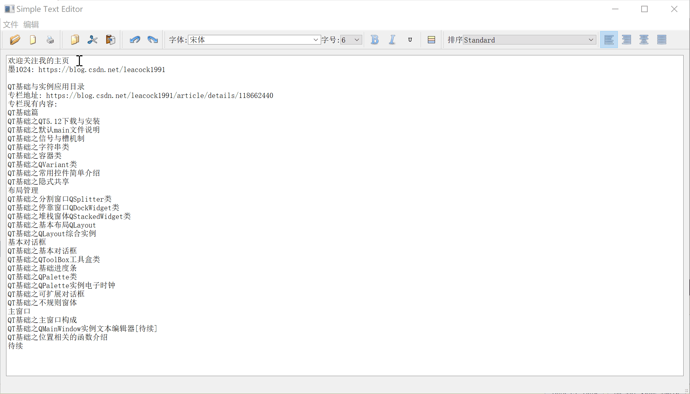


## 实现步骤


### 工程创建

如下图创建`SimpleTextEditor`工程，基类为`QMainWindow`,取消创建界面

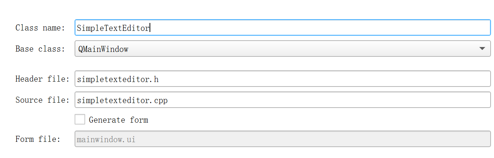

右键工程添加以`QWidget`为基类的中心部件`ShowWidget`

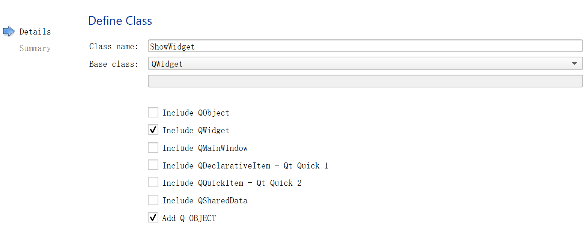

**showwidget.h 文件**

```cpp
class ShowWidget : public QWidget
{
    Q_OBJECT
public:
    explicit ShowWidget(QWidget *parent = nullptr);
    QTextEdit *text;
signals:

};
```


**showwidget.cpp 文件**

```cpp
ShowWidget::ShowWidget(QWidget *parent) : QWidget(parent)
{
    text = new QTextEdit(this);
    QGridLayout *showWidgetLayout = new QGridLayout(this);
    showWidgetLayout->addWidget(text);
}
```


**simpletexteditor.h 文件**

声明实现主窗口所需要的各种元素，包括菜单，工具栏以及各个动作。非最终版

```cpp
class SimpleTextEditor : public QMainWindow
{
    Q_OBJECT

public:
    SimpleTextEditor(QWidget *parent = nullptr);
    ~SimpleTextEditor();

    void CreateAction(); // 创建动作
    void CreateMenus(); // 创建菜单
    void CreateToolBars(); // 创建工具栏

private:
    QString fileName; // 打开的文件名
    ShowWidget *showWidget; //中心部件

    QMenu *fileMenu;    // 文件 菜单
    QMenu *editMenu;    // 编辑 菜单

    // 文件菜单项
    QAction *openFileAction;    // 打开
    QAction *newFileAction;    // 新建
    QAction *printFileAction;    // 打印
    QAction *exitAction;    // 退出

    // 编辑菜单项
    QAction *copyAction;    // 复制
    QAction *cutAction;    // 剪切
    QAction *pasteAction;    // 粘贴
    QAction *undoAction;    // 撤销
    QAction *redoAction;    // 重做
    QAction *aboutAction;    // 关于

    // 工具栏
    QToolBar *fileToolBar; // 文件
    QToolBar *editToolBar; // 编辑
    QToolBar *doToolBar; // undo redo
};
```


**simpletexteditor.cpp 文件**

```cpp
SimpleTextEditor::SimpleTextEditor(QWidget *parent)
    : QMainWindow(parent)
{
    setWindowTitle(tr("Simple Text Editor"));
    showWidget = new ShowWidget(this);
    setCentralWidget(showWidget);
    QStatusBar *statusbar = statusBar();
    statusbar->showMessage("欢迎 Welcome");

    // 创建 动作 菜单 工具栏
    CreateActions();
    CreateMenus();
    CreateToolBars();
}
```

**添加资源和icon**

为了方便管理，将icon放在resources中，由于图标我放在一个文件夹中，对其取了别名方便代码使用

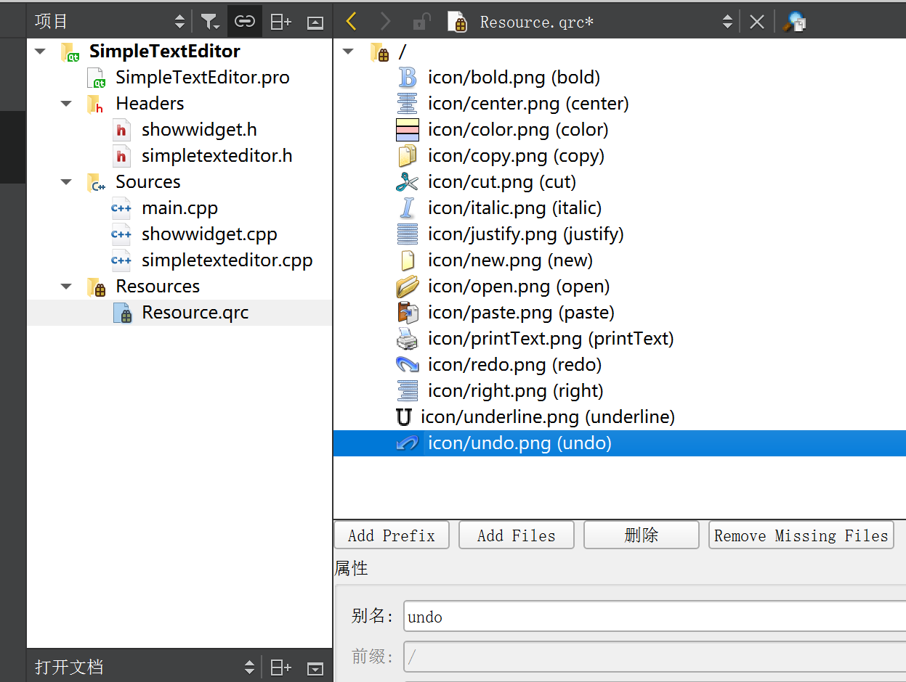


### 菜单与工具栏的实现

菜单与工具都与`QAction`类相关，工具栏上的功能按钮和菜单上的选项对应完成相同的功能，使用相同的快捷键和图标。

#### 动作Action的实现

在函数`SimpleTextEditor::CreateActions()`中实现

```cpp
void SimpleTextEditor::CreateActions()
{
    // 文件菜单项
    // 打开
    //创建打开文件动作同时指定图标、名称和父窗口
    openFileAction = new QAction(QIcon(":/open"),tr("打开"),this);
    // 为 打开文件动作 设置组合快捷键
    openFileAction->setShortcut(tr("Ctrl+O"));
    // 设置 状态栏显示 光标移动到这里时 状态栏显示同时
    openFileAction->setStatusTip(tr("打开一个文件"));

    // 新建
    newFileAction = new QAction(QIcon(":/new"),tr("新建"),this);
    newFileAction->setShortcut(tr("Ctrl+N"));
    newFileAction->setStatusTip(tr("新建一个文件"));

    // 打印
    printFileAction = new QAction(QIcon(":/printText"),tr("打印文本"),this);
    printFileAction->setStatusTip(tr("打印一个文本"));

    // 退出
    exitAction = new QAction(tr("退出"),this);
    exitAction->setShortcut(tr("Ctrl+Q"));
    exitAction->setStatusTip(tr("退出 程序"));
    connect(exitAction,SIGNAL(triggered()),this,SLOT(close()));

    // 编辑菜单项
    // 复制
    copyAction = new QAction(QIcon(":/copy"),tr("复制"),this);
    copyAction->setShortcut(tr("Ctrl+C"));
    copyAction->setStatusTip(tr("复制文件"));
    connect(copyAction,SIGNAL(triggered()),showWidget->text,SLOT(copy()));

    // 剪切
    cutAction = new QAction(QIcon(":/cut"),tr("剪切"),this);
    cutAction->setShortcut(tr("Ctrl+X"));
    cutAction->setStatusTip(tr("剪切文件"));
    connect(cutAction,SIGNAL(triggered()),showWidget->text,SLOT(cut()));

    // 粘贴
    pasteAction = new QAction(QIcon(":/paste"),tr("粘贴"),this);
    pasteAction->setShortcut(tr("Ctrl+P"));
    pasteAction->setStatusTip(tr("粘贴文件"));
    connect(pasteAction,SIGNAL(triggered()),showWidget->text,SLOT(copy()));

    // 撤销
    undoAction = new QAction(QIcon(":/undo"),tr("撤销"),this);
    undoAction->setShortcut(tr("Ctrl+Z"));
    undoAction->setStatusTip(tr("撤销"));
    connect(undoAction,SIGNAL(triggered()),showWidget->text,SLOT(undo()));

    // 重做
    redoAction = new QAction(QIcon(":/redo"),tr("重做"),this);
    redoAction->setShortcut(tr("Ctrl+Y"));
    redoAction->setStatusTip(tr("重做"));
    connect(redoAction,SIGNAL(triggered()),showWidget->text,SLOT(redo()));

    // 关于
    // 也可不指定图标，通常只在菜单中出现，不在工具栏上显示
    aboutAction = new QAction(tr("关于"),this);
    connect(aboutAction,SIGNAL(triggered()),this,SLOT(QApplication::aboutQt()));
}
```

#### 菜单（Menus）的实现

在函数`SimpleTextEditor::CreateMenus()`中实现

```cpp
void SimpleTextEditor::CreateMenus()
{
    // 文件菜单
    // menuBar() 获取主窗口的菜单栏指针
    // addMenu() 向菜单栏中插入一个新菜单
    fileMenu = menuBar()->addMenu(tr("文件"));
    fileMenu->addAction(openFileAction); // 插入菜单项
    fileMenu->addAction(newFileAction);
    fileMenu->addSeparator();
    fileMenu->addAction(printFileAction);
    fileMenu->addSeparator();
    fileMenu->addAction(exitAction);

    // 编辑菜单项
    editMenu = menuBar()->addMenu(tr("编辑"));
    editMenu->addAction(copyAction); // 插入菜单项
    editMenu->addAction(cutAction);
    editMenu->addAction(pasteAction);
    fileMenu->addSeparator();
    editMenu->addAction(undoAction);
    editMenu->addAction(redoAction);
    fileMenu->addSeparator();
    editMenu->addAction(aboutAction);
}
```


#### 工具（ToolBars）的实现

在函数`SimpleTextEditor::CreateToolBars()`中实现

```cpp
void SimpleTextEditor::CreateToolBars()
{
    // 文件 工具栏
    fileToolBar = addToolBar(tr("File"));
    fileToolBar->addAction(openFileAction);
    fileToolBar->addAction(newFileAction);
    fileToolBar->addAction(printFileAction);

    // 编辑 工具栏
    editToolBar = addToolBar(tr("Edit"));
    editToolBar->addAction(copyAction);
    editToolBar->addAction(cutAction);
    editToolBar->addAction(pasteAction);

    // undo redo 工具栏
    doToolBar = addToolBar(tr("UndoRedo"));
    doToolBar->addAction(undoAction);
    doToolBar->addAction(redoAction);
}
```

#### 阶段展示

菜单、工具栏、中心部件、状态栏

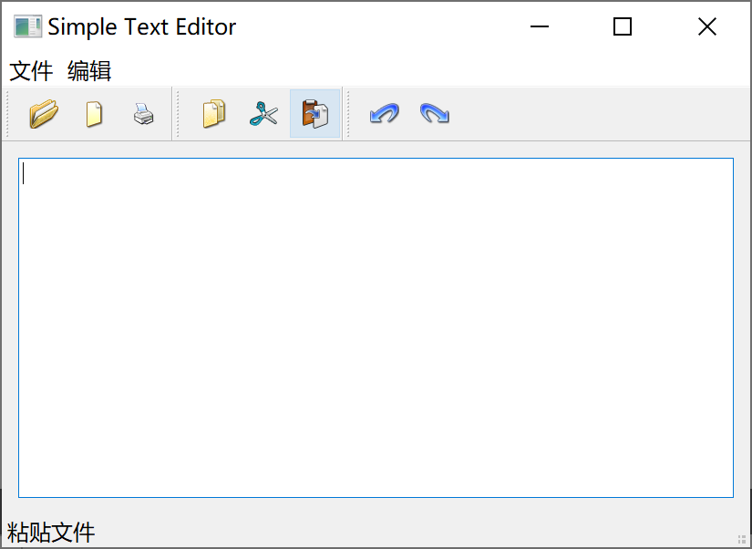

### 文件操作功能的实现

实现新建文件、打开文件以及打印文件的功能

#### 新建文件


在`simpletexteditor.h `中添加槽函数`NewFile`

```cpp
...
    void CreateToolBars(); // 创建工具栏
protected slots:
    void NewFile(); // 新建文件
private:
...
```

在`simpletexteditor.cpp`中实现槽函数`NewFile`

```cpp
void SimpleTextEditor::NewFile()
{
    SimpleTextEditor *newsimpleTextEditor = new SimpleTextEditor();
    newsimpleTextEditor->show();
}
```


在函数`SimpleTextEditor::CreateActions()`中`新建`Action处添加`connect`

```cpp
...
    // 新建
    newFileAction = new QAction(QIcon(":/new"),tr("新建"),this);
    newFileAction->setShortcut(tr("Ctrl+N"));
    newFileAction->setStatusTip(tr("新建一个文件"));
    connect(newFileAction,SIGNAL(triggered()),this,SLOT(NewFile()));

    // 打印
...
```


#### 打开文件

利用标准文件对话框（参见 [QT基础之基本对话框](https://blog.csdn.net/leacock1991/article/details/124743667)）`QFileDialog`打开一个已经存在的文件。若当期中心部件已有打开的文件，则在一个新的窗口中打开选定的文件；若没有则在当期窗体打开。


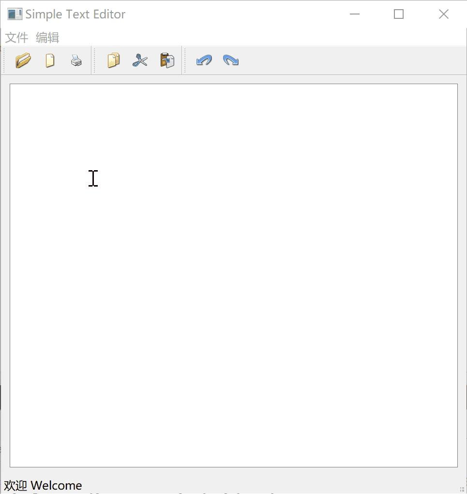


在`simpletexteditor.h `中添加槽函数`OpenFile` 和文件加载函数 `LoadFile`

```cpp
...
protected slots:
    void NewFile(); // 新建文件
    void OpenFile(); // 打开文件
private:
    void LoadFile(QString fileName); // 加载文件
private:
...
```

在`simpletexteditor.cpp`中实现槽函数`OpenFile` 和文件加载函数 `LoadFile`

```cpp
void SimpleTextEditor::OpenFile()
{
    fileName = QFileDialog::getOpenFileName(this,tr("Open file dialog"),tr("D:\\"));// 可以限制下文件类型
    if(!fileName.isEmpty()){
        // 判断当前中心部件是否已有文件打开
        if(showWidget->text->document()->isEmpty()){
            LoadFile(fileName); // 加载文件
        } else {
            // 新建加载
            SimpleTextEditor *newsimpleTextEditor = new SimpleTextEditor();
            newsimpleTextEditor->show();
            newsimpleTextEditor->LoadFile(fileName);
        }
    }
}

void SimpleTextEditor::LoadFile(QString fileName)
{
    qDebug() << tr("Load file : ") << fileName;
    QFile file(fileName);
    if(file.open(QIODevice::ReadOnly | QIODevice::Text)){
        QTextStream textStream(&file);
        // 注打开文本需要为 UTF-8
        textStream.setCodec("UTF-8");//设置文件流编码方式, 否则可能会乱码
        while(!textStream.atEnd()){
            showWidget->text->append(textStream.readLine());
        }
        qDebug() << tr("Read file end");
    }
}
```


在函数`SimpleTextEditor::CreateActions()`中`打开`Action处添加`connect`

```cpp
...
// 设置 状态栏显示 光标移动到这里时 状态栏显示同时
    openFileAction->setStatusTip(tr("打开一个文件"));
    connect(openFileAction,SIGNAL(triggered()),this,SLOT(OpenFile()));

    // 新建
    newFileAction = new QAction(QIcon(":/new"),tr("新建"),this);
...
```

#### 打印文件

使用标准打印对话款`QPrintDialog`实现文本打印功能

注意：需要在 （.pro）工程文件中加入 `QT+= printsupport `，变为 `QT       += core gui printsupport`


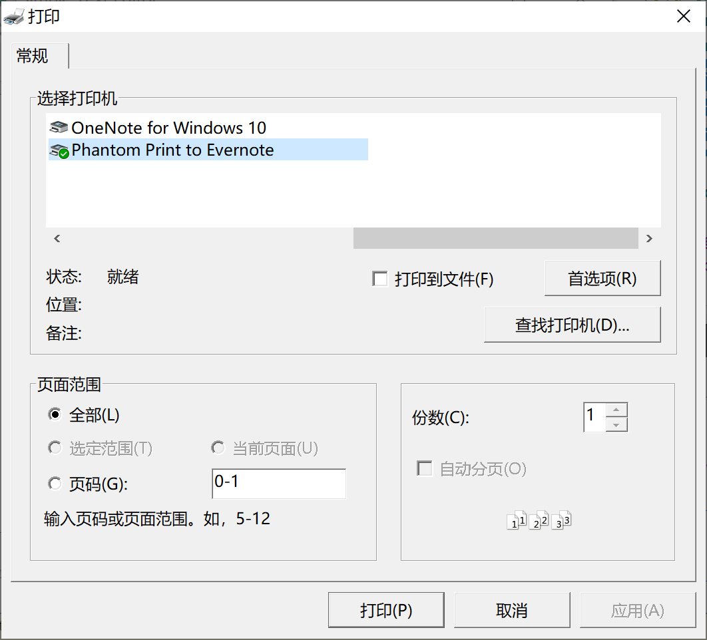

在`simpletexteditor.h `中添加槽函数`PrintFile`

```cpp
...
protected slots:
    void NewFile(); // 新建文件
    void OpenFile(); // 打开文件
    void PrintFile(); // 打印文件
private:
...
```

在`simpletexteditor.cpp`中实现槽函数`PrintFile`

```cpp
void SimpleTextEditor::LoadFile(QString fileName)
{
    qDebug() << tr("Load file : ") << fileName;
    QFile file(fileName);
    if(file.open(QIODevice::ReadOnly | QIODevice::Text)){
        QTextStream textStream(&file);
        // 注打开文本需要为 UTF-8
        textStream.setCodec("UTF-8");//设置文件流编码方式, 否则可能会乱码
        while(!textStream.atEnd()){
            showWidget->text->append(textStream.readLine());
        }
        qDebug() << tr("Read file end");
    }
}
```


在函数`SimpleTextEditor::CreateActions()`中`打印`Action处添加`connect`

```cpp
...
	// 打印
    printFileAction = new QAction(QIcon(":/printText"),tr("打印文本"),this);
    printFileAction->setStatusTip(tr("打印一个文本"));
    connect(printFileAction,SIGNAL(triggered()),this,SLOT(PrintFile()));
...
```

### 文本编辑功能

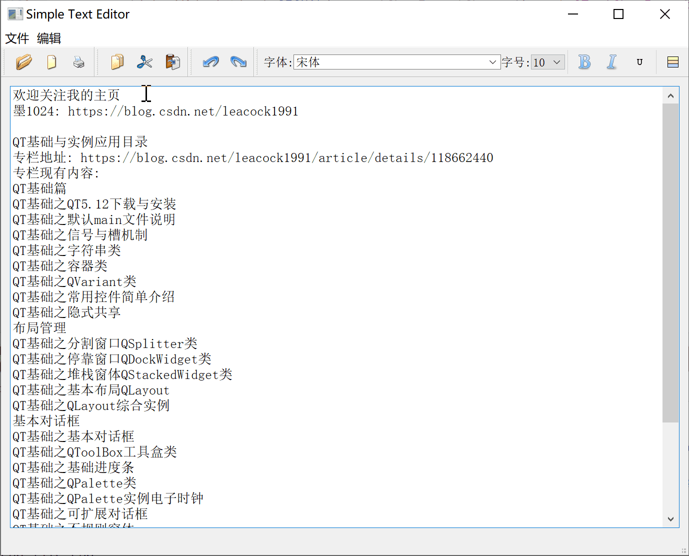


在编写包含格式设置的文本编辑程序时，经常用到的 Qt 类有 `QTextEdit 、QTextDocument 、QTextBlock 、QTextList 、QTextFrame 、QTextTable 、QTextCharFormat 、QTextBlockFormat 、QTextListFormat 、QTextFrameFormat 和 QTextTableFormat` 等。
  文本编辑器各类之间的划分与关系如下图所示：

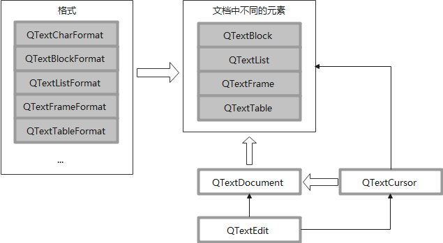


- 任何一个文本编辑器的程序都要用 `QTextEdit` 作为输入文本的容器
-  `QTextEdit`中可编辑文本由 `QTextDocument` 作为载体
- `QTextDocument`的不同元素：`QTextBolck 、QTextList 、QTextFrame` 等，可以表示为字符串、段落、列表、表格或图片等
- 每种元素都有自己的格式，这些格式则用 `QTextCharFormat 、QTextBlockFormat 、QTextListFormat 、QTextFrameFormat` 等类来描述与实现，例如，`QTextBlockFormat` 类对应于 `QTextBlock` 类，`QTextBlock` 类用于表示一块文本，通常可以理解为一个段落，但它并不仅指段落；`QTextBlockFormat` 类则表示这一块文本的格式，如缩进的值、与四边的边距等。
-  `QTextCursor `类用于表示编辑文本中的光标，提供了对 `QTextDocument` 文档的修改接口，所有对文档格式的修改，都与光标有关。例如，改变字符的格式，实际上指的是改变光标处字符的格式。又例如，改变段落的格式，实际上指的是改变光标所在段落的格式。


在 `simpletexteditor.h`中添加槽函数和各个变量

```cpp
protected slots:
	...
    void SetFontComboBox(QString comboStr); // 设置 字体
    void SetSizeSpinBox(QString spinValue); // 设置 字号
    void SetBoldBtn(); // 设置 加粗
    void SetItalicBtn(); // 设置 斜体
    void SetUnderlineBtn(); // 设置 下划线
    void SetColorBtn(); // 设置 颜色
    void ShowCurrentFormatChanged(const QTextCharFormat &fmt); // 根据光标处字体格式 变化刷新 工具上的显示
	...
private:
    ...
    // 文本编辑 字体相关设置
    // 字体设置项
    QLabel *fontLabel1;
    QFontComboBox *fontComboBox;
    // 字号
    QLabel *fontLabel2;
    QComboBox *sizeComboBox;
    // 加粗 按钮
    QToolButton *boldBtn;
    // 斜体 按钮
    QToolButton *italicBtn;
    // 下划线 按钮
    QToolButton *underlineBtn;
    // 颜色 按钮
    QToolButton *colorBtn;
    // 字体工具栏
    QToolBar *fontToolBar;
 	...
```

在 `SimpleTextEditor::SimpleTextEditor`构造函数中添加，函数`CreateFontToolBar`创建文本编辑字体项工具栏

```cpp
    ...
	CreateToolBars();
    // 创建 文本编辑 字体项 工具栏
    CreateFontToolBar();
	...
```


添加`void SimpleTextEditor::CreateFontToolBar()`函数

```cpp
void SimpleTextEditor::CreateFontToolBar()
{
    // 设置 字体
    fontLabel1 =new QLabel(tr("字体:"));
    fontComboBox =new QFontComboBox;
    // 调用 QFontComboBox 的 setFontFilters 接口可过滤只在下拉列表框中显示某一类字体
    // 默认情况下为 QFontComboBox::AllFonts 列出所有字体。
    fontComboBox->setFontFilters(QFontComboBox::ScalableFonts); // ScalableFonts 显示可缩放字体

    // 设置 字号
    fontLabel2 =new QLabel(tr("字号:"));
    sizeComboBox =new QComboBox;
    QFontDatabase db; // QFontDatabase 表示系统所有可用的格式信息，主要是字体和字号
    // standardSizes 返回可用标准字号列表
    foreach(int size,db.standardSizes()){
        sizeComboBox->addItem(QString::number(size));
    }
    // 设置 加粗
    boldBtn =new QToolButton;
    boldBtn->setIcon(QIcon(":/bold"));
    boldBtn->setCheckable(true);

    // 设置 斜体
    italicBtn =new QToolButton;
    italicBtn->setIcon(QIcon(":/italic"));
    italicBtn->setCheckable(true);

    // 设置 下划线
    underlineBtn =new QToolButton;
    underlineBtn->setIcon(QIcon(":/underline"));
    underlineBtn->setCheckable(true);

    // 设置 颜色
    colorBtn =new QToolButton;
    colorBtn->setIcon(QIcon(":/color"));
    colorBtn->setCheckable(true);

    // 事件关联
    // 设置 字体
    connect(fontComboBox,SIGNAL(activated(QString)),
        this,SLOT(SetFontComboBox(QString)));
    // 设置 字号
    connect(sizeComboBox,SIGNAL(activated(QString)),
        this,SLOT(SetSizeSpinBox(QString)));
    // 设置 加粗
    connect(boldBtn,SIGNAL(clicked()),this,SLOT(SetBoldBtn()));
    // 设置 斜体
    connect(italicBtn,SIGNAL(clicked()),this,SLOT(SetItalicBtn()));
    // 设置 下划线
    connect(underlineBtn,SIGNAL(clicked()),this,SLOT(SetUnderlineBtn()));
    // 设置 颜色
    connect(colorBtn,SIGNAL(clicked()),this,SLOT(SetColorBtn()));
    // 根据光标处字体格式 变化刷新 工具上的显示
    connect(showWidget->text,SIGNAL(currentCharFormatChanged(QTextCharFormat&)),this,SLOT(ShowCurrentFormatChanged(QTextCharFormat&)));

    // 字体 工具条
    fontToolBar =addToolBar("Font");
    fontToolBar->addWidget(fontLabel1); // 设置 字体
    fontToolBar->addWidget(fontComboBox);
    fontToolBar->addWidget(fontLabel2); // 设置 字号
    fontToolBar->addWidget(sizeComboBox);
    fontToolBar->addSeparator();
    fontToolBar->addWidget(boldBtn); // 设置 加粗
    fontToolBar->addWidget(italicBtn); // 设置 斜体
    fontToolBar->addWidget(underlineBtn); // 设置 下划线
    fontToolBar->addSeparator();
    fontToolBar->addWidget(colorBtn);   // 设置 颜色
}
```

#### 设置字体

在`simpletexteditor.cpp`中实现槽函数`SetFontComboBox`

```cpp
void SimpleTextEditor::SetFontComboBox(QString comboStr)
{
    QTextCharFormat fmt;
    fmt.setFontFamily(comboStr);
    SetTextCharFormat(fmt);
}
```

在 `simpletexteditor`类中添加函数 `SetTextCharFormat`用于应用格式到 `QTextEdit`中的可编辑文本载体 `QTextDocument` 。

**函数 `SimpleTextEditor::SetTextCharFormat`**

所有对 `QTextDocument` 的修改都通过`QTextCursor`类完成

```cpp
void SimpleTextEditor::SetTextCharFormat(QTextCharFormat format)
{
    // 获取 编辑框中的光标
    QTextCursor cursor = showWidget->text->textCursor();

    if(!cursor.hasSelection()){ // 判断是否有选择 区域
        // 没有 就选取所在词作为选取 由前后 空格或， . 等标点符号区分词
        cursor.select(QTextCursor::WordUnderCursor);
        /*
        enum SelectionType {
            WordUnderCursor, // 选择光标下的单词。 如果光标不在可选字符的字符串中，则不选择文本。
            LineUnderCursor,	// 选择光标下的文本行。
            BlockUnderCursor, // 选择光标下的文本块。
            Document 		 // 选择整个文档。
        };
        */

    }
    cursor.mergeCharFormat(format); // 将格式应用到光标所在区域
    showWidget->text->mergeCurrentCharFormat(format); // 将格式应用到cursor选区内所有字符上
}
```

#### 设置字号

在`simpletexteditor.cpp`中实现槽函数`SetSizeSpinBox`

```cpp
void SimpleTextEditor::SetSizeSpinBox(QString spinValue)
{
    QTextCharFormat fmt;
    fmt.setFontPointSize(spinValue.toFloat());
    showWidget->text->mergeCurrentCharFormat(fmt);
}
```

#### 设置文字加粗

在`simpletexteditor.cpp`中实现槽函数`SetBoldBtn`

```cpp
void SimpleTextEditor::SetBoldBtn()
{
    QTextCharFormat fmt;
    if(boldBtn->isChecked()){
        fmt.setFontWeight(QFont::Bold);
    } else {
        fmt.setFontWeight(QFont::Normal);
    }
    showWidget->text->mergeCurrentCharFormat(fmt);
}
```


#### 设置文字斜体

在`simpletexteditor.cpp`中实现槽函数`SetItalicBtn`

```cpp
void SimpleTextEditor::SetItalicBtn()
{
    QTextCharFormat fmt;
    fmt.setFontItalic(italicBtn->isChecked());
    showWidget->text->mergeCurrentCharFormat(fmt);
}
```


#### 设置文字下划线

在`simpletexteditor.cpp`中实现槽函数`SetUnderlineBtn`

```cpp
void SimpleTextEditor::SetUnderlineBtn()
{
    QTextCharFormat fmt;
    fmt.setFontUnderline(underlineBtn->isChecked());
    showWidget->text->mergeCurrentCharFormat(fmt);
}
```


#### 设置文字颜色

在`simpletexteditor.cpp`中实现槽函数`SetColorBtn`

```cpp
void SimpleTextEditor::SetColorBtn()
{
    QColor color = QColorDialog::getColor(Qt::red,this);
    if(color.isValid()){ // 可用
        QTextCharFormat fmt;
        fmt.setForeground(color);
        showWidget->text->mergeCurrentCharFormat(fmt);
    }
}
```


#### 刷新工具栏信息

在`simpletexteditor.cpp`中实现槽函数`ShowCurrentFormatChanged`

```cpp
void SimpleTextEditor::ShowCurrentFormatChanged(const QTextCharFormat &fmt)
{
    // 字体
    fontComboBox->setCurrentIndex(fontComboBox->findText(fmt.fontFamily()));
    // 字号
    sizeComboBox->setCurrentIndex(sizeComboBox->findText(QString::number(fmt.fontPointSize())));
    // 是否 加粗
    boldBtn->setChecked(fmt.font().bold());
    // 是否 斜体
    italicBtn->setChecked(fmt.font().italic());
    // 是否 下划线
    underlineBtn->setChecked(fmt.font().underline());
}
```


### 排版功能

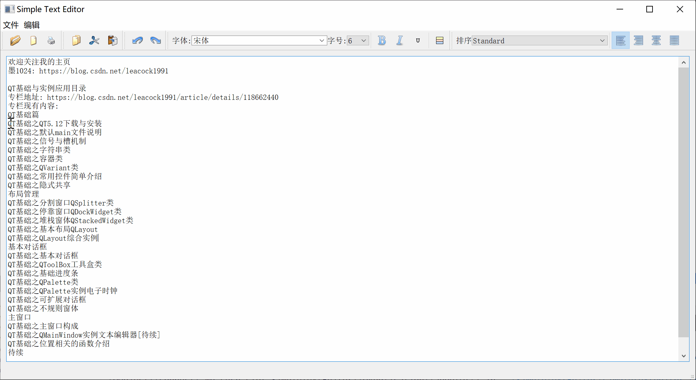

这里介绍文本段落对齐方式和和文本排列方式的功能实现

对齐方式： 左对齐、右对齐、居中和两端对齐

排列方式： 一个实心圆圈、一个空心圆圈、一个实心正方形、按升序排列的十进制值、按降序的拉丁字母、按升序的拉丁字母、按降序的罗马字母、按升序的罗马字母

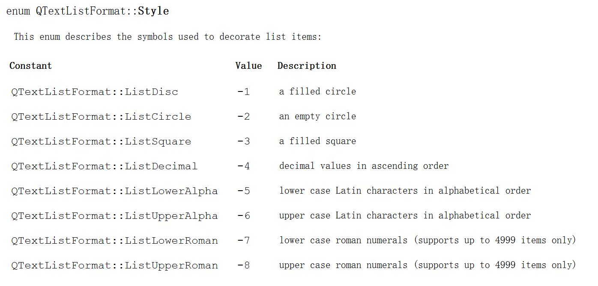

​    

在 `simpletexteditor.h`中添加槽函数和各个变量

```cpp
protected slots:
	...
    // 排版设置项
    void SetAlignment (QAction *act); // 设置 段落对齐方式
    void SetList(int index); // 设置排序
    void ShowCursorPositionChanged(); // 光标位置发生变化 刷新 排版工具栏的显示
	...
private:
	...
    // 排版设置项
    // 文本排序 方式
    QLabel *listLabel;
    QComboBox *listComboBox;
    // 文本段落对其方式
    QActionGroup *actGrp;
    QAction *leftAction; // 左对齐
    QAction *rightAction; // 右对齐
    QAction *centerAction; // 居中对齐
    QAction *justifyAction; // 两端对齐
    // 排版工具栏
    QToolBar *listToolBar;
```

在函数`SimpleTextEditor::CreateActions()`中添加Action

```cpp
void SimpleTextEditor::CreateActions()
{
	...
    //排序：左对齐、右对齐、居中和两端对齐
    actGrp =new QActionGroup(this);
    leftAction =new QAction(QIcon(":/left"),"左对齐",actGrp);
    leftAction->setCheckable(true);
    rightAction =new QAction(QIcon(":/right"),"右对齐",actGrp);
    rightAction->setCheckable(true);
    centerAction =new QAction(QIcon(":/center"),"居中",actGrp);
    centerAction->setCheckable(true);
    justifyAction =new QAction(QIcon(":/justify"),"两端对齐",actGrp);
    justifyAction->setCheckable(true);
    connect(actGrp,SIGNAL(triggered(QAction*)),this,SLOT(SetAlignment (QAction*)));

}
```


在 `SimpleTextEditor::SimpleTextEditor`构造函数中添加，函数`CreateTypesettingToolbar`排版 工具栏包含对齐方式和排序方式

```cpp
	...
    // 创建 排版 工具栏 对齐方式和排序方式
    CreateTypesettingToolbar();
```


添加`void SimpleTextEditor::CreateTypesettingToolbar()`函数

```cpp
void SimpleTextEditor::CreateTypesettingToolbar()
{
    listLabel = new QLabel(tr("排序"));
    listComboBox = new QComboBox;
    // 排序方式 列表 参见 QT帮助手册
    listComboBox->addItem("Standard"); // 不设置
    listComboBox->addItem("QTextListFormat::ListDisc"); // 一个实心圆圈
    listComboBox->addItem("QTextListFormat::ListCircle"); // 一个空心圆圈
    listComboBox->addItem("QTextListFormat::ListSquare"); // 一个实心正方形
    listComboBox->addItem("QTextListFormat::ListDecimal"); // 按升序排列的十进制值
    listComboBox->addItem("QTextListFormat::ListLowerAlpha"); // 按降序的拉丁字母
    listComboBox->addItem("QTextListFormat::ListUpperAlpha"); // 按升序的拉丁字母
    listComboBox->addItem("QTextListFormat::ListLowerRoman"); // 按降序的罗马字母
    listComboBox->addItem("QTextListFormat::ListUpperRoman"); // 按升序的罗马字母

    // 事件关联
    // 设置列表
    connect(listComboBox,SIGNAL(activated(int)),this,SLOT(SetList(int)));
    // 光标位置发生变化 刷新 排版工具栏的显示, 例如 是否使能对齐按钮
    connect(showWidget->text,SIGNAL(cursorPositionChanged()),
          this,SLOT(ShowCursorPositionChanged()));
    // 是否使能 undo redo 按钮
    connect(showWidget->text->document(),SIGNAL(undoAvailable(bool)),
          redoAction,SLOT(setEnabled(bool)));
    connect(showWidget->text->document(),SIGNAL(redoAvailable(bool)),
          redoAction,SLOT(setEnabled(bool)));

    // 排版工具条
    // 排列方式
    listToolBar =addToolBar("list");
    listToolBar->addWidget(listLabel);
    listToolBar->addWidget(listComboBox);
    listToolBar->addSeparator();
    // 对齐方式
    listToolBar->addActions(actGrp->actions());

}
```

#### 

#### 段落对齐

通过 `setAlignment` 设置当前段落对齐方式

```cpp
void SimpleTextEditor::SetAlignment(QAction *act)
{
    // 通过 setAlignment 设置当前段落对齐方式
    if(act==leftAction) {  // 左对齐
        showWidget->text->setAlignment(Qt::AlignLeft);
    }
    if(act==rightAction) { // 右对齐
        showWidget->text->setAlignment(Qt::AlignRight);
    }
    if(act==centerAction) { // 居中对齐
        showWidget->text->setAlignment(Qt::AlignCenter);
    }
    if(act==justifyAction) { // 两端对齐
        showWidget->text->setAlignment(Qt::AlignJustify);
    }
}
```

响应光标位置发生变化`cursorPositionChanged`， 刷新 排版工具栏的显示

```cpp
void SimpleTextEditor::ShowCursorPositionChanged()
{
    if(showWidget->text->alignment()==Qt::AlignLeft) {
        leftAction->setChecked(true);
    }
    if(showWidget->text->alignment()==Qt::AlignRight) {
        rightAction->setChecked(true);
    }
    if(showWidget->text->alignment()==Qt::AlignCenter) {
        centerAction->setChecked(true);
    }
    if(showWidget->text->alignment()==Qt::AlignJustify) {
        justifyAction->setChecked(true);
    }
}
```

#### 文本排序

用于描述文本排序格式的 `QTextListFormat` 包含两个基本的属性：一个为 `QTextListFormat::style`，表示文本采用哪种排序方式；另一个为 `QTextListFormat::indent`，表示排序后的缩进值。因此，若要实现文本排序的功能，则只需要设置好`QTextListFormat` 的以上两个属性，并将整个格式通过 `QTextCursor` 类应用到文本中即可。

通常的文本编辑器中，`QTextListFormat` 的缩进值 `indent` 都是预设好的，并不需要由用户设定。本实例在程序中通过获取当前文本段 `QTextBlockFormat` 的缩进值来进行相应的计算的方法，以获得排序文本的缩进值。

通过 `SetList`设置文本排序

```cpp
void SimpleTextEditor::SetList(int index)
{
    //获得编辑框的QTextCursor对象指针
    QTextCursor cursor=showWidget->text->textCursor();
    if(index!=0) { // 不是选择 Standard
        QTextListFormat::Style style=QTextListFormat::ListDisc;
        switch(index) {  //设置style属性值
        case 1:{
            style=QTextListFormat::ListDisc;
            break;
        }
        case 2: {
            style=QTextListFormat::ListCircle;
            break;
        }
        case 3:{
            style=QTextListFormat::ListSquare;
            break;
        }
        case 4:{
            style=QTextListFormat::ListDecimal;
            break;
        }
        case 5:{
            style=QTextListFormat::ListLowerAlpha;
            break;
        }
        case 6:{
            style=QTextListFormat::ListUpperAlpha;
            break;
        }
        case 7:{
            style=QTextListFormat::ListLowerRoman;
            break;
        }
        case 8:{
            style=QTextListFormat::ListUpperRoman;
            break;
        }
        default:
            break;
        }
        /* 设置缩进值 */
        // beginEditBlock 和 endEditBlock 成对出现
        cursor.beginEditBlock();
        QTextBlockFormat blockFmt=cursor.blockFormat();
        QTextListFormat listFmt;
        if(cursor.currentList()) { // 存在
            listFmt = cursor.currentList()->format(); // 列表的格式
        } else {
            // 如果没有  则列表缩进值 + 1
            listFmt.setIndent(blockFmt.indent()+1);
            blockFmt.setIndent(0); //
            cursor.setBlockFormat(blockFmt); // 设置块格式
        }
        listFmt.setStyle(style);
        cursor.createList(listFmt);
        cursor.endEditBlock();
    } else {
        QTextBlockFormat bfmt;
        bfmt.setObjectIndex(0); // 设置格式对象的对象索引；
        cursor.mergeBlockFormat(bfmt); // 合并当前块格式
    }
}
```


注意：

```cpp
cursor.beginEditBlock();
…
cursor.endEditBlock();
```

此段代码完成 `QTextListFormat` 的 `indent `（即缩进值）的设定，并将设置的格式应用到光标所在的文本处。
以 `cursor.beginEditBlock()` 开始，以 `cursor.endEditBlock()` 结束，这两个函数的作用是设定这两个函数之间的所有操作相当于一个动作。如果需要进行撤销或恢复，则这两个函数之间的所有操作将同时被撤销或恢复，这两个函数通常成对出现。

为了刷新工具栏的排序下拉菜单的显示在函数`ShowCursorPositionChanged`中添加如下代码

```cpp
void SimpleTextEditor::ShowCursorPositionChanged()
{
	...
    QTextListFormat listFmt;
    QTextCursor cursor=showWidget->text->textCursor();
    QString text = "Standard";
    if(cursor.currentList()) { // 存在
        listFmt = cursor.currentList()->format(); // 列表的格式
        QTextListFormat::Style style = listFmt.style();
        switch(style) {  //设置style属性值
        case QTextListFormat::ListDisc:{
            text = "QTextListFormat::ListDisc";
            break;
        }
        case QTextListFormat::ListCircle: {
            text = "QTextListFormat::ListCircle";
            break;
        }
        case QTextListFormat::ListSquare:{
            text = "QTextListFormat::ListSquare";
            break;
        }
        case QTextListFormat::ListDecimal:{
            text = "QTextListFormat::ListDecimal";
            break;
        }
        case QTextListFormat::ListLowerAlpha:{
            text = "QTextListFormat::ListLowerAlpha";
            break;
        }
        case QTextListFormat::ListUpperAlpha:{
            text = "QTextListFormat::ListUpperAlpha";
            break;
        }
        case QTextListFormat::ListLowerRoman:{
            text = "QTextListFormat::ListLowerRoman";
            break;
        }
        case QTextListFormat::ListUpperRoman:{
            text = "QTextListFormat::ListUpperRoman";
            break;
        }
        default:
            text = "Standard";
            break;
        }
    }
    listComboBox->setCurrentIndex(listComboBox->findText(text));
}

```

### main函数添加

```cpp
QFont f("楷体",12);            //设置显示的字体格式
a.setFont(f);
```


希望我的文章对于大家有帮助，由于个人能力的局限性，文中可能存在一些问题，欢迎指正、补充！

