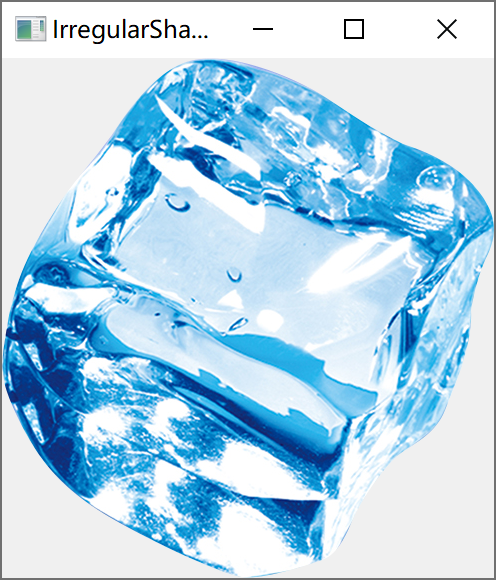

[TOC]

更多参见
[QT基础与实例应用目录](https://blog.csdn.net/leacock1991/article/details/118662440)

### 代码链接

GitHub链接 ：[IrregularShapeExample](https://github.com/lichangke/QT/tree/main/CodeDemo/CH4/CH407/IrregularShapeExample)

### 简介

常见的对话框窗体是各种方形，但是有时也需要使用非方形的窗体，比如圆形、椭圆形、甚至不规则形状的对话框。这是就要利用`setMask`函数为窗体设置遮罩来实现不规则窗体。设置遮罩后的窗体其尺寸还是原窗体大小，只是被遮罩的地方不可见。

注意：

1、如何按给出图片形状生成不规则的窗体

```cpp
    QPixmap pix;
    pix.load(":/shape.png"); 
    resize(pix.size()); // 1、获取图片的size并将图片
    setMask(QBitmap(pix.mask()));// 2、设置遮罩  mask() 获取pix图片自身的遮罩
    // 此时窗体变为 shape.png 的形状，但是是空白的
```


如果不`setMask`将会生成如下窗体




2、不要忘记重写`paintEvent`将图片绘制上去

```cpp
void ShapeWidget::paintEvent(QPaintEvent *event)
{
    // 在窗体上绘制图片
    QPainter painter(this);
    painter.drawPixmap(0,0,QPixmap(":/shape.png"));
}
```


### 代码展示

**头文件**

```cpp
class ShapeWidget : public QWidget
{
    Q_OBJECT

public:
    ShapeWidget(QWidget *parent = nullptr);
    ~ShapeWidget();
protected:
    void mouseMoveEvent(QMouseEvent *event) override;
    void mousePressEvent(QMouseEvent *event) override;
    void paintEvent(QPaintEvent *event) override;
private:
    QPoint dragPosition; // 记录拖拽时 鼠标点击位置 与 窗体左上角的 偏移
};
```

**Cpp文件**

```cpp
ShapeWidget::ShapeWidget(QWidget *parent)
    : QWidget(parent)
{
    QPixmap pix;
    pix.load(":/shape.png");
    resize(pix.size());
    setMask(QBitmap(pix.mask()));// 设置遮罩  mask() 获取pix图片自身的遮罩
    // 此时窗体变为 shape.png 的形状，但是是空白的
}

ShapeWidget::~ShapeWidget()
{
}

void ShapeWidget::mouseMoveEvent(QMouseEvent *event)
{
    if(event->buttons() & Qt::LeftButton){
        move(event->globalPos() - dragPosition);
        event->accept();
    }
}

void ShapeWidget::mousePressEvent(QMouseEvent *event)
{
    if(event->button() == Qt::LeftButton){
        dragPosition = event->globalPos() - frameGeometry().topLeft();
        event->accept();
    }
    if(event->button() == Qt::RightButton){
        close();
    }
}

void ShapeWidget::paintEvent(QPaintEvent *event)
{
    // 在窗体上绘制图片
    QPainter painter(this);
    painter.drawPixmap(0,0,QPixmap(":/shape.png"));
}
```


希望我的文章对于大家有帮助，由于个人能力的局限性，文中可能存在一些问题，欢迎指正、补充！

