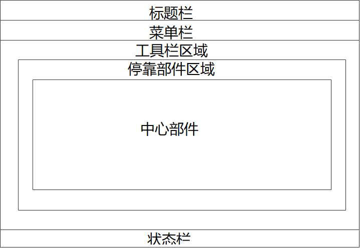
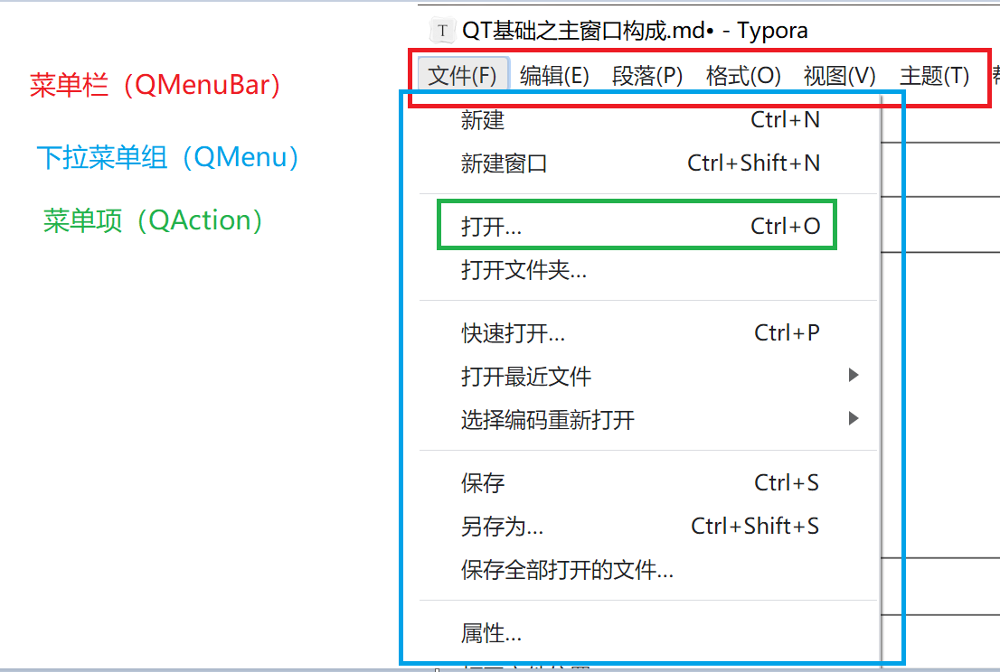
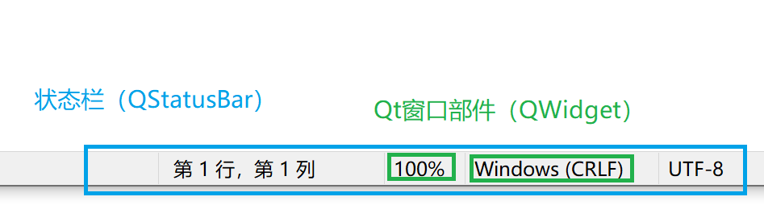
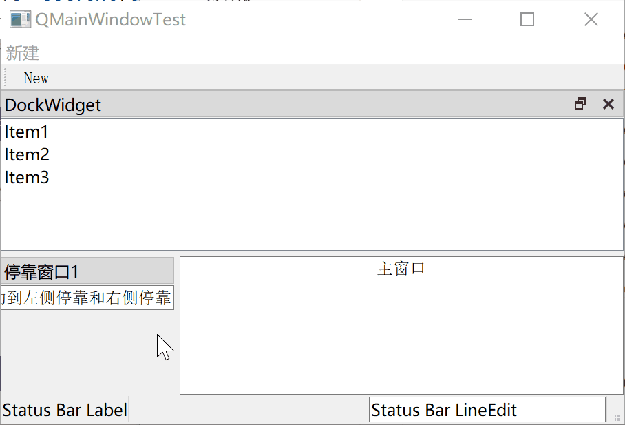

[TOC]

更多参见
[QT基础与实例应用目录](https://blog.csdn.net/leacock1991/article/details/118662440)

### 代码链接

GitHub链接 ：[QMainWindowTest](https://github.com/lichangke/QT/tree/main/CodeDemo/CH5/QMainWindowTest/QMainWindowTest)


### 介绍

主窗口`QMainWindow`是一个为用户提供主窗口程序的类，包含

- 一个菜单栏(menu bar)
- 多个工具栏(tool bar)
- 多个停靠部件(dock widget)
- 一个状态栏(status bar)
- 一个中心部件(central widget)

主窗口是与用户进行长时间交互的顶层窗口，程序的绝大多数功能直接由主窗口提供，主窗口通常是应用程序启动后显示的第一个窗口，QMainWindow是Qt中主窗口的基类。



### 菜单栏

在Qt中提供与菜单相关的操作，提供一系列命令列表。Qt使用`Action`表示这些命令，并实现菜单、工具栏按钮、键盘快捷方式等命令的一致性。位于主窗口标题栏下面。



在Qt主窗口中创建菜单：

```cpp
    QMenuBar* menubar = menuBar();
    QMenu* menu = new QMenu(tr("新建"));
    QAction* action = new QAction(tr("New")); //

    menu->addAction(action);
    menubar->addMenu(menu);
```

快捷键设置：

```cpp
    action->setShortcut(tr("Ctrl+N"));
```

提示设置：

```cpp
    action->setStatusTip(tr("新建一个文件"));
```


### 状态栏

状态栏通常显示应用程序的一些状态信息，位于主窗口的底部，可以在其上添加使用Qt窗口部件。



```cpp
QStatusBar *statusBar = statusBar();
QLabel *label = new QLabel("Status Bar Label");
QLineEdit *lineEdit = new QLineEdit("Status Bar LineEdit");
//statusbar->showMessage("欢迎",30000); // 指定的字符串作为提示信息显示在状态栏左侧，并且第二个是指定显示的时间
statusBar->addWidget(label);
statusBar->addPermanentWidget(lineEdit);
```

| 方法                 | 描述                                           |
| -------------------- | ---------------------------------------------- |
| addWidget()          | 在状态栏中添加给定的窗口小控件对象（左侧）     |
| addPermanentWidget() | 在状态栏中永久添加给定的窗口小控件对象（右侧） |
| showMessage()        | 在状态栏中显示一条临时信息指定时间间隔         |
| clearMessage()       | 删除正在显示的临时信息                         |
| removeWidget()       | 从状态栏中删除指定的小控件                     |


### 工具栏

工具栏是由一系列类似于按钮的动作排列而成的面板，通常由一些经常使用的命令(`QAction`)组成。位于菜单栏下方，状态栏上面，可以停靠在主窗口的上下左右四个方向。

```cpp
    QToolBar *toolBar = addToolBar(tr("File"));
    toolBar->addAction(action);
    // 设置停靠区域 默认为 AllToolBarAreas
    // TopToolBarArea BottomToolBarArea LeftToolBarArea RightToolBarArea AllToolBarAreas
    toolBar->setAllowedAreas(Qt::TopToolBarArea|Qt::LeftToolBarArea);
    //toolBar->setMovable(false); // 设置可移动性
```

### 停靠部件

停靠部件作为一个容器使用，以包容其他的窗口部件来实现某些功能。它位于工具栏区域内部。可以作为一个窗口自由地浮动在主窗口的上面，也可以像工具栏一样停靠在主窗口的上下左右。

参见[QT基础之停靠窗口QDockWidget类](https://blog.csdn.net/leacock1991/article/details/118866481)


### 中心部件

处于主窗口中心。


### 代码展示




```cpp
MainWindow::MainWindow(QWidget *parent)
    : QMainWindow(parent)
{
    QMenuBar* menubar = menuBar();
    QMenu* menu = new QMenu(tr("新建"));
    QAction* action = new QAction(tr("New")); //

    menu->addAction(action);
    menubar->addMenu(menu);
    action->setShortcut(tr("Ctrl+N"));
    action->setStatusTip(tr("新建一个文件"));

    QStatusBar *statusbar = statusBar();
    QLabel *label = new QLabel("Status Bar Label");
    QLineEdit *lineEdit = new QLineEdit("Status Bar LineEdit");

    //statusbar->showMessage("欢迎",3000); // 指定的字符串作为提示信息显示在状态栏左侧，并且第二个是指定显示的时间
    statusbar->addWidget(label);
    statusbar->addPermanentWidget(lineEdit);

    QToolBar *toolBar = addToolBar(tr("File"));
    toolBar->addAction(action);
    // 设置停靠区域 默认为 AllToolBarAreas
    // TopToolBarArea BottomToolBarArea LeftToolBarArea RightToolBarArea AllToolBarAreas
    toolBar->setAllowedAreas(Qt::TopToolBarArea|Qt::LeftToolBarArea);
    //toolBar->setMovable(false); // 设置可移动性

    // 停靠窗口1
    // 步骤1 创建一个`QDockWidget`对象的停靠窗体
    QDockWidget *dock1 = new QDockWidget(tr("停靠窗口1"),this);
    // 步骤2 设置此停靠窗体的属性，通常调用 `setFeatures()`以及 `setAllowedAreas()`
    dock1->setFeatures(QDockWidget::DockWidgetMovable); // 可移动
    dock1->setAllowedAreas(Qt::LeftDockWidgetArea|Qt::RightDockWidgetArea); // 可 左侧停靠 和 右侧停靠
    //dock1->setFloating(true); // 不设置 不能悬浮
    // 步骤3 新建一个要插入停靠窗体的控件，比如 `QListWidget`、`QTextEdit`
    QLineEdit *textEdit1 = new QLineEdit(this);
    textEdit1->setText(tr("停靠窗口1,可移动到左侧停靠和右侧停靠"));
    // 步骤4 将控件插入停靠窗体，调用`QDockWidget`的`setWidget()`方法
    dock1->setWidget(textEdit1);
    // 步骤5 使用 `addDockWidget()`方法在`MainWindow`中加入此停靠窗体
    addDockWidget(Qt::LeftDockWidgetArea,dock1);

    QDockWidget *dockWidget = new QDockWidget(tr("DockWidget"));
    QListWidget *listWidget = new QListWidget;
    listWidget->addItem(tr("Item1"));
    listWidget->addItem(tr("Item2"));
    listWidget->addItem(tr("Item3"));
    dockWidget->setWidget(listWidget);
    dockWidget->setFloating(false); // 浮动主窗口内，可手动脱离
    //LeftDockWidgetArea RightDockWidgetArea TopDockWidgetArea BottomDockWidgetArea AllDockWidgetAreas
    dockWidget->setAllowedAreas(Qt::BottomDockWidgetArea|Qt::TopDockWidgetArea);
    addDockWidget(Qt::TopDockWidgetArea,dockWidget);

    QTextEdit *textEdit = new QTextEdit(this);
    textEdit->setText(tr("主窗口"));
    textEdit->setAlignment(Qt::AlignCenter);
    this->setCentralWidget(textEdit); // 设置 textEdit 为主窗口的中央窗体
}

MainWindow::~MainWindow()
{
}
```


希望我的文章对于大家有帮助，由于个人能力的局限性，文中可能存在一些问题，欢迎指正、补充！

