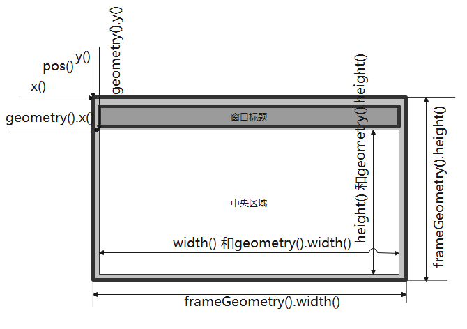
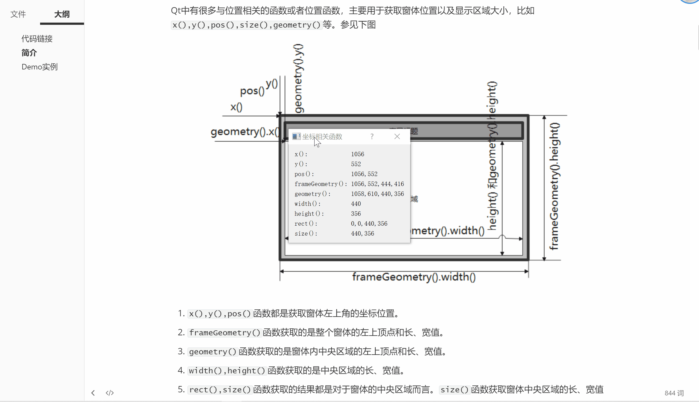

[TOC]

更多参见
[QT基础与实例应用目录](https://blog.csdn.net/leacock1991/article/details/118662440)

### 代码链接

GitHub链接 ：[CoordinateExample](https://github.com/lichangke/QT/tree/main/CodeDemo/CH6/CH601/CoordinateExample)

### 简介

Qt中有很多与位置相关的函数或者位置函数，主要用于获取窗体位置以及显示区域大小，比如`x(),y(),pos(),size(),geometry()`等。参见下图



1. `x(),y(),pos()`函数都是获取窗体左上角的坐标位置。
2. `frameGeometry()`函数获取的是整个窗体的左上顶点和长、宽值。
3. `geometry()`函数获取的是窗体内中央区域的左上顶点和长、宽值。
4. `width(),height()`函数获取的是中央区域的长、宽值。
5. `rect(),size()`函数获取的结果都是对于窗体的中央区域而言。`size()`函数获取窗体中央区域的长、宽值
6. `rect()`函数和`geometry()`函数相同，返回一个`QRect`对象，两个函数获取的长、宽值相同。不同的是左顶点，`rect()`左顶点坐标始终为`(0,0)`,而`geometry()`其左顶点坐标是相对于父窗体而言。


### Demo实例

介绍`QWidget`提供的`x(),y(),frameGeometry(),pos(),rect(),size(),geometry()`等函数的使用，窗体移动，调整大小相关坐标随之改变。





**头文件**

```cpp
class Coordinate : public QDialog
{
    Q_OBJECT

public:
    Coordinate(QWidget *parent = nullptr);
    ~Coordinate();
    void updateCoorLabel(); // 更新坐标信息
protected:
    void moveEvent(QMoveEvent *event) override; // 移动事件响应
    void resizeEvent(QResizeEvent *event) override; // 大小调整事件响应
private:
    QGridLayout *mainLayout;
    // x()
    QLabel *xLabel;
    QLabel *xValueLabel;
    // y()
    QLabel *yLabel;
    QLabel *yValueLabel;
    // pos()
    QLabel *posLabel;
    QLabel *posValueLabel;
    // frameGeometry()
    QLabel *frameGeomLabel;
    QLabel *frameGeomValueLabel;
    // geometry()
    QLabel *geomLabel;
    QLabel *geomValueLabel;
    // width()
    QLabel *widthLabel;
    QLabel *widthValueLabel;
    // height()
    QLabel *heightLabel;
    QLabel *heightValueLabel;
    // rect()
    QLabel *rectLabel;
    QLabel *rectValueLabel;
    // size()
    QLabel *sizeLabel;
    QLabel *sizeValueLabel;
};
```

**Cpp文件**

```cpp
Coordinate::Coordinate(QWidget *parent)
    : QDialog(parent)
{
    setWindowTitle(tr("坐标相关函数"));
    // x()
    xLabel = new QLabel(tr("x():"));
    xValueLabel = new QLabel();
    // y()
    yLabel = new QLabel(tr("y():"));
    yValueLabel = new QLabel();
    // pos()
    posLabel = new QLabel(tr("pos():"));
    posValueLabel = new QLabel();
    // frameGeometry()
    frameGeomLabel = new QLabel(tr("frameGeometry():"));
    frameGeomValueLabel = new QLabel();
    // geometry()
    geomLabel = new QLabel(tr("geometry():"));
    geomValueLabel = new QLabel();
    // width()
    widthLabel = new QLabel(tr("width():"));
    widthValueLabel = new QLabel();
    // height()
    heightLabel = new QLabel(tr("height():"));
    heightValueLabel = new QLabel();
    // rect()
    rectLabel = new QLabel(tr("rect():"));
    rectValueLabel = new QLabel();
    // size()
    sizeLabel = new QLabel(tr("size():"));
    sizeValueLabel = new QLabel();

    mainLayout = new QGridLayout(this);
    mainLayout->addWidget(xLabel,0,0);
    mainLayout->addWidget(xValueLabel,0,1);
    mainLayout->addWidget(yLabel,1,0);
    mainLayout->addWidget(yValueLabel,1,1);
    mainLayout->addWidget(posLabel,2,0);
    mainLayout->addWidget(posValueLabel,2,1);
    mainLayout->addWidget(frameGeomLabel,3,0);
    mainLayout->addWidget(frameGeomValueLabel,3,1);
    mainLayout->addWidget(geomLabel,4,0);
    mainLayout->addWidget(geomValueLabel,4,1);
    mainLayout->addWidget(widthLabel,5,0);
    mainLayout->addWidget(widthValueLabel,5,1);
    mainLayout->addWidget(heightLabel,6,0);
    mainLayout->addWidget(heightValueLabel,6,1);
    mainLayout->addWidget(rectLabel,7,0);
    mainLayout->addWidget(rectValueLabel,7,1);
    mainLayout->addWidget(sizeLabel,8,0);
    mainLayout->addWidget(sizeValueLabel,8,1);

    updateCoorLabel();
}

Coordinate::~Coordinate()
{
}

void Coordinate::updateCoorLabel()
{
    // x()
    QString xStr = QString::number(x());
    xValueLabel->setText(xStr);
    // y()
    QString yStr = QString::number(y());
    yValueLabel->setText(yStr);
    // pos()
    QString posStrX = QString::number(pos().x());
    QString posStry = QString::number(pos().y());
    posValueLabel->setText(posStrX + "," + posStry);
    // frameGeometry()
    QString frameStrX = QString::number(frameGeometry().x());
    QString frameStry = QString::number(frameGeometry().y());
    QString frameStrwidth = QString::number(frameGeometry().width());
    QString frameStrheight = QString::number(frameGeometry().height());
    frameGeomValueLabel->setText(frameStrX+","+frameStry+","+frameStrwidth+","+frameStrheight);
    // geometry()
    QString geomStrX = QString::number(geometry().x());
    QString geomStry = QString::number(geometry().y());
    QString geomStrwidth = QString::number(geometry().width());
    QString geomStrheight = QString::number(geometry().height());
    geomValueLabel->setText(geomStrX+","+geomStry+","+geomStrwidth+","+geomStrheight);
    // width()
    QString widthStr = QString::number(width());
    widthValueLabel->setText(widthStr);
    // height()
    QString heightStr = QString::number(height());
    heightValueLabel->setText(heightStr);
    // rect()
    QString rectStrX = QString::number(rect().x());
    QString rectStry = QString::number(rect().y());
    QString rectStrwidth = QString::number(rect().width());
    QString rectStrheight = QString::number(rect().height());
    rectValueLabel->setText(rectStrX+","+rectStry+","+rectStrwidth+","+rectStrheight);
    // size()
    QString sizeStrwidth = QString::number(size().width());
    QString sizeStrheight = QString::number(size().height());
    sizeValueLabel->setText(sizeStrwidth + "," + sizeStrheight);
}

void Coordinate::moveEvent(QMoveEvent *event)
{
    updateCoorLabel();
}

void Coordinate::resizeEvent(QResizeEvent *event)
{
    updateCoorLabel();
}
```


希望我的文章对于大家有帮助，由于个人能力的局限性，文中可能存在一些问题，欢迎指正、补充！

