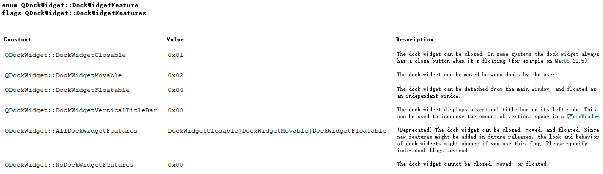
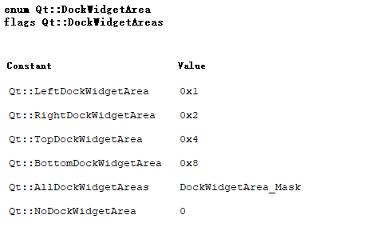
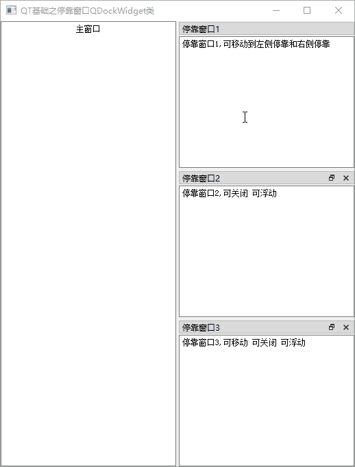

[TOC]

更多参见
[QT基础与实例应用目录](https://blog.csdn.net/leacock1991/article/details/118662440)


## QDockWidget类简介

`QDockWidget` 类提供了一个部件，它可以停靠在 `QMainWindow` 内或作为桌面上的顶级窗口浮动。

`QDockWidget` 提供了停靠窗口部件的概念，也称为工具面板或实用程序窗口。 停靠窗口是位于 `QMainWindow` 中央部件周围的停靠部件区域中的辅助窗口。


停靠窗口可以在其当前区域内移动，移动到新区域或者浮动（例如，取消停靠）。 `QDockWidget`的 API 允许程序员限制停靠部件的移动、浮动和关闭，以及它们可以放置的区域的能力。


`QDockWidget` 由标题栏和内容区域组成。标题栏显示停靠窗口部件的窗口标题、浮动按钮和关闭按钮。根据 `QDockWidget `的状态，浮动和关闭按钮可能被禁用或根本不显示。标题栏和按钮的视觉外观取决于使用的样式。`QDockWidget`可以作为它子窗口部件的封装，通过`setWidget()`设置子窗口部件。自定义的尺寸提示，最小和最大化尺寸已经尺寸策略都必须由子窗口部件来实现。`QDockWidget`会遵守它们，调整它自己的限制包括框架和工具栏。我们不应该为`QDockWidget`设置尺寸限制，因为它们根据`QDockWidget`是否锁住而改变，一个锁住的`QDockWidget`窗口部件不包括框架和小的工具栏。

**`QDockWidget`对象包含一些特性，例如：移动、悬浮、关闭等等，这些都是枚举类型：**




**`QDockWidget`可以放置的位置，也是枚举类型：**




## 简单Demo和说明


设置停靠窗口的一般流程如下：

1. 创建一个`QDockWidget`对象的停靠窗体
2. 设置此停靠窗体的属性，通常调用 `setFeatures()`以及 `setAllowedAreas()`
3. 新建一个要插入停靠窗体的控件，比如 `QListWidget`、`QTextEdit`
4. 将控件插入停靠窗体，调用`QDockWidget`的`setWidget()`方法
5. 使用 `addDockWidget()`方法在`MainWindow`中加入此停靠窗体





GitHub链接 ： [DockWindows](https://github.com/lichangke/QT/tree/main/CodeDemo/CH3/CH302/DockWindows)

```cpp
    setWindowTitle(tr("QT基础之停靠窗口QDockWidget类"));
    QTextEdit *textEdit = new QTextEdit(this);
    textEdit->setText(tr("主窗口"));
    textEdit->setAlignment(Qt::AlignCenter);
    this->setCentralWidget(textEdit); // 设置 textEdit 为主窗口的中央窗体

    // 停靠窗口1
    // 步骤1 创建一个`QDockWidget`对象的停靠窗体
    QDockWidget *dock1 = new QDockWidget(tr("停靠窗口1"),this);
    // 步骤2 设置此停靠窗体的属性，通常调用 `setFeatures()`以及 `setAllowedAreas()`
    dock1->setFeatures(QDockWidget::DockWidgetMovable); // 可移动
    dock1->setAllowedAreas(Qt::LeftDockWidgetArea|Qt::RightDockWidgetArea); // 可 左侧停靠 和 右侧停靠
    // 步骤3 新建一个要插入停靠窗体的控件，比如 `QListWidget`、`QTextEdit`
    QTextEdit *textEdit1 = new QTextEdit(this);
    textEdit1->setText(tr("停靠窗口1,可移动到左侧停靠和右侧停靠"));
    // 步骤4 将控件插入停靠窗体，调用`QDockWidget`的`setWidget()`方法
    dock1->setWidget(textEdit1);
    // 步骤5 使用 `addDockWidget()`方法在`MainWindow`中加入此停靠窗体
    this->addDockWidget(Qt::RightDockWidgetArea,dock1);


    // 停靠窗口2
    // 步骤1
    QDockWidget *dock2 = new QDockWidget(tr("停靠窗口2"),this);
    // 步骤2
    dock2->setFeatures(QDockWidget::DockWidgetClosable|QDockWidget::DockWidgetFloatable); // 可关闭 可浮动
    // 步骤3
    QTextEdit *textEdit2 = new QTextEdit(this);
    textEdit2->setText(tr("停靠窗口2,可关闭 可浮动"));
    // 步骤4
    dock2->setWidget(textEdit2);
    // 步骤5
    this->addDockWidget(Qt::RightDockWidgetArea,dock2);


    // 停靠窗口3
    // 步骤1
    QDockWidget *dock3 = new QDockWidget(tr("停靠窗口3"),this);
    // 步骤2
    dock3->setFeatures(QDockWidget::AllDockWidgetFeatures); // 可移动 可关闭 可浮动
    // 步骤3
    QTextEdit *textEdit3 = new QTextEdit(this);
    textEdit3->setText(tr("停靠窗口3,可移动 可关闭 可浮动"));
    // 步骤4
    dock3->setWidget(textEdit3);
    // 步骤5
    this->addDockWidget(Qt::RightDockWidgetArea,dock3);
```


**`setFeatures(QDockWidget::DockWidgetFeatures features)`**

设置停靠窗体的特性

`QDockWidget::DockWidgetFeatures `指停靠窗口的特性

```cpp
    enum DockWidgetFeature {
        DockWidgetClosable    = 0x01,
        DockWidgetMovable     = 0x02,
        DockWidgetFloatable   = 0x04,
        DockWidgetVerticalTitleBar = 0x08,

        DockWidgetFeatureMask = 0x0f,
        AllDockWidgetFeatures = DockWidgetClosable|DockWidgetMovable|DockWidgetFloatable, // ### Qt 6: remove
        NoDockWidgetFeatures  = 0x00,

        Reserved              = 0xff
    };
```

|             特性             |            说明             |
| :--------------------------: | :-------------------------: |
|     `DockWidgetClosable`     |       停靠窗体可关闭        |
|     `DockWidgetMovable`      |       停靠窗体可移动        |
|    `DockWidgetFloatable`     |       停靠窗体可浮动        |
| `DockWidgetVerticalTitleBar` |     左侧显示垂直标题栏      |
|   `DockWidgetFeatureMask`    |            Mask             |
|   `AllDockWidgetFeatures`    |    可关闭 可移动  可浮动    |
|    `NoDockWidgetFeatures`    | 不可关闭 不可移动  不可浮动 |


**`setAllowedAreas(Qt::DockWidgetAreas areas)`**

设置停靠窗体可停靠区域

`Qt::DockWidgetAreas`指可停靠区域

```cpp
    enum DockWidgetArea {
        LeftDockWidgetArea = 0x1,
        RightDockWidgetArea = 0x2,
        TopDockWidgetArea = 0x4,
        BottomDockWidgetArea = 0x8,
        DockWidgetArea_Mask = 0xf,
        AllDockWidgetAreas = DockWidgetArea_Mask,
        NoDockWidgetArea = 0
    };
```


|          特性          |             说明             |
| :--------------------: | :--------------------------: |
|  `LeftDockWidgetArea`  |      可在主窗口左侧停靠      |
| `RightDockWidgetArea`  |      可在主窗口右侧停靠      |
|  `TopDockWidgetArea`   |      可在主窗口顶部停靠      |
| `BottomDockWidgetArea` |      可在主窗口底部停靠      |
| `DockWidgetArea_Mask`  |             Mask             |
|  `AllDockWidgetAreas`  | 可在任意部位停靠（上面四个） |
|   `NoDockWidgetArea`   |       只可停靠在插入出       |


希望我的文章对于大家有帮助，由于个人能力的局限性，文中可能存在一些问题，欢迎指正、补充！

