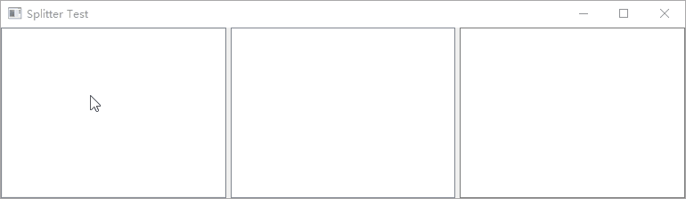
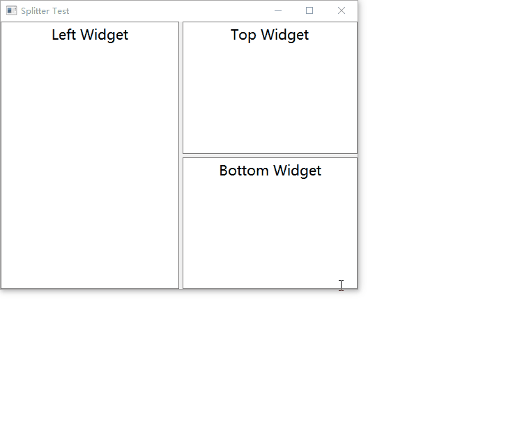

[TOC]

更多参见
[QT基础与实例应用目录](https://blog.csdn.net/leacock1991/article/details/118662440)


## QSplitter类简介

`QSplitter` 类实现了一个拆分部件。一个拆分器`splitter`允许用户通过拖动它们之间的边界来控制子部件的大小。任何数量的部件都可以由单个拆分器`splitter`控制。`QSplitter` 的典型用途是创建多个部件并使用 `insertWidget() `或` addWidget() `添加它们。

以下示例将并排显示 `QListView`、`QTreeView` 和 `QTextEdit`，并带有两个分隔：

```cpp
    QSplitter *splitter = new QSplitter();
    QListView *listview = new QListView();
    QTreeView *treeview = new QTreeView();
    QTextEdit *textedit = new QTextEdit();
    splitter->addWidget(listview);
    splitter->addWidget(treeview);
    splitter->addWidget(textedit);
    splitter->setWindowTitle("Splitter Test");
    splitter->show();
```




如果在调用 `insertWidget()` 或` addWidget() `时部件已经在 `QSplitter` 中，它将移动到新位置。 这可用于稍后在拆分器中重新排序部件。 可以使用 `indexOf()`、`widget()` 和` count() `来访问拆分器内的小部件。


默认的 `QSplitter`是 水平（并排）布置其子项如上例； 可以使用 `setOrientation(Qt::Vertical) `将其子项垂直放置。默认情况下，所有部件都可以根据用户的意愿在部件` minimumSizeHint()`（或` minimumSize()`）和 `maximumSize()` 之间或大或小。默认情况下，`QSplitter` 会动态调整其子项的大小。

部件之间大小的初始分布是通过将初始大小乘以**拉伸因子**来确定的。 您还可以使用`setSizes() `来设置所有部件的大小。 函数 `size() `返回用户设置的大小。 或者，您可以分别使用` saveState() `和` restoreState()` 从 `QByteArray` 保存和恢复部件的大小。

当`hide() `一个子部件时，它的空间将分配给其他子部件。 当您再次 `show() `它时，它将被恢复。


## 简单Demo和说明



Github链接：[Splitter](https://github.com/lichangke/QT/tree/main/CodeDemo/CH3/CH301/Splitter)

```cpp
#include "mainwindow.h"
#include <QApplication>
#include <QSplitter>
#include <QTextEdit>

int main(int argc, char *argv[])
{
    QApplication a(argc, argv);
    QFont font("微软雅黑",15);
    a.setFont(font); // 设置字体

    // 主分割窗口
    // 新建一个 QSplitter 对象 作为主分割窗口，水平分割窗口
    QSplitter *splitterMain = new QSplitter(Qt::Horizontal,nullptr); // 水平布置

    // 新建 一个 QTextEdit 对象  并将其加入 主分割窗口中
    QTextEdit *textLeft = new QTextEdit(QObject::tr("Left Widget"),splitterMain);
//    QTextEdit *textLeft = new QTextEdit(QObject::tr("Left Widget"));
//    splitterMain->addWidget(textLeft);
    textLeft->setAlignment(Qt::AlignCenter); // 设置 QTextEdit 对齐方式   AlignCenter 居中对齐

    // 右分割窗口
    QSplitter *splitterRight = new QSplitter(Qt::Vertical,splitterMain); // 垂直布置 其父窗口为 splitterMain
//    QSplitter *splitterRight = new QSplitter(Qt::Vertical);
//    splitterRight->setParent(splitterMain);

    // 调用 setOpaqueResize 用于设定分割窗口的分割条在拖拽是是否实时更新显示。
    // true 实时显示，false则拖拽时只显示一条灰色的粗线，拖拽到位并释放鼠标后显示分割条。默认 为true
    splitterRight->setOpaqueResize(false);


    QTextEdit *textTop= new QTextEdit(QObject::tr("Top Widget"),splitterRight);
    textTop->setAlignment(Qt::AlignCenter);
    QTextEdit *textBottom= new QTextEdit(QObject::tr("Bottom Widget"),splitterRight);
    textBottom->setAlignment(Qt::AlignCenter);

    splitterMain->setStretchFactor(1,1);
    splitterMain->setWindowTitle(QObject::tr("Splitter Test"));
    splitterMain->show();

//    MainWindow w;
//    w.show();
    return a.exec();
}
```


**`QSplitter::setStretchFactor(int index, int stretch)`**

```cpp
void QSplitter::setStretchFactor(int index, int stretch)
Updates the size policy of the widget at position index to have a stretch factor of stretch.
stretch is not the effective stretch factor; the effective stretch factor is calculated by taking the initial size of the widget and multiplying it with stretch.
This function is provided for convenience. It is equivalent to
 QWidget *widget = splitter->widget(index);
 QSizePolicy policy = widget->sizePolicy();
 policy.setHorizontalStretch(stretch);
 policy.setVerticalStretch(stretch);
 widget->setSizePolicy(policy);
See also setSizes() and widget().

```

更新位置索引处的部件的大小策略以具有拉伸因子。参数`stretch`不是有效拉伸系数； 有效拉伸因子是通过取部件的初始大小并将其乘以拉伸来计算的。

位置索引按插入的先后次序从0起依次编号。在这里`setStretchFactor(1,1);`中第一个1是位置索引表示第二个插入`splitterMain`的·部件也就是`splitterRight`,第二个1表示此控件也就是`splitterMain`可伸缩控件。也就是当整个对话框的宽度发生改变时，左部分的文件编辑框宽度保持不变，右部分的分割窗口宽度随整个对话框大小的改变进行调整。


希望我的文章对于大家有帮助，由于个人能力的局限性，文中可能存在一些问题，欢迎指正、补充！

