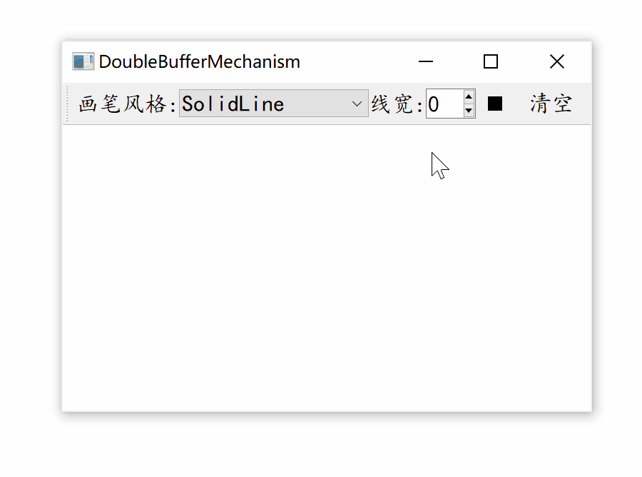
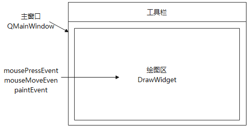
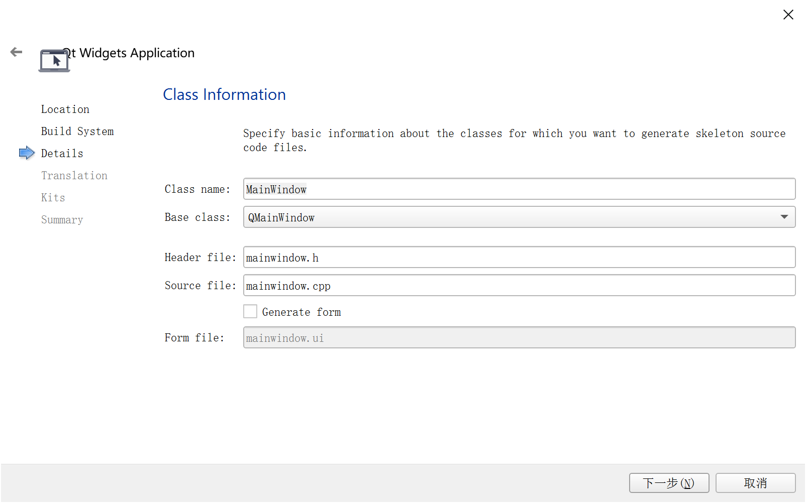
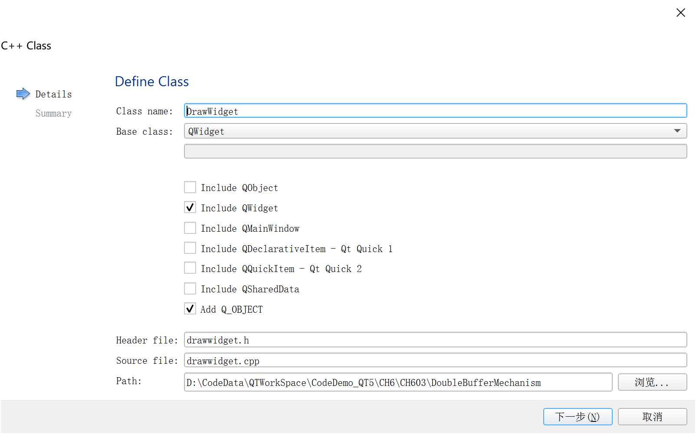

[TOC]

更多参见
[QT基础与实例应用目录](https://blog.csdn.net/leacock1991/article/details/118662440)

## 代码链接

GitHub链接 ：[DoubleBufferMechanism](https://github.com/lichangke/QT/tree/main/CodeDemo/CH6/CH603/DoubleBufferMechanism)

## 介绍

双缓冲机制，是指在控件绘制时，会首先将要绘制的内容绘制在一个图片中，再将图片**一次性**地绘制到控件上。早期Qt版本，如果直接在控件上进行绘制工作，那么在控件重绘时会产生闪烁的现象，重绘越频繁闪烁越明显。双缓冲机制可以有效的消除这一现象。自Qt5版本后，`QWidget`控件已经能够自动处理闪烁问题，虽然在控件上直接绘图时不用再担心闪烁问题，但是双缓冲机制很多场合仍然有其用武之地。比如，当需绘制的内容比较复杂并且需要频繁刷新，或者每次只需要绘制整个控件的一小部分时，依然采用双缓冲机制是需要的。

以下通过介绍实现一个简单的绘图工具，来介绍双缓冲机制的实现。图像先绘制在pixmap上，再将整个pixmap绘制到中央部件的绘图区。




`QMainWindow` 对象作为主窗口，`QToolBar` 对象作为工具栏，`QWidget` 对象作为主窗口的中央窗体，也就是绘图区。通过对绘图区鼠标事件的重定义，来实现绘图功能。




# 实现步骤

## 工程创建

如下图创建工程，基类为`QMainWindow`,取消创建界面



右键工程添加以`QWidget`为基类的绘图显示区`DrawWidget`



## 绘图区实现

绘图区需要重定义鼠标事件`mousePressEvent`和`mouseMoveEvent`，重定义重绘事件`paintEvent`以及尺寸变化事件`resizeEvent`，以及一些参数的设置，*画笔颜色*、*画笔线宽*、*画笔风格* 参见[QT基础之一文介绍QPainter绘制基础图形(画笔画刷设置，填充铺展渐变效果)_____主选项区域实现](https://blog.csdn.net/leacock1991/article/details/125117790#t8)

### drawwidget.h文件

```cpp
class DrawWidget : public QWidget
{
    Q_OBJECT
public:
    explicit DrawWidget(QWidget *parent = nullptr);
    void mouseMoveEvent(QMouseEvent *event) override;
    void mousePressEvent(QMouseEvent *event) override;
    void paintEvent(QPaintEvent *event) override;
    void resizeEvent(QResizeEvent *event) override;
public slots:
    void SetPenStyle(Qt::PenStyle style); // 画笔风格
    void SetPenWidth(int penWidth); // 画笔线宽
    void SetPenColor(QColor color); // 画笔颜色
    void ClearAll(); // 清空所有
private:
    QPixmap *pix; // 绘制的图像
    QPoint startPos;
    QPoint endPos;
    Qt::PenStyle style;
    int penWidth;
    QColor color;
};
```

### drawwidget.cpp文件

```cpp
DrawWidget::DrawWidget(QWidget *parent) : QWidget(parent)
{
    setAutoFillBackground(true); // 背景色 设置
    setPalette(QPalette(Qt::white)); // QWidget设置白色为背景
    pix = new QPixmap(size()); // 绘图区同尺寸的 pixmap 用于接收绘制内容
    pix->fill(Qt::white); // 填充图像背景为白色
    setMinimumSize(600,400); // 绘制区窗体最小尺寸
}

void DrawWidget::mouseMoveEvent(QMouseEvent *event)
{
    // 鼠标移动 绘制移动的轨迹
    QPainter *painter = new QPainter; // QPainter对象
    QPen pen; // QPen 对象
    // 设置 pen 的属性
    pen.setStyle(style);
    pen.setWidth(penWidth);
    pen.setColor(color);
    // painter 无参数构造，使用 begin  参见 https://blog.csdn.net/kenfan1647/article/details/116266875
    painter->begin(pix); // 在调用begin()时，所有绘画工具设置（setPen()，setBrush()等）都将重置为默认值
    painter->setPen(pen);
    // 绘制从startPos 到鼠标当前位置的直线
    painter->drawLine(startPos,event->pos()); // 先在 pix 上绘制
    painter->end();
    startPos = event->pos();
    update(); // 再 重绘绘图区 将 pix 绘制到 控件
}

void DrawWidget::mousePressEvent(QMouseEvent *event)
{
    this->startPos = event->pos(); // 记录鼠标按下的起始位置
}

void DrawWidget::paintEvent(QPaintEvent *event)
{
    QPainter painter(this);
    painter.drawPixmap(QPoint(0,0),*pix); // 再绘制 pix 到 绘图区， pix 和 绘图区 同尺寸
}

void DrawWidget::resizeEvent(QResizeEvent *event)
{
    if(width() != pix->width() || height() != pix->height()){ // 尺寸是否改变
        QPixmap *newPix = new QPixmap(size()); //新尺寸的 pix
        newPix->fill(Qt::white);
        QPainter painter(newPix);
        painter.drawPixmap(QPoint(0,0),*pix);  //  将 图像绘制到新 pix 上
        pix = newPix;
    }
    QWidget::resizeEvent(event);
}

void DrawWidget::SetPenStyle(Qt::PenStyle style)
{
    this->style = style;
}

void DrawWidget::SetPenWidth(int penWidth)
{
    this->penWidth = penWidth;
}

void DrawWidget::SetPenColor(QColor color)
{
    this->color = color;
}

void DrawWidget::ClearAll()
{
    // 将 新的 pix 替代以前的
    QPixmap *clearPix = new QPixmap(size()); //新尺寸的 pix
    clearPix->fill(Qt::white);
    pix = clearPix;
    update();
}
```

#### 注意Painter的无参数构造

```cpp
QPainter *painter = new QPainter; // QPainter对象
painter->begin(pix); // 在调用begin()时，所有绘画工具设置（setPen()，setBrush()等）都将重置为默认值
painter->setPen(pen);
// 绘制从startPos 到鼠标当前位置的直线
painter->drawLine(startPos,event->pos()); // 在 pix 上绘制
painter->end();
```

可参见 [https://blog.csdn.net/kenfan1647/article/details/116266875](https://blog.csdn.net/kenfan1647/article/details/116266875)


## 主选项区域实现

创建了一个`QToolBar`,用于绘制区各种选项的选择。

### mainwindow.h文件

```cpp
class MainWindow : public QMainWindow
{
    Q_OBJECT

public:
    MainWindow(QWidget *parent = nullptr);
    ~MainWindow();
public slots:
    void PenColorSelect(); // penColorBtn 按钮响应 用于选择颜色
    void SetPenStyle(); // 设置画笔style到 中心绘制区
private:
    void createToolBar(); // 创建工具条
    DrawWidget *drawWidget; // 绘制区
    QToolBar *toolBar;
    QLabel *penStyleLabel; // 画笔风格
    QComboBox *penStyleComboBox;
    QLabel *penWidthLabel; // 画笔线宽
    QSpinBox *penWidthSpinBox;
    QToolButton *penColorBtn; // 画笔颜色选择
    QToolButton *clearBtn;
};
```

### mainwindow.cpp文件

```cpp
MainWindow::MainWindow(QWidget *parent)
    : QMainWindow(parent)
{
    drawWidget = new DrawWidget;
    setCentralWidget(drawWidget); // 设置drawWidget 为中央部件
    createToolBar(); // 创建工具条
    setMinimumSize(600,400); // 设置主窗口 最小尺寸 与 drawWidget 同步
    SetPenStyle(); // 设置画笔style
    // 设置 画笔初始线宽
    drawWidget->SetPenWidth(penWidthSpinBox->value());
    // 设置 画笔初始颜色
    drawWidget->SetPenColor(Qt::black);
}

MainWindow::~MainWindow()
{
}

void MainWindow::PenColorSelect()
{
    QColor color = QColorDialog::getColor(Qt::black,this);
    if(color.isValid()){
        drawWidget->SetPenColor(color);
        QPixmap pix(20,20);
        pix.fill(color);
        penColorBtn->setIcon(QIcon(pix));
    }
}

void MainWindow::SetPenStyle()
{
    drawWidget->SetPenStyle(static_cast<Qt::PenStyle>(penStyleComboBox->
                itemData(penStyleComboBox->currentIndex(),Qt::UserRole).toInt()));
}

void MainWindow::createToolBar()
{
    toolBar = addToolBar(tr("Tool"));

    // 画笔风格
    penStyleLabel = new QLabel(tr("画笔风格:"));
    penStyleComboBox = new QComboBox;
    penStyleComboBox->addItem(tr("SolidLine"),static_cast<int>(Qt::SolidLine));
    penStyleComboBox->addItem(tr("DashLine"),static_cast<int>(Qt::DashLine));
    penStyleComboBox->addItem(tr("DotLine"),static_cast<int>(Qt::DotLine));
    penStyleComboBox->addItem(tr("DashDotLine"),static_cast<int>(Qt::DashDotLine));
    penStyleComboBox->addItem(tr("DashDotDotLine"),static_cast<int>(Qt::DashDotDotLine));
    penStyleComboBox->addItem(tr("CustomDashLine"),static_cast<int>(Qt::CustomDashLine));
    connect(penStyleComboBox,SIGNAL(activated(int)),this,SLOT(SetPenStyle()));

    // 画笔线宽
    penWidthLabel = new QLabel(tr("线宽:"));
    penWidthSpinBox = new QSpinBox;
    connect(penWidthSpinBox,SIGNAL(valueChanged(int)),drawWidget,SLOT(SetPenWidth(int)));

    // 颜色 选择
    penColorBtn = new QToolButton; // 选择按钮
    QPixmap pixmap(20,20);
    pixmap.fill(Qt::black);
    penColorBtn->setIcon(pixmap);
    connect(penColorBtn,SIGNAL(clicked()),this,SLOT(PenColorSelect()));

    // 清除按钮
    clearBtn = new QToolButton;
    clearBtn->setText(tr("清空"));
    connect(clearBtn,SIGNAL(clicked()),drawWidget,SLOT(ClearAll()));

    toolBar->addWidget(penStyleLabel);
    toolBar->addWidget(penStyleComboBox);
    toolBar->addWidget(penWidthLabel);
    toolBar->addWidget(penWidthSpinBox);
    toolBar->addWidget(penColorBtn);
    toolBar->addWidget(clearBtn);
}
```


希望我的文章对于大家有帮助，由于个人能力的局限性，文中可能存在一些问题，欢迎指正、补充！

