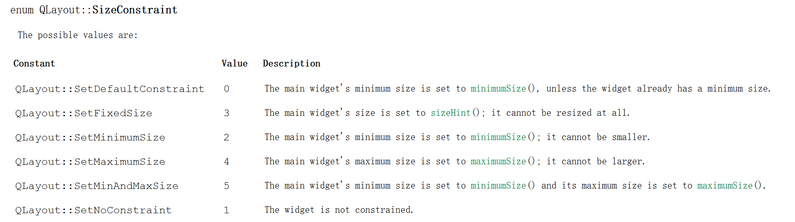
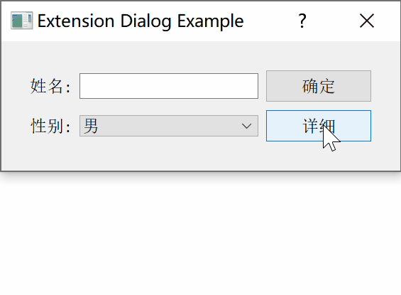

[TOC]

更多参见
[QT基础与实例应用目录](https://blog.csdn.net/leacock1991/article/details/118662440)

### 代码链接

GitHub链接 ：[ExtensibleDialogExample](https://github.com/lichangke/QT/tree/main/CodeDemo/CH4/CH406/ExtensibleDialogExample)

### 简介

扩展对话框通常情况下，只是出现基本对话框，可通过某种方式切换显示完整的对话框窗体，一般情况下通过一个按钮实现。

注意：

1、需要设置对话框的尺寸保持相对固定，确保扩展对话框在扩展隐藏后能恢复到初始状态。

`void setSizeConstraint(QLayout::SizeConstraint)` 设置布局调整大小的模式



参见Qt帮助手册

例子默认情况下只显示基础信息部分，通过一个按钮来展示或者隐藏扩展的部分。


### 代码展示



**头文件**

```cpp
class ExtensibleDlg : public QDialog
{
    Q_OBJECT

public:
    ExtensibleDlg(QWidget *parent = nullptr);
    ~ExtensibleDlg();
private slots:
    void showDetailInfoPart(); // 按钮响应用于 显示隐藏 扩展部分
private:
    void CreateBaseInfoPart(); // 创建基础信息部分
    void CreateDetailInfoPart(); // 创建扩展的细节信息部分
    QWidget *baseInfoPart;  // 础信息部分
    QWidget *detailInfoPart; // 细节信息部分
    QVBoxLayout *mainLayout; // 布局
};
```


**Cpp文件**

```cpp
ExtensibleDlg::ExtensibleDlg(QWidget *parent)
    : QDialog(parent)
{
    setWindowTitle(tr("Extension Dialog Example"));
    CreateBaseInfoPart();
    CreateDetailInfoPart();
    mainLayout = new QVBoxLayout(this);
    mainLayout->addWidget(baseInfoPart);
    mainLayout->addWidget(detailInfoPart);
    mainLayout->setSizeConstraint(QLayout::SetFixedSize); // 设置窗体大小固定，不能通过拖拽改变大小
}

ExtensibleDlg::~ExtensibleDlg()
{
}

void ExtensibleDlg::showDetailInfoPart()
{
    if(detailInfoPart->isHidden()){
        detailInfoPart->show();
    } else {
        detailInfoPart->hide();
    }
}

void ExtensibleDlg::CreateBaseInfoPart()
{
    baseInfoPart = new QWidget;
    // 控件
    QLabel *nameLabel = new QLabel(tr("姓名:"));
    QLineEdit *nameLineEdit = new QLineEdit;
    QLabel *sexLabel = new QLabel(tr("性别:"));
    QComboBox *sexComboBox = new QComboBox;
    sexComboBox->addItem(tr("男"));
    sexComboBox->addItem(tr("女"));
    QPushButton *okBtn = new QPushButton(tr("确定"));
    QPushButton *detailBtn = new QPushButton(tr("详细"));
    // 信号槽
    connect(detailBtn,SIGNAL(clicked()),this,SLOT(showDetailInfoPart()));
    // 布局
    QGridLayout *baseInfoLayout = new QGridLayout(baseInfoPart);
    baseInfoLayout->addWidget(nameLabel,0,0);
    baseInfoLayout->addWidget(nameLineEdit,0,1);
    baseInfoLayout->addWidget(okBtn,0,2);
    baseInfoLayout->addWidget(sexLabel,1,0);
    baseInfoLayout->addWidget(sexComboBox,1,1);
    baseInfoLayout->addWidget(detailBtn,1,2);
    baseInfoLayout->setSpacing(10);
}

void ExtensibleDlg::CreateDetailInfoPart()
{
    detailInfoPart = new QWidget;
    QLabel *ageLabel = new QLabel(tr("年龄:"));
    QLineEdit *ageLineEdit = new QLineEdit;
    QLabel *departmentLabel = new QLabel(tr("部门:"));
    QComboBox *departmentComboBox = new QComboBox;
    departmentComboBox->addItem(tr("部门1"));
    departmentComboBox->addItem(tr("部门2"));
    QLabel *emailLabel = new QLabel(tr("Email:"));
    QLineEdit *emailLineEdit = new QLineEdit;
    // 布局
    QGridLayout *detailInfoLayout = new QGridLayout(detailInfoPart);
    detailInfoLayout->addWidget(ageLabel,0,0);
    detailInfoLayout->addWidget(ageLineEdit,0,1);
    detailInfoLayout->addWidget(departmentLabel,1,0);
    detailInfoLayout->addWidget(departmentComboBox,1,1);
    detailInfoLayout->addWidget(emailLabel,2,0);
    detailInfoLayout->addWidget(emailLineEdit,2,1);
    detailInfoPart->hide(); // 一开始隐藏
}
```


希望我的文章对于大家有帮助，由于个人能力的局限性，文中可能存在一些问题，欢迎指正、补充！

