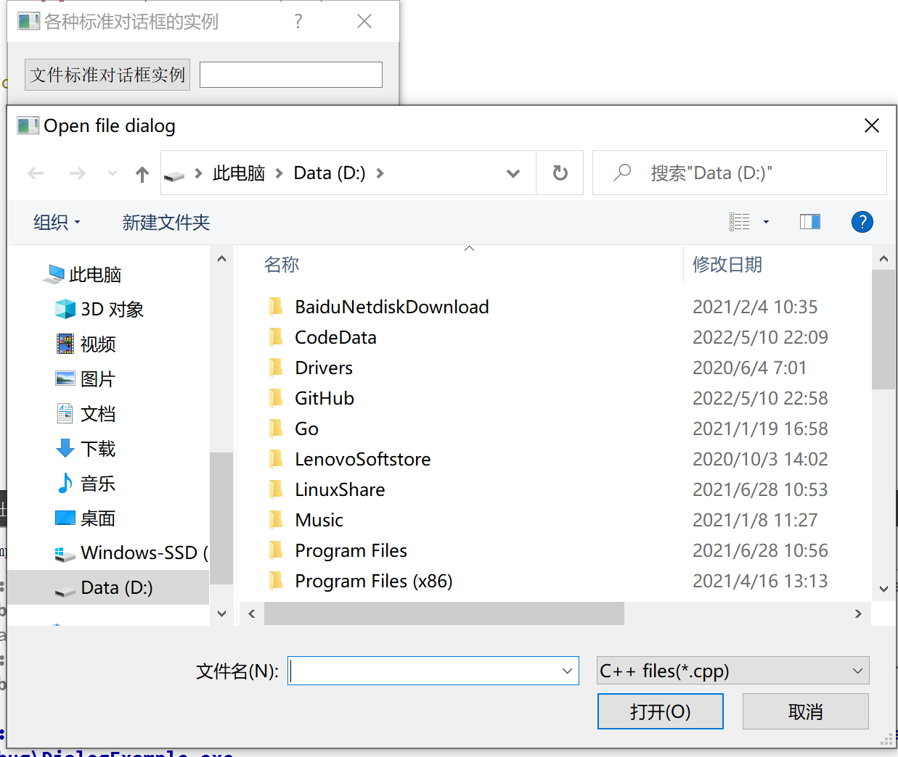
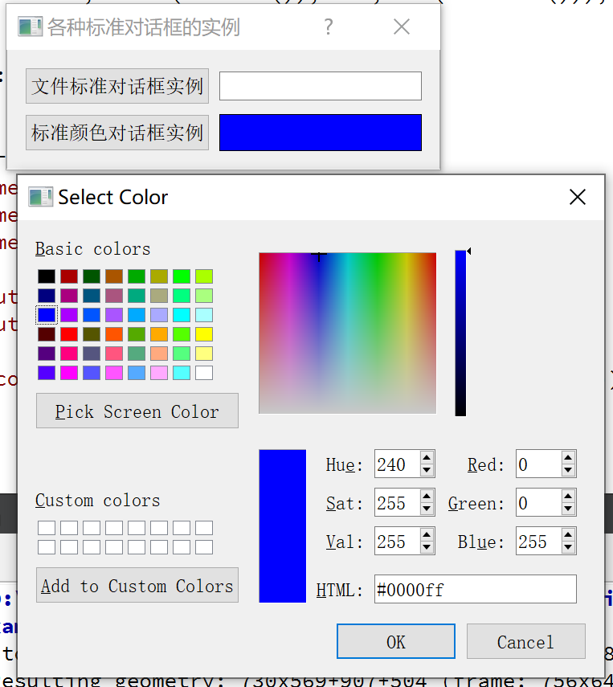

更多参见
[QT基础与实例应用目录](https://blog.csdn.net/leacock1991/article/details/118662440)


### 介绍

介绍标准文件对话框(QFileDialog)、标准颜色对话框(QColorDialog)、标准字体对话框(QFontDialog)、标准输入对话框(QInputDialog)以及标准消息对话框(QMessageDialog)的使用


### 代码链接


### 标准文件对话框(QFileDialog)



#### 代码简介

**头文件：**

```cpp
private slots:
    void showFile(); // fileBtn 点击触发
private:
    QGridLayout *mainLayOut; // 网格布局布局    
    // 标准文件对话框成员变量
    QPushButton *fileBtn; // 点击按钮弹出 标准文件对话框
    QLineEdit *fileLineEdit; // 显示标准对话框选择的文件
```

**cpp文件：**

```cpp
void Dialog::showFile()
{
    QString str = QFileDialog::getOpenFileName(this,"Open file dialog","D:\\",
                                               tr("C++ files(*.cpp);;C files(*.c);;Head files(*.h)"));
    fileLineEdit->setText(str);
}

void Dialog::createQFileDialog()
{
    // 创建组件
    fileBtn = new QPushButton;
    fileBtn->setText(tr("文件标准对话框实例"));
    fileLineEdit = new QLineEdit;

    // 布局
    mainLayOut->addWidget(fileBtn,0,0);
    mainLayOut->addWidget(fileLineEdit,0,1);

    // 关联事件
    connect(fileBtn,SIGNAL(clicked()),this,SLOT(showFile()));
}
```

**`getOpenFileName` 函数介绍**

```cpp
QString QFileDialog::getOpenFileName
(
QWidget *parent = nullptr,	// 父窗口
const QString &caption = QString(),	// 标题
const QString &dir = QString(), 	// 默认目录，若带文件名，则此文件为默认选中的文件
const QString &filter = QString(),	// 文件类型过滤，多种过滤器之间用;;隔开
QString *selectedFilter = nullptr,	// 用户选择的过滤器通过此返回
QFileDialog::Options options = Options()	// 选择显示文件名的格式，默认同时显示目录和文件名
)
```

#### QFileDialog类常用静态函数

| 静态函数             | 函数说明                     |
| :------------------- | :--------------------------- |
| getOpenFileName      | 获取用户选择的文件名         |
| getOpenFileNames     | 获取用户选择的文件名列表     |
| getSaveFileName      | 获取用户保存的文件名         |
| getExistingDirectory | 获取用户选择的已存在的目录名 |


### 标准颜色对话框(QColorDialog)




#### 代码简介

**头文件：**

```cpp
private slots:
    void showColor(); // colorBtn
private:
    // 标准颜色对话框成员变量
    QPushButton *colorBtn;
    QFrame *colorFrame; // 显示选择的颜色
```

**cpp文件：**

```cpp
void Dialog::showColor()
{
    QColor color = QColorDialog::getColor(Qt::blue);
    if(color.isValid()){
        colorFrame->setPalette(QPalette(color));
    }
}
void Dialog::createQColorDialog()
{
    colorBtn = new QPushButton;
    colorBtn->setText(tr("标准颜色对话框实例"));
    colorFrame = new QFrame;
    colorFrame->setFrameShape(QFrame::Box);
    colorFrame->setAutoFillBackground(true);

    mainLayOut->addWidget(colorBtn,1,0);
    mainLayOut->addWidget(colorFrame,1,1);

    connect(colorBtn,SIGNAL(clicked()),this,SLOT(showColor()));
}
```

**`getColor` 函数介绍**

```cpp
QColor QColorDialog::getColor
(
const QColor &initial = Qt::white,	// 默认选中颜色
 QWidget *parent = nullptr,	// 父窗口
 const QString &title = QString(), // 窗口 title ，如果未指定，则为Select Color
 QColorDialog::ColorDialogOptions options = ColorDialogOptions() // 允许自定义对话框
 )
```

### QColorDialog类常用静态函数

| 静态函数 | 函数说明             |
| :------- | :------------------- |
| getColor | 获取用户选择的颜色值 |


希望我的文章对于大家有帮助，由于个人能力的局限性，文中可能存在一些问题，欢迎指正、补充！

