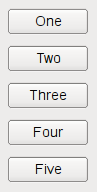
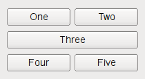
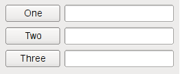
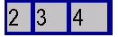
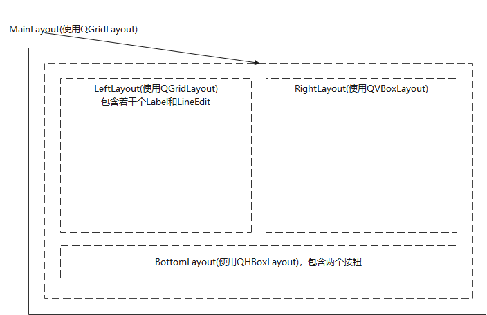
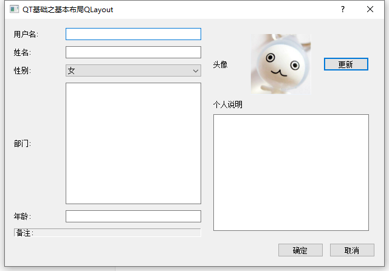

[TOC]

更多参见
[QT基础与实例应用目录](https://blog.csdn.net/leacock1991/article/details/118662440)


## 基本布局QLayout简介

### 简述

`QLayout`是由具体类 `QBoxLayout`、`QGridLayout`、`QFormLayout` 和 `QStackedLayout `继承的抽象基类。

对于 `QLayout `子类或 `QMainWindow `的用户，很少需要使用 `QLayout` 提供的基本功能，例如 `setSizeConstraint()` 或 `setMenuBar()`。Qt 布局系统提供了一种简单而强大的方法，可以在控件内自动排列子控件，以确保它们充分利用可用空间。Qt 包含一组布局管理类，用于描述控件在应用程序用户界面中的布局方式。 当控件的可用空间发生变化时，这些布局会自动定位和调整控件的大小，确保它们的排列一致并且用户界面作为一个整体仍然可用。

所有 `QWidget `子类都可以使用布局来管理它们的子类。` QWidget::setLayout() `函数可以为一个控件布局。 当以这种方式在`widget`上设置布局时，它负责以下任务：

- 布置子控件。
- 最高层窗口可感知的默认大小。
- 最高层窗口可感知的最小大小。
- 调整大小的处理。
- 当内容改变的时候自动更新：
  - 字体大小、文本或者子控件的其它内容。
  - 隐藏或者显示子控件。
  - 移除一些子控件。


### Qt的布局类

Qt的布局类使用手写的C++代码设计的，所以很容易理解和使用。

使用Qt Designer创建的界面生成的代码也使用了布局类。涉及用户界面开发时，Qt Designer非常有用，因为它避免了编译、链接、运行这样一个循环。

|          类           |                     描述                      |
| :-------------------: | :-------------------------------------------: |
|      QBoxLayout       |             水平或垂直排列子控件              |
|     QButtonGroup      |           用于组织按钮控件组的容器            |
|      QFormLayout      |          管理输入控件和其相关的标签           |
|    QGraphicsAnchor    | 表示在QGraphicsAnchorLayout中两个项目之间的锚 |
| QGraphicsAnchorLayout |    可以在图形视图中将控件锚定在一起的布局     |
|      QGridLayout      |                   网格布局                    |
|       QGroupBox       |                带标题的分组框                 |
|      QHBoxLayout      |                 水平排列控件                  |
|        QLayout        |               几何管理器的基类                |
|      QLayoutItem      |            QLayout 操作的抽象item             |
|      QSizePolicy      |     描述水平和垂直大小调整策略的布局属性      |
|      QSpacerItem      |                布局中的空间隔                 |
|    QStackedLayout     |      堆栈布局，同一时间只有一个控件可见       |
|    QStackedWidget     |      堆栈窗体，同一时间只有一个控件可见       |
|      QVBoxLayout      |                 垂直排列控件                  |
|      QWidgetItem      |            表示一个控件的布局item             |


### 水平、垂直、网格、表单布局

为控件提供良好布局的最简单方法是使用内置布局管理器：`QHBoxLayout`、`QVBoxLayout`、`QGridLayout `和 `QFormLayout`。这些类从` QLayout` 继承，而 `QLayout `又从 `QObject`（而不是` QWidget`）派生。他们负责一组控件的几何管理。 要创建更复杂的布局，可以将布局管理器相互嵌套。

- `QHBoxLayout`:从左到右在水平行中布置控件。


- `QVBoxLayout`: 在垂直列中从上到下布置控件。



- `QGridLayout` :在二维网格中布置控件。 控件可以占用多个单元格。




- `QFormLayout `:把控件按照标签-输入框的形式排列在两列。




### 使用布局提示

当使用布局的时候，构建子控件的时候不需要指定parent，布局将会自动的指定parent（使用`QWidget::setParent()`），使它们成为安装了该布局的界面的子控件。

注意：布局中的控件是安装了该布局的控件的子控件，而非布局自身的，控件只能以控件作为parent，不能是布局。也可以在布局中使用`addLayout()`来嵌套布局，内部的布局就会变成它的子布局。

### 为布局添加控件

将控件添加到一个布局时，布局过程如下：

1. 所有控件最初将根据它们的 `QWidget::sizePolicy()` 和 `QWidget::sizeHint()` 分配一定数量的空间。
2. 如果任何控件设置了拉伸系数，并且其值大于零，那么它们将按其拉伸因子的比例分配空间（如下**伸展因素**所述）。
3. 如果任何控件的拉伸系数设置为零，它们只会在没有其他控件需要空间的情况下获得更多空间。 其中，空间首先分配给具有扩展大小策略的控件。
4. 任何控件被分配的空间的大小如果小于它们的最小大小（如果未指定最小尺寸，则为最小尺寸提示），它们就会被按它们所需要的最小大小分配空间。（如果控件的伸展因素是它们的决定因素，它们不必有最小大小或者最小大小的提示。）
5. 任何控件被分配的空间的大小如果大于它们的最大大小，它们就会被按它们所需要的最大大小分配空间。（如果控件的伸展因素是它们的决定因素，它们不必有最大大小。）

### 伸展因素

控件通常是在没有伸展因素设置的情况下被生成的。当它们被布置到一个布局中时，控件会被根据它们的`QWidget::sizePolicy()`或者它们的最小大小的提示中大的那一个分配给整个空间的一部分。伸展因素是用来根据控件互相的比例来改变它们所被分配的空间。

如果你使用一个`QHBoxLayout`来布置没有伸展参数设置的三个控件，我们就会得到像下面这样的布局：


如果我们给每个控件设置一个伸展因素，它们就会被按比例布置（但是不能小于最小大小的提示）：




### 布局中的自定义控件

当您创建自己的控件类时，还应该传达其布局属性。如果这个控件有一个QLayout，这样的话就已经被处理了。 如果控件没有任何子控件，或使用自定义布局，可以使用以下方法更改控件的行为：

- 重新实现 `QWidget::sizeHint()` 以返回控件的首选大小。
- 重新实现 `QWidget::minimumSizeHint()`以返回控件可以具有的最小尺寸。
- 调用 `QWidget::setSizePolicy()` 来指定控件的空间要求。

只要大小提示、最小大小提示或者大小策略发生改变，都要调用`QWidget::updateGeometry()`。这将导致布局重新计算。 多次连续调用 `QWidget::updateGeometry()` 只会导致一次布局重新计算。

如果您的控件的首选高度取决于其实际宽度（例如，带有自动断字的标签），在控件的大小策略中设置 `height-for-width` 标志并重新实现 `QWidget::heightForWidth()`。即使你实现了`heightForWidth()`，提供一个好的`sizeHint()`仍然是必需的。

### 手动布局

如果要生成一种特殊的布局，也可以按上面的描述来生成一个自定义控件。重新实现`QWidget::resizeEvent()`来计算所需要分配的大小并且给每一个子控件调用`setGeometry()`。当布局需要重新计算的时候，控件会得到一个类型是`QEvent::LayoutRequest`的事件。重新实现 `QWidget::event() `来处理 `QEvent::LayoutRequest` 事件。

### 如何编写自定义布局管理器

手动布局的替代方法是通过继承 `QLayout` 来编写自己的布局管理器。 具体操作介绍见后续文章


## 简单Demo和说明


QT提供了 `QHBoxLayout`、`QVBoxLayout`、`QGridLayout `类等基本布局管理器，分别是水平排列布局、垂直排列布局、网格排列布局。`QHBoxLayout`、`QVBoxLayout`继承自 `QBoxLayout`， `QBoxLayout`、`QGridLayout `继承自`QLayout`

布局中常用的方法有 `addWidget()`和`addLayout()`.

 `addWidget()` 方法用于加入需要布局的控件

```cpp
void addWidget
(
	QWidget *widget, 	// 需要插入的控件对象
	int fromRow, 		// 插入的行
	int fromColumn, 	// 插入的列
	int rowSpan, 		// 占用的行
	int columnSpan, 	// 占用的列数
	Qt::Alignment alignment = Qt::Alignment() // 各个控件的对齐方式
)
```

`addLayout()`方法用于加入子布局

```cpp
void addLayout
(
	QLayout *layout, 	// 需要插入的子布局对象
	int row, 			// 插入的起始行
	int column, 		// 插入的起始列
	int rowSpan, 		// 占用的行数
	int columnSpan,     // 占用的列数
	Qt::Alignment alignment = Qt::Alignment() // 指定的对齐方式
)
```

Demo介绍了如何使用基本布局管理，如`QHBoxLayout` `QVBoxLayout` `QGridLayout`类。Demo用到了四个布局管理器，分别是 `LeftLayout`(使用`QGridLayout`)，`RightLayout`(使用`QVBoxLayout`)，`BottomLayout`(使用`QHBoxLayout`)，`MainLayout`(使用`QGridLayout`)




效果图




**GitHub链接 ：** [UserInfo](https://github.com/lichangke/QT/tree/main/CodeDemo/CH3/CH304/UserInfo)

**`LeftLayout`(使用`QGridLayout`) **

```cpp
void Dialog::LeftLayoutSetting()
{
    //左侧
    UserNameLabel = new QLabel(tr("用户名:"));
    UserNameLineEdit = new QLineEdit();

    NameLabel = new QLabel(tr("姓名:"));
    NameLineEdit = new QLineEdit();

    SexLabel = new QLabel(tr("性别:"));
    SexComboBox = new QComboBox();
    SexComboBox->addItem(tr("女"));
    SexComboBox->addItem(tr("男"));

    DepartmentLabel = new QLabel(tr("部门:"));
    DepartmentTextEdit = new QTextEdit();

    AgeLabel = new QLabel(tr("年龄:"));
    AgeLineEdit = new QLineEdit();

    NoteLabel = new QLabel(tr("备注:"));
    // 设置控件的风格，有形状和阴影两项配合设定
    // 形状: NoFrame Box Panel WinPanel HLine VLine StyledPanel 六种
    // 阴影: Plain Raised Sunken 三种
    NoteLabel->setFrameStyle(QFrame::Panel|QFrame::Sunken);

    LeftLayout = new QGridLayout(); // 由于 不是主布局器 不用指定父窗口

    LeftLayout->addWidget(UserNameLabel,0,0);
    LeftLayout->addWidget(UserNameLineEdit,0,1);

    LeftLayout->addWidget(NameLabel,1,0);
    LeftLayout->addWidget(NameLineEdit,1,1);

    LeftLayout->addWidget(SexLabel,2,0);
    LeftLayout->addWidget(SexComboBox,2,1);

    LeftLayout->addWidget(DepartmentLabel,3,0);
    LeftLayout->addWidget(DepartmentTextEdit,3,1);

    LeftLayout->addWidget(AgeLabel,4,0);
    LeftLayout->addWidget(AgeLineEdit,4,1);

    LeftLayout->addWidget(NoteLabel,5,0,1,2);
    // 设置 列的 拉伸系数，对话框框架大小改变，两列的比例不变 这里 1：3
    LeftLayout->setColumnStretch(0,1);
    LeftLayout->setColumnStretch(1,3);
}
```

**`RightLayout`(使用`QVBoxLayout`)**

```cpp

void Dialog::RightLayoutSetting()
{
    HeadLabel = new QLabel(tr("头像"));
    HeadIconLabel = new QLabel();
    QPixmap icon(":/icon/head.png");
    HeadIconLabel->setPixmap(icon);
    HeadIconLabel->setFixedSize(100, 100);
    //HeadIconLabel->resize(icon.width(),icon.height());
    // setScaledContents按比例缩放图片达到理想的效果
    HeadIconLabel->setScaledContents(true);
    UpdateHeadBtn = new QPushButton(tr("更新"));
    // 右上 头像部分布局
    RightTopLayout = new QHBoxLayout();
    RightTopLayout->addWidget(HeadLabel);
    RightTopLayout->addWidget(HeadIconLabel);
    RightTopLayout->addWidget(UpdateHeadBtn);
    RightTopLayout->setSpacing(20); // 控件之间的间距

    PersonalInfoLabel = new QLabel(tr("个人说明"));
    PersonalInfoTextEdit = new QTextEdit();

    RightLayout = new QVBoxLayout(); // 由于 不是主布局器 不用指定父窗口

    RightLayout->addLayout(RightTopLayout); // 子布局
    RightLayout->addWidget(PersonalInfoLabel);
    RightLayout->addWidget(PersonalInfoTextEdit);
    RightLayout->setMargin(10); // 控件与窗体的边距

}
```


**`BottomLayout`(使用`QHBoxLayout`)**

```cpp
void Dialog::BottomLayoutSetting()
{
    OkBtn = new QPushButton(tr("确定"));
    CancelBtn = new QPushButton(tr("取消"));
    BottomLayout = new QHBoxLayout();
    // 之前（这里是左边） 加入 空间间隔 占位符，使两个按钮靠右对齐
    BottomLayout->addStretch();
    BottomLayout->addWidget(OkBtn);
    BottomLayout->addWidget(CancelBtn);

}
```


**`MainLayout`(使用`QGridLayout`)**

````cpp
void Dialog::MainLayoutSetting()
{
    MainLayout = new QGridLayout(this);// 主布局 父窗口指定为this
    MainLayout->setMargin(15); // 控件与窗体的边距
    MainLayout->setSpacing(10); // 控件之间的间距
    MainLayout->addLayout(LeftLayout,0,0);
    MainLayout->addLayout(RightLayout,0,1);
    MainLayout->addLayout(BottomLayout,1,0,1,2); // 占两列

    // 设置 最优化显示，使用户无法改变对话框大小，最优化就是控件按其 sizeHint 的大小显示
    MainLayout->setSizeConstraint(QLayout::SetFixedSize);
}
````


**`void QGridLayout::setColumnStretch(int column, int stretch)`**

```cpp
Sets the stretch factor of column column to stretch. The first column is number 0.
The stretch factor is relative to the other columns in this grid. Columns with a higher stretch factor take more of the available space.
The default stretch factor is 0. If the stretch factor is 0 and no other column in this table can grow at all, the column may still grow.
An alternative approach is to add spacing using addItem() with a QSpacerItem.
```


**添加资源：**

右键工程->add New...->选择Qt  Qt Resource File -> 选择保存路径和名称(默认 .qrc) -> 下一步选着添加项目

在 add Prefix 中 前缀 修改为 icon (根据需要修改)

点击 add Files 添加 图片，并取别名


希望我的文章对于大家有帮助，由于个人能力的局限性，文中可能存在一些问题，欢迎指正、补充！

