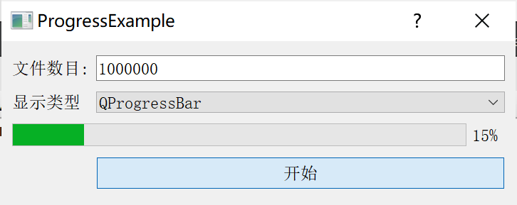
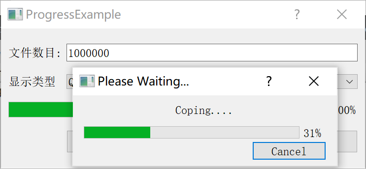

[TOC]


更多参见
[QT基础与实例应用目录](https://blog.csdn.net/leacock1991/article/details/118662440)


### 代码链接

GitHub链接 ：[ProgressExample](https://github.com/lichangke/QT/tree/main/CodeDemo/CH4/CH403/ProgressExample)


### 介绍

在长时间任务中需要提供进度条用于显示进度。进度条对话框有两种使用方法，模态方式和非模态方式。

Qt提供了两种显示进度条的方式：一种是`QProgressBar`，提供一种横向或纵向显示进度的控件表示方式，来描述任务的完成情况；另一种是`QProgressDialog`，提供一种针对慢速过程的进度对话框表示方式，用于描述任务的完成情况。标准的进度条对话框包括一个进度显示条、一个取消按钮以及一个标签。








### 代码展示

**头文件**

```cpp
class ProgressDlg : public QDialog
{
    Q_OBJECT

public:
    ProgressDlg(QWidget *parent = nullptr);
    ~ProgressDlg();
private slots:
    void startProgress();
private:
    QLabel *fileNumLabel;
    QLineEdit *fileNumLineEdit;
    QLabel *progressType;
    QComboBox *typeComboBox;
    QProgressBar *progressBar;
    QPushButton *startBtn;
    QGridLayout *mainLayout;
};
```

**Cpp文件**

```cpp
ProgressDlg::ProgressDlg(QWidget *parent)
    : QDialog(parent)
{
    setWindowTitle(tr("ProgressExample"));
    fileNumLabel = new QLabel();
    fileNumLabel->setText(tr("文件数目:"));
    fileNumLineEdit = new QLineEdit;
    fileNumLineEdit->setText(tr("1000000"));
    progressType = new QLabel;
    progressType->setText(tr("显示类型"));
    typeComboBox = new QComboBox;
    typeComboBox->addItem(tr("QProgressBar"));
    typeComboBox->addItem(tr("QProgressDialog"));
    progressBar = new QProgressBar;
    startBtn = new QPushButton;
    startBtn->setText(tr("开始"));

    mainLayout = new QGridLayout(this);
    mainLayout->addWidget(fileNumLabel,0,0);
    mainLayout->addWidget(fileNumLineEdit,0,1);
    mainLayout->addWidget(progressType,1,0);
    mainLayout->addWidget(typeComboBox,1,1);
    mainLayout->addWidget(progressBar,2,0,1,2);
    mainLayout->addWidget(startBtn,3,1);
    mainLayout->setMargin(15);
    mainLayout->setSpacing(10);

    connect(startBtn,SIGNAL(clicked()),this,SLOT(startProgress()));
}

ProgressDlg::~ProgressDlg()
{
}

void ProgressDlg::startProgress()
{
    bool ok = false;
    int num = fileNumLineEdit->text().toInt(&ok);
    if(ok){
        int index = typeComboBox->currentIndex();
        if(index == 0){// 选择了 QProgressBar
            startBtn->setDisabled(true);
            // QProgressBar 有几个重要属性
            // 1、minimum\maximum: 决定进度条指示的最小值和最大值
            // 2、format: 决定进度条显示文字的格式。`%p%` 显示完成百分比，默认方式； `%v`显示当前进度值； `%m`显示总的步进值
            // 3、invertedAppearance ： 反向显示
            progressBar->setRange(0,num);
            progressBar->setFormat("%p%"); // %p%[0%-100%]  %v[0-num]  %m
            progressBar->setInvertedAppearance(false);
            for (int i = 1; i<num+1; i++) {
                progressBar->setValue(i);
            }
            startBtn->setDisabled(false);
        } else if(index == 1){
            // QProgressDialog几个重要属性
            // 1、minimum\maximum: 决定进度条指示的最小值和最大值
            // 2、minimumDuration: 进度条显示等待时间，系统会根据工作量预估，若大于则显示，若小于不显示
            QProgressDialog *progressDlg = new QProgressDialog;
            progressDlg->setWindowModality(Qt::WindowModal); // 设置模态显示
            progressDlg->setMinimumDuration(1); // 默认4秒
            progressDlg->setRange(0,num);
            progressDlg->setWindowTitle(tr("Please Waiting..."));
            progressDlg->setLabelText(tr("Coping...."));
            progressDlg->setCancelButtonText(tr("Cancel"));
            for (int i = 1; i<num+1; i++) {
                progressDlg->setValue(i);
                if(progressDlg->wasCanceled()){
                    return;
                }
            }
        }
    }
}
```


希望我的文章对于大家有帮助，由于个人能力的局限性，文中可能存在一些问题，欢迎指正、补充！

