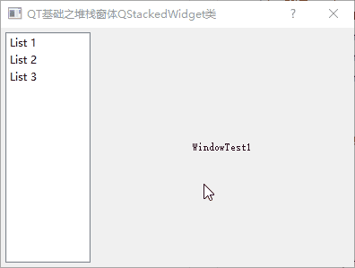

[TOC]

更多参见
[QT基础与实例应用目录](https://blog.csdn.net/leacock1991/article/details/118662440)


## QStackedWidget类简介

`QStackedWidget `类提供了一堆部件，一次只能看到其中一个部件。`QStackedWidget` 可用于创建类似于` QTabWidget` 提供的用户界面。它是一个构建在 `QStackedLayout `类之上的便捷布局部件。

与 `QStackedLayout` 一样，`QStackedWidget` 可以构造并填充多个子部件（“页面”）。

```cpp
	QLabel *firstOageWidget = new QLabel(tr("firstOageWidget")); // 可以是其他 widget
    QLabel *secondPageWidget =  new QLabel(tr("secondPageWidget"));
    QLabel *thirdPageWidget =  new QLabel(tr("thirdPageWidget"));
    QStackedWidget *stackedWidget = new QStackedWidget(this);
    stackedWidget->addWidget(firstOageWidget);
    stackedWidget->addWidget(secondPageWidget);
    stackedWidget->addWidget(thirdPageWidget);
    QVBoxLayout *layout = new QVBoxLayout;
    layout->addWidget(stackedWidget);
    setLayout(layout);
```

`QStackedWidget` 没有为用户提供切换页面的内在方法。 这通常通过存储 `QStackedWidget` 页面标题的 `QComboBox` 或 `QListWidget` 来完成。

```cpp
	QComboBox *pageComboBox = new QComboBox();
    pageComboBox->addItem(tr("Page 1"));
    pageComboBox->addItem(tr("Page 2"));
    pageComboBox->addItem(tr("Page 3"));
    connect(pageComboBox, SIGNAL(activated(int)),stackedWidget, SLOT(setCurrentIndex(int)));
```

填充堆叠部件时，部件将添加到内部列表中。` indexOf()` 函数返回该列表中部件的索引。部件可以使用 `addWidget()` 函数添加到列表的末尾，也可以使用` insertWidget() `函数插入到给定的索引处。`removeWidget() `函数从堆叠部件中删除部件。可以使用 `count() `函数获取堆叠部件中包含的部件数量。


## 简单Demo和说明

在实际应用中，`QStackedWidget`多与列表框`QListWidget`及下拉表框`QComboBox`配合使用。



GitHub链接 ：[StackDlg](https://github.com/lichangke/QT/tree/main/CodeDemo/CH3/CH303/StackDlg)

```cpp
    setWindowTitle(tr("QT基础之堆栈窗体QStackedWidget类"));
    // 创建 一个 QListWidget 控件对象 ，用于同 QStackedWidget 关联
    list = new QListWidget();
    list->addItem(tr("List 1"));
    list->addItem(tr("List 2"));
    list->addItem(tr("List 3"));


    // 创建 三个 QLabel 标签控件对象，作为堆栈窗口需要显示的三层窗体
    label1 = new QLabel(tr("WindowTest1"));
    label2 = new QLabel(tr("WindowTest2"));
    label3 = new QLabel(tr("WindowTest3"));

    // 创建 QStackedWidget 堆栈窗体对象
    stackedWidget = new QStackedWidget(this);
    // 将 三个 QLabel 标签控件对象 插入 QStackedWidget
    stackedWidget->addWidget(label1);
    stackedWidget->addWidget(label2);
    stackedWidget->addWidget(label3);
    // 创建 布局
    QHBoxLayout *layout = new QHBoxLayout(this);// 水平布局

    layout->setMargin(5); // 对话框或窗体 边距 5
    layout->setSpacing(5); // 各个控件之间的间距 5
    layout->addWidget(list);
    layout->addWidget(stackedWidget,5,Qt::AlignCenter);
    layout->setStretchFactor(list,1); // 设定可伸缩控件
    layout->setStretchFactor(stackedWidget,3);
    connect(list, SIGNAL(currentRowChanged(int)),stackedWidget, SLOT(setCurrentIndex(int)));
```


希望我的文章对于大家有帮助，由于个人能力的局限性，文中可能存在一些问题，欢迎指正、补充！

