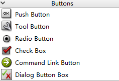
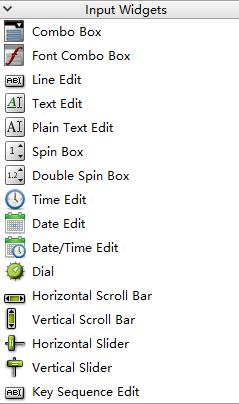
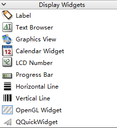
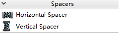
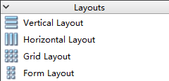
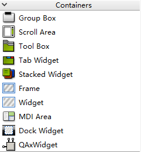
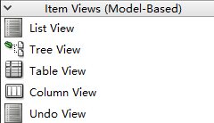
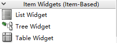

[TOC]

更多参见
[QT基础与实例应用目录](https://blog.csdn.net/leacock1991/article/details/118662440)

## 按钮组（Buttons）

- `Push Button` ：按钮
- `Tool Button` ：工具按钮
- `Radio Button` ：单选按钮
- `Check Button` ：复选框
- `Command Link Button` ：命令链接按钮
- `Dialog Button Box` ：对话框按钮盒

## 输入部件组（Input Widgets）

- `Combo Box`：组合框
- `Font Combo Box`：字体组合框
- ` Line Edit`：行编辑框
- `Text Edit`：文本编辑框
- `Plain Text Edit`：纯文本编辑框
- `Spin Box`：数字显示框（旋转盒）
- `Double Spin Box`：Double 数字显示框
- `Time Edit`：时间编辑
- `Date Edit`：日期编辑
- `Date/Time Edit `：日期/时间编辑
- `Dial`：拨号
- `Horizontal Scroll Bar`：水平滚动条
- `Vertical Scroll Bar `：垂直滚动条
- `Horizontal Slider`：水平滑块
- `Vertical Slider `：垂直滑块
- `Key Sequence Edit`：按键序列编辑框

## 显示控件组（Display Widgets）

- `Label`：标签

- `Text Browser`：文本浏览器
- ` Graphics View`：图形视图
- ` Calendar Widget`：日历
- ` LCD Number`：液晶数字
- `Progress Bar `：进度条
- `Horizontal Line `：水平线
- ` Vertical Line`：垂直线
- `OpenGL Widget `：OpenGL 工具
- ` QQuickWidget`：嵌入QML工具

## 空间间隔组（Spacers）

- `Horizontal Spacer `：水平间隔
- `Vertical Spacer`：垂直间隔

## 布局管理组（Layouts）

- `Vertical Layout `：垂直布局
- `Horizontal Layout`：水平布局
- `Grid Layout`：网格布局
- `Form Layout`：表单布局

## 容器组（Containers）

- `Group Box`：组框
- `Scroll Area`：滚动区域
- `Tool Box`：工具箱
- `Tab Widget`：标签部件
- `Stacked Widget`：堆叠部件
- `Frame`：框架
- `Widget`：小部件
- `MDI Area`：MDI区域
- `Dock Widget`：停靠窗体部件
- `QAxWidget`：封装Flash的ActiveX控件

## 项目视图组（Item Views）

- `List View`：列表视图
- `Tree View`：树形视图

- `Table View`：表格式图

- `Column View`：列视图

- `Undo View`：撤消视图

## 项目控件组（Item Widgets）

- `List Widget`：列表控件
- `Tree Widget`：树形控件
- `Table Widget`：表格控件

希望我的文章对于大家有帮助，由于个人能力的局限性，文中可能存在一些问题，欢迎指正、补充！

